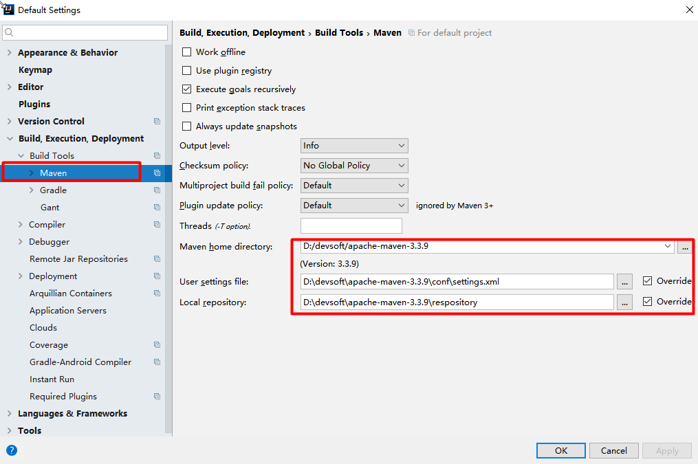
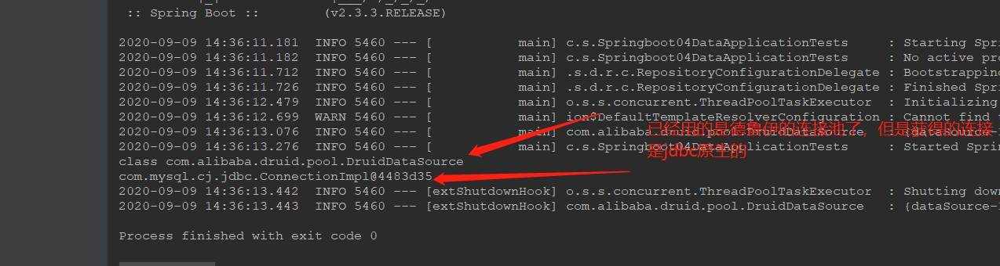

# 一、Spring Boot 入门

## 1、回顾什么是SpringBoot

Spring是一个开源框架，2003 年兴起的一个轻量级的Java 开发框架，作者：Rod Johnson 。

**Spring是为了解决企业级应用开发的复杂性而创建的，简化开发**

## 2、Spring是如何简化Java开发的

为了降低Java开发的复杂性，Spring采用了以下4种关键策略：

1、基于POJO的轻量级和最小侵入性编程，所有东西都是bean；

2、通过IOC，依赖注入（DI）和面向接口实现松耦合；

3、基于切面（AOP）和惯例进行声明式编程；

4、通过切面和模版减少样式代码，RedisTemplate，xxxTemplate；

## 3、Spring Boot 简介

学过javaweb的同学就知道，开发一个web应用，从最初开始接触Servlet结合Tomcat, 跑出一个Hello Wolrld程序，是要经历特别多的步骤；后来就用了框架Struts，再后来是SpringMVC，到了现在的SpringBoot，过一两年又会有其他web框架出现；你们有经历过框架不断的演进，然后自己开发项目所有的技术也在不断的变化、改造吗？建议都可以去经历一遍；

​		言归正传，什么是SpringBoot呢，就是一个javaweb的开发框架，和SpringMVC类似，对比其他javaweb框架的好处，官方说是简化开发，约定大于配置，  you can "just run"，能迅速的开发web应用，几行代码开发一个http接口。

​		所有的技术框架的发展似乎都遵循了一条主线规律：从一个复杂应用场景 衍生 一种规范框架，人们只需要进行各种配置而不需要自己去实现它，这时候强大的配置功能成了优点；发展到一定程度之后，人们根据实际生产应用情况，选取其中实用功能和设计精华，重构出一些轻量级的框架；之后为了提高开发效率，嫌弃原先的各类配置过于麻烦，于是开始提倡“约定大于配置”，进而衍生出一些一站式的解决方案。

​		是的这就是Java企业级应用->J2EE->spring->springboot的过程。

​		随着 Spring 不断的发展，涉及的领域越来越多，项目整合开发需要配合各种各样的文件，慢慢变得不那么易用简单，违背了最初的理念，甚至人称配置地狱。Spring Boot 正是在这样的一个背景下被抽象出来的开发框架，目的为了让大家更容易的使用 Spring 、更容易的集成各种常用的中间件、开源软件；

​		Spring Boot 基于 Spring 开发，Spirng Boot 本身并不提供 Spring 框架的核心特性以及扩展功能，只是用于快速、敏捷地开发新一代基于 Spring 框架的应用程序。也就是说，它并不是用来替代 Spring 的解决方案，而是和 Spring 框架紧密结合用于提升 Spring 开发者体验的工具。Spring Boot 以**约定大于配置的核心思想**，默认帮我们进行了很多设置，多数 Spring Boot 应用只需要很少的 Spring 配置。同时它集成了大量常用的第三方库配置（例如 Redis、MongoDB、Jpa、RabbitMQ、Quartz 等等），Spring Boot 应用中这些第三方库几乎可以零配置的开箱即用。

​		简单来说就是SpringBoot其实不是什么新的框架，它默认配置了很多框架的使用方式，就像maven整合了所有的jar包，spring boot整合了所有的框架 。

​		Spring Boot 出生名门，从一开始就站在一个比较高的起点，又经过这几年的发展，生态足够完善，Spring Boot 已经当之无愧成为 Java 领域最热门的技术。

**Spring Boot的主要优点：**

- 为所有Spring开发者更快的入门
- **开箱即用**，提供各种默认配置来简化项目配置
- 内嵌式容器简化Web项目
- 没有冗余代码生成和XML配置的要求

真的很爽，我们快速去体验开发个接口的感觉吧！


## 4、什么是微服务

2014，martin fowler

微服务：架构风格（服务微化）

一个应用应该是一组小型服务；可以通过HTTP的方式进行互通；

单体应用：ALL IN ONE

微服务：每一个功能元素最终都是一个可独立替换和独立升级的软件单元；

[详细参照微服务文档](https://martinfowler.com/articles/microservices.html#MicroservicesAndSoa)

## 5、环境准备

### 1、相关开发工具准备

我们将学习如何快速的创建一个Spring Boot应用，并且实现一个简单的Http请求处理。通过这个例子对Spring Boot有一个初步的了解，并体验其结构简单、开发快速的特性。

我的环境准备：

- java version "1.8.0_181"
- Maven-3.6.1
- SpringBoot 2.x 最新版

开发工具：

- IDEA

我们将学习如何快速的创建一个Spring Boot应用，并且实现一个简单的Http请求处理。通过这个例子对Spring Boot有一个初步的了解，并体验其结构简单、开发快速的特性。

我的环境准备：

- java version "1.8.0_181"
- Maven-3.6.1
- SpringBoot 2.x 最新版

开发工具：

- IDEA

### 2、创建项目基本说明

Spring官方提供了非常方便的工具让我们快速构建应用

Spring Initializr：https://start.spring.io/

**项目创建方式一：**使用Spring Initializr 的 Web页面创建项目

1、打开  https://start.spring.io/

2、填写项目信息

3、点击”Generate Project“按钮生成项目；下载此项目

4、解压项目包，并用IDEA以Maven项目导入，一路下一步即可，直到项目导入完毕。

5、如果是第一次使用，可能速度会比较慢，包比较多、需要耐心等待一切就绪。


**项目创建方式二：**使用 IDEA 直接创建项目

1、创建一个新项目

2、选择spring initalizr ， 可以看到默认就是去官网的快速构建工具那里实现

3、填写项目信息

4、选择初始化的组件（初学勾选 Web 即可）

5、填写项目路径

6、等待项目构建成功


**项目结构分析：**

通过上面步骤完成了基础项目的创建。就会自动生成以下文件。

1、程序的主启动类

2、一个 application.properties 配置文件

3、一个 测试类

4、一个 pom.xml

```xml
<?xml version="1.0" encoding="UTF-8"?>
<project xmlns="http://maven.apache.org/POM/4.0.0" xmlns:xsi="http://www.w3.org/2001/XMLSchema-instance"
         xsi:schemaLocation="http://maven.apache.org/POM/4.0.0 https://maven.apache.org/xsd/maven-4.0.0.xsd">
    <modelVersion>4.0.0</modelVersion>
    <parent>
        <groupId>org.springframework.boot</groupId>
        <artifactId>spring-boot-starter-parent</artifactId>
        <version>2.3.3.RELEASE</version>
        <relativePath/> <!-- lookup parent from repository -->
    </parent>
    <groupId>com.example</groupId>
    <artifactId>springboot01</artifactId>
    <version>0.0.1-SNAPSHOT</version>
    <name>springboot01</name>
    <description>Demo project for Spring Boot</description>

    <properties>
        <java.version>1.8</java.version>
    </properties>

    <dependencies>
        <dependency>
            <groupId>org.springframework.boot</groupId>
            <artifactId>spring-boot-starter-web</artifactId>
        </dependency>

        <dependency>
            <groupId>org.springframework.boot</groupId>
            <artifactId>spring-boot-starter-test</artifactId>
            <scope>test</scope>
            <exclusions>
                <exclusion>
                    <groupId>org.junit.vintage</groupId>
                    <artifactId>junit-vintage-engine</artifactId>
                </exclusion>
            </exclusions>
        </dependency>
    </dependencies>

    <build>
        <plugins>
            <plugin>
                <groupId>org.springframework.boot</groupId>
                <artifactId>spring-boot-maven-plugin</artifactId>
            </plugin>
        </plugins>
    </build>
</project>
```

### 3、IDEA设置

整合maven进来；




## 6、创建第一个HelloWorld

需求：

浏览器发送hello请求，服务器接受请求并处理，响应Hello World字符串；

### 1、创建一个maven工程；（jar）

### 2、导入spring boot相关的依赖

```xml
    <parent>
        <groupId>org.springframework.boot</groupId>
        <artifactId>spring-boot-starter-parent</artifactId>
        <version>1.5.9.RELEASE</version>
    </parent>
    <dependencies>
        <dependency>
            <groupId>org.springframework.boot</groupId>
            <artifactId>spring-boot-starter-web</artifactId>
        </dependency>
    </dependencies>
```

### 3、编写一个主程序；启动Spring Boot应用

### 

```java
/**
 *  @SpringBootApplication 来标注一个主程序类，说明这是一个Spring Boot应用
 */
@SpringBootApplication
public class HelloWorldMainApplication {

    public static void main(String[] args) {

        // Spring应用启动起来
        SpringApplication.run(HelloWorldMainApplication.class,args);
    }
}
```

### 4、编写相关的Controller、Service

实际操作：

1、在主程序的同级目录下，新建一个controller包，一定要在同级目录下，否则识别不到

2、在包中新建一个HelloController类

```java
@Controller
public class HelloController {

    @ResponseBody
    @RequestMapping("/hello")
    public String hello(){
        return "Hello World!";
    }
}

```

### 5、运行主程序测试

编写完毕后，从主程序启动项目，浏览器发起请求，看页面返回；控制台输出了 Tomcat 访问的端口号！


简单几步，就完成了一个web接口的开发，SpringBoot就是这么简单。所以我们常用它来建立我们的微服务项目！

将项目打成jar包，点击 maven的 package


如果遇到以上错误，可以配置打包时 跳过项目运行测试用例

如果打包成功，则会在target目录下生成一个 jar 包

)

打成了jar包后，就可以在任何地方运行了！OK

### 6、简化部署

```xml
 <!-- 这个插件，可以将应用打包成一个可执行的jar包；-->
    <build>
        <plugins>
            <plugin>
                <groupId>org.springframework.boot</groupId>
                <artifactId>spring-boot-maven-plugin</artifactId>
            </plugin>
        </plugins>
    </build>
```

将这个应用打成jar包，直接使用java -jar的命令进行执行；


### **7、彩蛋**

如何更改启动时显示的字符拼成的字母，SpringBoot呢？也就是 banner 图案；

只需一步：到项目下的 resources 目录下新建一个banner.txt 即可。

图案可以到：[彩蛋生成处](https://www.bootschool.net/ascii) 这个网站生成，然后拷贝到文件中即可！

## 7、HelloWorld探究

### 1、POM文件

#### 1、父项目

```xml
<parent>
        <groupId>org.springframework.boot</groupId>
        <artifactId>spring-boot-starter-parent</artifactId>
        <version>2.3.3.RELEASE</version>
        <relativePath/> <!-- lookup parent from repository -->
    </parent>

他的父项目是

<parent>
    <groupId>org.springframework.boot</groupId>
    <artifactId>spring-boot-dependencies</artifactId>
    <version>2.2.3.RELEASE</version>
    <relativePath>../../spring-boot-dependencies</relativePath>
</parent>
他来真正管理Spring Boot应用里面的所有依赖版本；

```

Spring Boot的版本仲裁中心；

以后我们导入依赖默认是不需要写版本；（没有在dependencies里面管理的依赖自然需要声明版本号）

#### 2、启动器

```xml
<dependency>
    <groupId>org.springframework.boot</groupId>
    <artifactId>spring-boot-starter-web</artifactId>
</dependency>
```

**spring-boot-starter**-==web==：

​	spring-boot-starter：spring-boot场景启动器；帮我们导入了web模块正常运行所依赖的组件；

Spring Boot将所有的功能场景都抽取出来，做成一个个的starters（启动器），只需要在项目里面引入这些starter相关场景的所有依赖都会导入进来。要用什么功能就导入什么场景的启动器

### 2、主程序类，主入口类

```java
/**
 *  @SpringBootApplication 来标注一个主程序类，说明这是一个Spring Boot应用
 */
@SpringBootApplication
public class HelloWorldMainApplication {

    public static void main(String[] args) {

        // Spring应用启动起来
        SpringApplication.run(HelloWorldMainApplication.class,args);
    }
}

```

但是**一个简单的启动类并不简单！**我们来分析一下这些注解都干了什么

#### @**SpringBootApplication**

​	作用：Spring Boot应用标注在某个类上说明这个类是SpringBoot的主配置类，SpringBoot就应该运行这个类的main方法来启动SpringBoot应用；

进入这个注解：可以看到上面还有很多其他注解！

```java
@Target(ElementType.TYPE)
@Retention(RetentionPolicy.RUNTIME)
@Documented
@Inherited
@SpringBootConfiguration //标注在某个类上，表示这是一个springboot的配置类
@EnableAutoConfiguration
@ComponentScan(excludeFilters = { @Filter(type = FilterType.CUSTOM, classes = TypeExcludeFilter.class),
		@Filter(type = FilterType.CUSTOM, classes = AutoConfigurationExcludeFilter.class) })
public @interface SpringBootApplication {
	 // ......
}
```

##### @**SpringBootConfiguration**

​	Spring Boot的配置类；

​		标注在某个类上，表示这是一个Spring Boot的配置类；

我们继续进去这个注解查看

```java

@Target({ElementType.TYPE})
@Retention(RetentionPolicy.RUNTIME)
@Documented
@Configuration //说明这是一个配置类 ，配置类就是对应Spring的xml 配置文件
public @interface SpringBootConfiguration {
    @AliasFor(
        annotation = Configuration.class
    )
    boolean proxyBeanMethods() default true;
}

```

##### @**Configuration**

​	配置类上来标注这个注解；

​			配置类 -----  配置文件；配置类也是容器中的一个组件；@Component

鼠标回到上一层的注解

##### @**EnableAutoConfiguration**

​	开启自动配置功能；

以前我们需要自己配置的东西，而现在SpringBoot可以自动帮我们配置 ；@EnableAutoConfiguration告诉SpringBoot开启自动配置功能，这样自动配置才能生效；

点进去这个**@EnableAutoConfiguration**看，里面是如下

```java
@Target({ElementType.TYPE})
@Retention(RetentionPolicy.RUNTIME)
@Documented
@Inherited
@AutoConfigurationPackage //自动配置包
@Import({AutoConfigurationImportSelector.class})//Spring的底层注解@Import，给容器中导入一个组件；导入的组件由AutoConfigurationPackages.Registrar.class；
public @interface EnableAutoConfiguration {
    String ENABLED_OVERRIDE_PROPERTY = "spring.boot.enableautoconfiguration";

    Class<?>[] exclude() default {};

    String[] excludeName() default {};
}

```

##### @**AutoConfigurationPackage**

​	自动配置包

再点击@**AutoConfigurationPackage**进去

```java
@Target({ElementType.TYPE})
@Retention(RetentionPolicy.RUNTIME)
@Documented
@Inherited
@Import({Registrar.class})
public @interface AutoConfigurationPackage {
    String[] basePackages() default {};

    Class<?>[] basePackageClasses() default {};
}
```

​		@Import({Registrar.class})：

​		Spring的底层注解@Import，给容器中导入一个组件；导入的组件由Registrar.class提供；

  	  Registrar.class 作用：将主启动类的所在包及包下面所有子包里面的所有组件扫描到Spring容器 ；

##### @**Import**(EnableAutoConfigurationImportSelector.class)；

AutoConfigurationImportSelector ：自动配置导入选择器，那么它会导入哪些组件的选择器呢？我们点击去这个类看源码：

1、这个类中有一个这样的方法

   ```java
// 获得候选的配置
protected List<String> getCandidateConfigurations(AnnotationMetadata metadata, AnnotationAttributes attributes) {
    //这里的getSpringFactoriesLoaderFactoryClass（）方法
    //返回的就是我们最开始看的启动自动导入配置文件的注解类；EnableAutoConfiguration
    List<String> configurations = SpringFactoriesLoader.loadFactoryNames(this.getSpringFactoriesLoaderFactoryClass(), this.getBeanClassLoader());
    Assert.notEmpty(configurations, "No auto configuration classes found in META-INF/spring.factories. If you are using a custom packaging, make sure that file is correct.");
    return configurations;
}
   ```

2、这个方法又调用了  SpringFactoriesLoader 类的静态方法！我们进入SpringFactoriesLoader类loadFactoryNames() 方法

```java
public static List<String> loadFactoryNames(Class<?> factoryClass, @Nullable ClassLoader classLoader) {
    String factoryClassName = factoryClass.getName();
    //这里它又调用了 loadSpringFactories 方法
    return (List)loadSpringFactories(classLoader).getOrDefault(factoryClassName, Collections.emptyList());
}
```

3、我们继续点击查看 loadSpringFactories 方法

 ```java
private static Map<String, List<String>> loadSpringFactories(@Nullable ClassLoader classLoader) {
        MultiValueMap<String, String> result = (MultiValueMap)cache.get(classLoader);
        if (result != null) {
            return result;
        } else {
            try {
                Enumeration<URL> urls = classLoader != null ? classLoader.getResources("META-INF/spring.factories") : ClassLoader.getSystemResources("META-INF/spring.factories");
                LinkedMultiValueMap result = new LinkedMultiValueMap();

                while(urls.hasMoreElements()) {
                    URL url = (URL)urls.nextElement();
                    UrlResource resource = new UrlResource(url);
                    Properties properties = PropertiesLoaderUtils.loadProperties(resource);
                    Iterator var6 = properties.entrySet().iterator();

                    while(var6.hasNext()) {
                        Entry<?, ?> entry = (Entry)var6.next();
                        String factoryTypeName = ((String)entry.getKey()).trim();
                        String[] var9 = StringUtils.commaDelimitedListToStringArray((String)entry.getValue());
                        int var10 = var9.length;

                        for(int var11 = 0; var11 < var10; ++var11) {
                            String factoryImplementationName = var9[var11];
                            result.add(factoryTypeName, factoryImplementationName.trim());
                        }
                    }
                }

                cache.put(classLoader, result);
                return result;
            } catch (IOException var13) {
                throw new IllegalArgumentException("Unable to load factories from location [META-INF/spring.factories]", var13);
            }
        }
    }
 ```

4、发现一个多次出现的文件：spring.factories，全局搜索它

### 3、spring.factories

我们根据源头打开spring.factories ， 看到了很多自动配置的文件；这就是自动配置根源所在！


**WebMvcAutoConfiguration**

我们在上面的自动配置类随便找一个打开看看，比如 ：WebMvcAutoConfiguration


可以看到这些一个个的都是JavaConfig配置类，而且都注入了一些Bean，可以找一些自己认识的类，看着熟悉一下！可以多找一下，可以看见InternalResourceViewResolver 等等

所以，自动配置真正实现是从classpath中搜寻所有的META-INF/spring.factories配置文件 ，并将其中对应的 org.springframework.boot.autoconfigure. 包下的配置项，通过反射实例化为对应标注了 @Configuration的JavaConfig形式的IOC容器配置类 ， 然后将这些都汇总成为一个实例并加载到IOC容器中。

#### **结论：**

1. SpringBoot在启动的时候从类路径下的META-INF/spring.factories中获取EnableAutoConfiguration指定的值
2. 将这些值作为自动配置类导入容器 ， 自动配置类就生效 ， 帮我们进行自动配置工作；
3. 整个J2EE的整体解决方案和自动配置都在springboot-autoconfigure的jar包中；
4. 它会给容器中导入非常多的自动配置类 （xxxAutoConfiguration）, 就是给容器中导入这个场景需要的所有组件 ， 并配置好这些组件 ；
5. 有了自动配置类 ， 免去了我们手动编写配置注入功能组件等的工作；

**现在大家应该大概的了解了下，SpringBoot的运行原理，后面我们还会深化一次！**

## **8、SpringApplication**

```java
@SpringBootApplication
public class SpringbootApplication {
    public static void main(String[] args) {
        SpringApplication.run(SpringbootApplication.class, args);
    }
}
```

**SpringApplication.run分析**

分析该方法主要分两部分，一部分是SpringApplication的实例化，二是run方法的执行；

* >#### SpringApplication

    查看构造器

    ```java
        public SpringApplication(Class... primarySources) {
            this((ResourceLoader)null, primarySources);
        }
    
        public SpringApplication(ResourceLoader resourceLoader, Class... primarySources) {
            this.sources = new LinkedHashSet();
            this.bannerMode = Mode.CONSOLE;
            this.logStartupInfo = true;
            this.addCommandLineProperties = true;
            this.addConversionService = true;
            this.headless = true;
            this.registerShutdownHook = true;
            this.additionalProfiles = new HashSet();
            this.isCustomEnvironment = false;
            this.lazyInitialization = false;
            this.resourceLoader = resourceLoader;
            Assert.notNull(primarySources, "PrimarySources must not be null");
            this.primarySources = new LinkedHashSet(Arrays.asList(primarySources));
            this.webApplicationType = WebApplicationType.deduceFromClasspath();
            this.setInitializers(this.getSpringFactoriesInstances(ApplicationContextInitializer.class));
            this.setListeners(this.getSpringFactoriesInstances(ApplicationListener.class));
            this.mainApplicationClass = this.deduceMainApplicationClass();
        }
    
    ```

    

    **这个类主要做了以下四件事情：**

    1、推断应用的类型是普通的项目还是Web项目

    2、查找并加载所有可用初始化器 ， 设置到initializers属性中

    3、找出所有的应用程序监听器，设置到listeners属性中

    4、推断并设置main方法的定义类，找到运行的主类

    就是最后的上面的最后4行

    

* >#### run方法流程分析

    

跟着源码和这幅图就可以一探究竟了！

附上：别的博客觉得解析springboot启动流程分析，可以参考参考

[springboot启动过程解读](https://blog.csdn.net/zxzzxzzxz123/article/details/69941910)

[springboot启动过程解读2](https://www.cnblogs.com/trgl/p/7353782.html)

# 二、配置文件

## 1、配置文件

SpringBoot使用一个全局的配置文件，配置文件名是固定的；

•application.properties

•application.yml


配置文件的作用：修改SpringBoot自动配置的默认值；SpringBoot在底层都给我们自动配置好；


YAML（YAML Ain't Markup Language）

​	YAML  A Markup Language：是一个标记语言

​	YAML   isn't Markup Language：不是一个标记语言；

标记语言：

​	以前的配置文件；大多都使用的是  **xxxx.xml**文件；

​	YAML：**以数据为中心**，比json、xml等更适合做配置文件；

​	YAML：配置例子

```yaml
server:
  port: 8081
```

​	XML：

```xml
<server>
	<port>8081</port>
</server>
```

## 2、YAML语法：

### 1、基本语法

k:(空格)v：表示一对键值对（空格必须有）；

以**空格**的缩进来控制层级关系；只要是左对齐的一列数据，都是同一个层级的

说明：语法要求严格！

1、==**空格不能省略**==

2、以==**缩进**==来控制层级关系，只要是左边对齐的一列数据都是同一个层级的。

3、==**属性**==和==**值**==的**==大小写==**都是十分敏感的。

```yaml
server:
    port: 8081
    path: /hello
```

属性和值也是大小写敏感；

### 2、值的写法

#### 字面量：普通的值（数字，字符串，布尔）

​	k: v：字面直接来写；

​		字符串默认不用加上单引号或者双引号；

​		""：双引号；不会转义字符串里面的特殊字符；特殊字符会作为本身想表示的意思

​				name:   "zhangsan \n lisi"：输出；zhangsan 换行  lisi

​		''：单引号；会转义特殊字符，特殊字符最终只是一个普通的字符串数据

​				name:   ‘zhangsan \n lisi’：输出；zhangsan \n  lisi

#### 对象、Map（属性和值）（键值对）：

​	k: v：在下一行来写对象的属性和值的关系；注意缩进

​		对象还是k: v的方式

```yaml
friends:
		lastName: zhangsan
		age: 20
```

行内写法：

```yaml
friends: {lastName: zhangsan,age: 18}
```


#### 数组（List、Set）：

用- 值表示数组中的一个元素

```yaml
pets:
 - cat
 - dog
 - pig
```

行内写法

```yaml
pets: [cat,dog,pig]
```

上面已经简单的学习了yaml的一些功能 但是最主要的不是体现在这里 而是**==直接==**给实体类注入匹配值

## 3、配置文件值注入

配置文件的写法

```yaml
person: #这个名字很关键 就是和下面的@ConfigurationProperties中的前缀一一对应的
    lastName: hello
    age: 18
    boss: false
    birth: 2017/12/12
    maps: {k1: v1,k2: 12}
    lists:
      - lisi
      - zhaoliu
    dog:
      name: 小狗
      age: 12
```

javaBean：

```java
/**
 * 将配置文件中配置的每一个属性的值，映射到这个组件中
 * @ConfigurationProperties：告诉SpringBoot将本类中的所有属性和配置文件中相关的配置进行绑定；
 *      prefix = "person"：配置文件中哪个下面的所有属性进行一一映射
 *
 * 只有这个组件是容器中的组件，才能容器提供的@ConfigurationProperties功能；
 *
 */
@Component//注册成为一个组件  直接注册到Bean容器中
@ConfigurationProperties(prefix = "person")
public class Person {

    private String lastName;
    private Integer age;
    private Boolean boss;
    private Date birth;

    private Map<String,Object> maps;
    private List<Object> lists;
    private Dog dog; //还有一个Dog类 也要创建一下
    //记得加上空参数，getXXX,setXXX方法
    
}
```

```java
@Component//注册成为一个组件  直接注册到Bean容器中
public class Dog {
    private  String name;
    private Integer age;

    public Dog() {
    }

    public Dog(String name, Integer age) {
        this.name = name;
        this.age = age;
    }
     //记得加上空参数，getXXX,setXXX方法
}
```

1、思考，我们原来是如何给bean注入属性值的！@Value，给狗狗类测试一下：

```java
@Component//注册成为一个组件  直接注册到Bean容器中
public class Dog {
    @Value("阿黄")
    private  String name;
    @Value("18")
    private Integer age;
```

此时我们再次启动springboot给我们的测试类测试

```java
@SpringBootTest
class Springboot01ApplicationTests {

    
    @Autowired
    Dog dog;//将狗狗自动注入进来
    @Test
    void contextLoads() {
        System.out.println(dog);//可以打印出上面注入的属性值
    }

}
```

上面已经试验了之前的学习的注入方式 ，现在我们看看springboot给我们提供的使用yaml的注入

```java
@SpringBootTest
class Springboot01ApplicationTests {

    @Autowired
    Dog dog;//将狗狗自动注入进来
    @Autowired
    Person person;//将Person自动注入进来
    @Test
    void contextLoads() {
        System.out.println(dog);
        System.out.println(person);//打印出全部属性
    }

}
```


全部属性注入成功

**==注意==**

课堂测试：

1、将配置文件的**==key==** 值 和 **==属性==**的值设置为不一样，则结果输出为null，注入失败

2、在配置一个person2，然后将 @ConfigurationProperties(prefix = "person2") 指向我们的person2；

上面是通过yaml的方式 我们之前是 用XXX.properties进行赋值的 现在我们回顾一下看看怎么弄

加载指定的配置文件

**@PropertySource ：**加载指定的配置文件；

**@configurationProperties**：默认从全局配置文件中获取值；

1. 我们去在resources目录下新建一个**person.properties**文件

    ```java
    name=miao
    ```

2. 然后在我们的代码中指定加载person.properties文件

    ```java
    package com.example.springboot01.pojo;
    
    import org.springframework.beans.factory.annotation.Value;
    import org.springframework.boot.context.properties.ConfigurationProperties;
    import org.springframework.context.annotation.PropertySource;
    import org.springframework.stereotype.Component;
    import sun.awt.SunHints;
    
    import java.util.Date;
    import java.util.List;
    import java.util.Map;
    /*
    @ConfigurationProperties作用：
    将配置文件中配置的每一个属性的值，映射到这个组件中；
    告诉SpringBoot将本类中的所有属性和配置文件中相关的配置进行绑定
    参数 prefix = “person” : 将配置文件中的person下面的所有属性一一对应
    */
    @Component //注册bean到容器中
    //@ConfigurationProperties(prefix="person")//这个一定要注释了 否则就不是这个下面的起作用了
    @PropertySource(value = "classpath:person.properties")
    public class Person {
    
        @Value("${name}")//切记一定要加这个
        private String name;
        private Integer age;
        private Boolean happy;
        private Date birth;
        private Map<String, Object> maps;
        private List<Object> lists;
        private Dog dog;
    
        //有参无参构造、get、set方法、toString()方法省略了
    }
    
    
    ```

    结果：属性绑定成功

    IDEA 提示，springboot配置注解处理器没有找到，让我们看文档，我们可以查看文档，找到一个依赖！

    ```java
    <!--导入配置文件处理器，配置文件进行绑定就会有提示-->
    		<dependency>
    			<groupId>org.springframework.boot</groupId>
    			<artifactId>spring-boot-configuration-processor</artifactId>
    			<optional>true</optional>
    		</dependency>
    ```

@**ImportResource**：导入Spring的配置文件，让配置文件里面的内容生效；

Spring Boot里面没有Spring的配置文件，我们自己编写的配置文件，也不能自动识别；

想让Spring的配置文件生效，加载进来；@**ImportResource**标注在一个配置类上

```java
@ImportResource(locations = {"classpath:beans.xml"})
//导入Spring的配置文件让其生效
```

来编写Spring的配置文件

```xml
<?xml version="1.0" encoding="UTF-8"?>
<beans xmlns="http://www.springframework.org/schema/beans"
       xmlns:xsi="http://www.w3.org/2001/XMLSchema-instance"
       xsi:schemaLocation="http://www.springframework.org/schema/beans http://www.springframework.org/schema/beans/spring-beans.xsd">


    <bean id="helloService" class="com.atguigu.springboot.service.HelloService"></bean>
</beans>
```

SpringBoot推荐给容器中添加组件的方式；推荐使用全注解的方式

1、配置类**@Configuration**------>Spring配置文件

2、使用**@Bean**给容器中添加组件

```java
/**
 * @Configuration：指明当前类是一个配置类；就是来替代之前的Spring配置文件
 *
 * 在配置文件中用<bean><bean/>标签添加组件
 *
 */
@Configuration
public class MyAppConfig {

    //将方法的返回值添加到容器中；容器中这个组件默认的id就是方法名
    @Bean
    public HelloService helloService02(){
        System.out.println("配置类@Bean给容器中添加组件了...");
        return new HelloService();
    }
}
```


**配置文件占位符**

配置文件还可以编写占位符生成随机数

```yaml
person:
    name: miaoyongjin${random.uuid} # 随机uuid
    age: ${random.int}  # 随机int
    happy: false
    birth: 2000/01/01
    maps: {k1: v1,k2: v2}
    lists:
      - code
      - girl
      - music
    dog:
      name: ${person.hello:other}_旺财 #如果有这个person.hello这个属性用这个属性 否则用other 跟三目运算符很像
      age: 1
```

**对比小结**


1、@ConfigurationProperties只需要写一次即可 ， @Value则需要每个字段都添加

2、松散绑定：这个什么意思呢? 比如我的yml中写的last-name，这个和lastName是一样的， - 后面跟着的字母默认是大写的。这就是松散绑定。可以测试一下。其实就是驼峰命名

3、JSR303数据校验 ， 这个就是我们可以在字段是增加一层过滤器验证 ， 可以保证数据的合法性

4、复杂类型封装，yml中可以封装对象 ， 使用value就不支持

**结论：**

配置yml和配置properties都可以获取到值 ， 强烈推荐 yml；

如果我们在某个业务中，只需要获取配置文件中的某个值，可以使用一下 @value；

如果说，我们专门编写了一个JavaBean来和配置文件进行一一映射，就直接@configurationProperties，不要犹豫！

### **1、JSR303数据校验**

Springboot中可以用@validated来校验数据，如果数据异常则会统一抛出异常，方便异常中心统一处理。我们这里来写个注解让我们的name只能支持Email格式；

**==注意：==**

​		如果下面的@Email等不起作用，那就是少了依赖，添加如下依赖即可

```java
<dependency>
            <groupId>org.springframework.boot</groupId>
            <artifactId>spring-boot-starter-validation</artifactId>
</dependency>
```

```java
@Component //注册bean
@ConfigurationProperties(prefix = "person")
@Validated  //数据校验
public class Person {
   //lastName必须是邮箱格式
    @Email
    //@Value("${person.last-name}")
    private String lastName;
    //@Value("#{11*2}")
    private Integer age;
    //@Value("true")
    private Boolean boss;

    private Date birth;
    private Map<String,Object> maps;
    private List<Object> lists;
    private Dog dog;
}
```

运行结果 ：default message [不是一个合法的电子邮件地址];

**使用数据校验，可以保证数据的正确性；**

>常用

```java
@NotNull(message="名字不能为空")
private String userName;
@Max(value=120,message="年龄最大不能查过120")
private int age;
@Email(message="邮箱格式错误")
private String email;

空检查
@Null       验证对象是否为null
@NotNull    验证对象是否不为null, 无法查检长度为0的字符串
@NotBlank   检查约束字符串是不是Null还有被Trim的长度是否大于0,只对字符串,且会去掉前后空格.
@NotEmpty   检查约束元素是否为NULL或者是EMPTY.
    
Booelan检查
@AssertTrue     验证 Boolean 对象是否为 true  
@AssertFalse    验证 Boolean 对象是否为 false  
    
长度检查
@Size(min=, max=) 验证对象（Array,Collection,Map,String）长度是否在给定的范围之内  
@Length(min=, max=) string is between min and max included.

日期检查
@Past       验证 Date 和 Calendar 对象是否在当前时间之前  
@Future     验证 Date 和 Calendar 对象是否在当前时间之后  
@Pattern    验证 String 对象是否符合正则表达式的规则

.......等等
除此以外，我们还可以自定义一些数据校验规则
```

### 2、properties配置文件在idea中默认utf-8可能会乱码


 	5、Profile

### 3、多Profile文件

我们在主配置文件编写的时候，文件名可以是   application-{profile}.properties/yml

默认使用application.properties的配置；


#### 1、yml支持多文档块方式

```yml
server:
  port: 8081
spring:
  profiles:
    active: prod

---
server:
  port: 8083
spring:
  profiles: dev


---

server:
  port: 8084
spring:
  profiles: prod  #指定属于哪个环境
```


#### 2、激活指定profile

​	1、在配置文件中指定  spring.profiles.active=dev

​	2、命令行：

​		java -jar spring-boot-02-config-0.0.1-SNAPSHOT.jar --spring.profiles.active=dev；

​		可以直接在测试的时候，配置传入命令行参数

​	3、虚拟机参数；

​		-Dspring.profiles.active=dev

## 4、配置文件加载位置

springboot 启动会扫描以下位置的application.properties或者application.yml文件作为Spring boot的默认配置文件

–file:./config/  项目路径下的config文件夹配置文件

–file:./   项目路径下配置文件

–classpath:/config/   资源路径下的config文件夹配置文件

–classpath:/ 资源路径下配置文件

优先级1：项目路径下的config文件夹配置文件
优先级2：项目路径下配置文件
优先级3：资源路径下的config文件夹配置文件
优先级4：资源路径下配置文件

优先级由高到底，高优先级的配置会覆盖低优先级的配置；

SpringBoot会从这四个位置全部加载主配置文件；**互补配置**；

现在我们依次在我们的项目中的上面情况依次设置看看具体结果如何

* 项目路径下的config文件夹配置文件

    

* 项目路径下配置文件


* 资源路径下的config文件夹配置文件

    

* 资源路径下配置文件

    

依次启动得出配置文件的加载优先级

```java
优先级1：项目路径下的config文件夹配置文件
优先级2：项目路径下配置文件
优先级3：资源路径下的config文件夹配置文件
优先级4：资源路径下配置文件
```

优先级由高到底，高优先级的配置会覆盖低优先级的配置；

**SpringBoot会从这四个位置全部加载主配置文件；互补配置；**

==我们还可以通过spring.config.location来改变默认的配置文件位置==

**项目打包好以后，我们可以使用命令行参数的形式，启动项目的时候来指定配置文件的新位置；指定配置文件和默认加载的这些配置文件共同起作用形成互补配置；**

java -jar spring-boot-02-config-02-0.0.1-SNAPSHOT.jar --spring.config.location=G:/application.properties

## 5、外部配置加载顺序

**==SpringBoot也可以从以下位置加载配置； 优先级从高到低；高优先级的配置覆盖低优先级的配置，所有的配置会形成互补配置==**

#### **1.命令行参数**

所有的配置都可以在命令行上进行指定

java -jar spring-boot-02-config-02-0.0.1-SNAPSHOT.jar --server.port=8087  --server.context-path=/abc

多个配置用空格分开； --配置项=值


2.来自java:comp/env的JNDI属性

3.Java系统属性（System.getProperties()）

4.操作系统环境变量

5.RandomValuePropertySource配置的random.*属性值


==**由jar包外向jar包内进行寻找；**==

==**优先加载带profile**==

**6.jar包外部的application-{profile}.properties或application.yml(带spring.profile)配置文件**

**7.jar包内部的application-{profile}.properties或application.yml(带spring.profile)配置文件**


==**再来加载不带profile**==

**8.jar包外部的application.properties或application.yml(不带spring.profile)配置文件**

**9.jar包内部的application.properties或application.yml(不带spring.profile)配置文件**


10.@Configuration注解类上的@PropertySource

11.通过SpringApplication.setDefaultProperties指定的默认属性

所有支持的配置加载来源；

[参考官方文档](https://docs.spring.io/spring-boot/docs/1.5.9.RELEASE/reference/htmlsingle/#boot-features-external-config)

# **三、SpringBoot**自动装配原理再讲解

配置文件到底能写什么？怎么写？自动配置原理；

[配置文件能配置的属性参照](https://docs.spring.io/spring-boot/docs/1.5.9.RELEASE/reference/htmlsingle/#common-application-properties)

## 1、自动配置原理

1）、SpringBoot启动的时候加载主配置类，开启了自动配置功能 **@EnableAutoConfiguration**

2）、@EnableAutoConfiguration 作用：

 - 利用EnableAutoConfigurationImportSelector给容器中导入一些组件？

- 可以查看selectImports()方法的内容；

- List<String> configurations = getCandidateConfigurations(annotationMetadata,      attributes);获取候选的配置

    - ```java
        SpringFactoriesLoader.loadFactoryNames()
        扫描所有jar包类路径下  META-INF/spring.factories
        把扫描到的这些文件的内容包装成properties对象
        从properties中获取到EnableAutoConfiguration.class类（类名）对应的值，然后把他们添加在容器中
        
        ```


**将 类路径下  META-INF/spring.factories 里面配置的所有EnableAutoConfiguration的值加入到了容器中**

```properties
# Auto Configure
org.springframework.boot.autoconfigure.EnableAutoConfiguration=\
org.springframework.boot.autoconfigure.admin.SpringApplicationAdminJmxAutoConfiguration,\
org.springframework.boot.autoconfigure.aop.AopAutoConfiguration,\
org.springframework.boot.autoconfigure.amqp.RabbitAutoConfiguration,\
org.springframework.boot.autoconfigure.batch.BatchAutoConfiguration,\
org.springframework.boot.autoconfigure.cache.CacheAutoConfiguration,\
org.springframework.boot.autoconfigure.cassandra.CassandraAutoConfiguration,\
org.springframework.boot.autoconfigure.cloud.CloudAutoConfiguration,\
org.springframework.boot.autoconfigure.context.ConfigurationPropertiesAutoConfiguration,\
org.springframework.boot.autoconfigure.context.MessageSourceAutoConfiguration,\
org.springframework.boot.autoconfigure.context.PropertyPlaceholderAutoConfiguration,\
org.springframework.boot.autoconfigure.couchbase.CouchbaseAutoConfiguration,\
org.springframework.boot.autoconfigure.dao.PersistenceExceptionTranslationAutoConfiguration,\
org.springframework.boot.autoconfigure.data.cassandra.CassandraDataAutoConfiguration,\
org.springframework.boot.autoconfigure.data.cassandra.CassandraRepositoriesAutoConfiguration,\
org.springframework.boot.autoconfigure.data.couchbase.CouchbaseDataAutoConfiguration,\
org.springframework.boot.autoconfigure.data.couchbase.CouchbaseRepositoriesAutoConfiguration,\
org.springframework.boot.autoconfigure.data.elasticsearch.ElasticsearchAutoConfiguration,\
org.springframework.boot.autoconfigure.data.elasticsearch.ElasticsearchDataAutoConfiguration,\
org.springframework.boot.autoconfigure.data.elasticsearch.ElasticsearchRepositoriesAutoConfiguration,\
org.springframework.boot.autoconfigure.data.jpa.JpaRepositoriesAutoConfiguration,\
org.springframework.boot.autoconfigure.data.ldap.LdapDataAutoConfiguration,\
org.springframework.boot.autoconfigure.data.ldap.LdapRepositoriesAutoConfiguration,\
org.springframework.boot.autoconfigure.data.mongo.MongoDataAutoConfiguration,\
org.springframework.boot.autoconfigure.data.mongo.MongoRepositoriesAutoConfiguration,\
org.springframework.boot.autoconfigure.data.neo4j.Neo4jDataAutoConfiguration,\
org.springframework.boot.autoconfigure.data.neo4j.Neo4jRepositoriesAutoConfiguration,\
org.springframework.boot.autoconfigure.data.solr.SolrRepositoriesAutoConfiguration,\
org.springframework.boot.autoconfigure.data.redis.RedisAutoConfiguration,\
org.springframework.boot.autoconfigure.data.redis.RedisRepositoriesAutoConfiguration,\
org.springframework.boot.autoconfigure.data.rest.RepositoryRestMvcAutoConfiguration,\
org.springframework.boot.autoconfigure.data.web.SpringDataWebAutoConfiguration,\
org.springframework.boot.autoconfigure.elasticsearch.jest.JestAutoConfiguration,\
org.springframework.boot.autoconfigure.freemarker.FreeMarkerAutoConfiguration,\
org.springframework.boot.autoconfigure.gson.GsonAutoConfiguration,\
org.springframework.boot.autoconfigure.h2.H2ConsoleAutoConfiguration,\
org.springframework.boot.autoconfigure.hateoas.HypermediaAutoConfiguration,\
org.springframework.boot.autoconfigure.hazelcast.HazelcastAutoConfiguration,\
org.springframework.boot.autoconfigure.hazelcast.HazelcastJpaDependencyAutoConfiguration,\
org.springframework.boot.autoconfigure.info.ProjectInfoAutoConfiguration,\
org.springframework.boot.autoconfigure.integration.IntegrationAutoConfiguration,\
org.springframework.boot.autoconfigure.jackson.JacksonAutoConfiguration,\
org.springframework.boot.autoconfigure.jdbc.DataSourceAutoConfiguration,\
org.springframework.boot.autoconfigure.jdbc.JdbcTemplateAutoConfiguration,\
org.springframework.boot.autoconfigure.jdbc.JndiDataSourceAutoConfiguration,\
org.springframework.boot.autoconfigure.jdbc.XADataSourceAutoConfiguration,\
org.springframework.boot.autoconfigure.jdbc.DataSourceTransactionManagerAutoConfiguration,\
org.springframework.boot.autoconfigure.jms.JmsAutoConfiguration,\
org.springframework.boot.autoconfigure.jmx.JmxAutoConfiguration,\
org.springframework.boot.autoconfigure.jms.JndiConnectionFactoryAutoConfiguration,\
org.springframework.boot.autoconfigure.jms.activemq.ActiveMQAutoConfiguration,\
org.springframework.boot.autoconfigure.jms.artemis.ArtemisAutoConfiguration,\
org.springframework.boot.autoconfigure.flyway.FlywayAutoConfiguration,\
org.springframework.boot.autoconfigure.groovy.template.GroovyTemplateAutoConfiguration,\
org.springframework.boot.autoconfigure.jersey.JerseyAutoConfiguration,\
org.springframework.boot.autoconfigure.jooq.JooqAutoConfiguration,\
org.springframework.boot.autoconfigure.kafka.KafkaAutoConfiguration,\
org.springframework.boot.autoconfigure.ldap.embedded.EmbeddedLdapAutoConfiguration,\
org.springframework.boot.autoconfigure.ldap.LdapAutoConfiguration,\
org.springframework.boot.autoconfigure.liquibase.LiquibaseAutoConfiguration,\
org.springframework.boot.autoconfigure.mail.MailSenderAutoConfiguration,\
org.springframework.boot.autoconfigure.mail.MailSenderValidatorAutoConfiguration,\
org.springframework.boot.autoconfigure.mobile.DeviceResolverAutoConfiguration,\
org.springframework.boot.autoconfigure.mobile.DeviceDelegatingViewResolverAutoConfiguration,\
org.springframework.boot.autoconfigure.mobile.SitePreferenceAutoConfiguration,\
org.springframework.boot.autoconfigure.mongo.embedded.EmbeddedMongoAutoConfiguration,\
org.springframework.boot.autoconfigure.mongo.MongoAutoConfiguration,\
org.springframework.boot.autoconfigure.mustache.MustacheAutoConfiguration,\
org.springframework.boot.autoconfigure.orm.jpa.HibernateJpaAutoConfiguration,\
org.springframework.boot.autoconfigure.reactor.ReactorAutoConfiguration,\
org.springframework.boot.autoconfigure.security.SecurityAutoConfiguration,\
org.springframework.boot.autoconfigure.security.SecurityFilterAutoConfiguration,\
org.springframework.boot.autoconfigure.security.FallbackWebSecurityAutoConfiguration,\
org.springframework.boot.autoconfigure.security.oauth2.OAuth2AutoConfiguration,\
org.springframework.boot.autoconfigure.sendgrid.SendGridAutoConfiguration,\
org.springframework.boot.autoconfigure.session.SessionAutoConfiguration,\
org.springframework.boot.autoconfigure.social.SocialWebAutoConfiguration,\
org.springframework.boot.autoconfigure.social.FacebookAutoConfiguration,\
org.springframework.boot.autoconfigure.social.LinkedInAutoConfiguration,\
org.springframework.boot.autoconfigure.social.TwitterAutoConfiguration,\
org.springframework.boot.autoconfigure.solr.SolrAutoConfiguration,\
org.springframework.boot.autoconfigure.thymeleaf.ThymeleafAutoConfiguration,\
org.springframework.boot.autoconfigure.transaction.TransactionAutoConfiguration,\
org.springframework.boot.autoconfigure.transaction.jta.JtaAutoConfiguration,\
org.springframework.boot.autoconfigure.validation.ValidationAutoConfiguration,\
org.springframework.boot.autoconfigure.web.DispatcherServletAutoConfiguration,\
org.springframework.boot.autoconfigure.web.EmbeddedServletContainerAutoConfiguration,\
org.springframework.boot.autoconfigure.web.ErrorMvcAutoConfiguration,\
org.springframework.boot.autoconfigure.web.HttpEncodingAutoConfiguration,\
org.springframework.boot.autoconfigure.web.HttpMessageConvertersAutoConfiguration,\
org.springframework.boot.autoconfigure.web.MultipartAutoConfiguration,\
org.springframework.boot.autoconfigure.web.ServerPropertiesAutoConfiguration,\
org.springframework.boot.autoconfigure.web.WebClientAutoConfiguration,\
org.springframework.boot.autoconfigure.web.WebMvcAutoConfiguration,\
org.springframework.boot.autoconfigure.websocket.WebSocketAutoConfiguration,\
org.springframework.boot.autoconfigure.websocket.WebSocketMessagingAutoConfiguration,\
org.springframework.boot.autoconfigure.webservices.WebServicesAutoConfiguration
```

每一个这样的  xxxAutoConfiguration类都是容器中的一个组件，都加入到容器中；用他们来做自动配置；

3）、每一个自动配置类进行自动配置功能；

4）、以**HttpEncodingAutoConfiguration（Http编码自动配置）**为例解释自动配置原理；

```java
@Configuration   //表示这是一个配置类，以前编写的配置文件一样，也可以给容器中添加组件
@EnableConfigurationProperties(HttpEncodingProperties.class)  //启动指定类的ConfigurationProperties功能；将配置文件中对应的值和HttpEncodingProperties绑定起来；并把HttpEncodingProperties加入到ioc容器中

@ConditionalOnWebApplication //Spring底层@Conditional注解（Spring注解版），根据不同的条件，如果满足指定的条件，整个配置类里面的配置就会生效；    判断当前应用是否是web应用，如果是，当前配置类生效

@ConditionalOnClass(CharacterEncodingFilter.class)  //判断当前项目有没有这个类CharacterEncodingFilter；SpringMVC中进行乱码解决的过滤器；

@ConditionalOnProperty(prefix = "spring.http.encoding", value = "enabled", matchIfMissing = true)  //判断配置文件中是否存在某个配置  spring.http.encoding.enabled；如果不存在，判断也是成立的
//即使我们配置文件中不配置pring.http.encoding.enabled=true，也是默认生效的；
public class HttpEncodingAutoConfiguration {
  
  	//他已经和SpringBoot的配置文件映射了
  	private final HttpEncodingProperties properties;
  
   //只有一个有参构造器的情况下，参数的值就会从容器中拿
  	public HttpEncodingAutoConfiguration(HttpEncodingProperties properties) {
		this.properties = properties;
	}
  
    @Bean   //给容器中添加一个组件，这个组件的某些值需要从properties中获取
	@ConditionalOnMissingBean(CharacterEncodingFilter.class) //判断容器没有这个组件？
	public CharacterEncodingFilter characterEncodingFilter() {
		CharacterEncodingFilter filter = new OrderedCharacterEncodingFilter();
		filter.setEncoding(this.properties.getCharset().name());
		filter.setForceRequestEncoding(this.properties.shouldForce(Type.REQUEST));
		filter.setForceResponseEncoding(this.properties.shouldForce(Type.RESPONSE));
		return filter;
	}
```

根据当前不同的条件判断，决定这个配置类是否生效？

一但这个配置类生效；这个配置类就会给容器中添加各种组件；这些组件的属性是从对应的properties类中获取的，这些类里面的每一个属性又是和配置文件绑定的；

**一句话总结 ：根据当前不同的条件判断，决定这个配置类是否生效！**

- 一但这个配置类生效；这个配置类就会给容器中添加各种组件；
- 这些组件的属性是从对应的properties类中获取的，这些类里面的每一个属性又是和配置文件绑定的；
- 所有在配置文件中能配置的属性都是在xxxxProperties类中封装着；
- 配置文件能配置什么就可以参照某个功能对应的这个属性类

5）、所有在配置文件中能配置的属性都是在xxxxProperties类中封装着‘；配置文件能配置什么就可以参照某个功能对应的这个属性类

```java
@ConfigurationProperties(prefix = "spring.http.encoding")  //从配置文件中获取指定的值和bean的属性进行绑定
public class HttpEncodingProperties {

   public static final Charset DEFAULT_CHARSET = Charset.forName("UTF-8");
```

**这就是自动装配的原理！**

==**精髓**==

1、SpringBoot启动会加载大量的自动配置类

2、我们看我们需要的功能有没有在SpringBoot默认写好的自动配置类当中；

3、我们再来看这个自动配置类中到底配置了哪些组件；（只要我们要用的组件存在在其中，我们就不需要再手动配置了）

4、给容器中自动配置类添加组件的时候，会从properties类中获取某些属性。我们只需要在配置文件中指定这些属性的值即可；

## 2、了解：@Conditional

了解完自动装配的原理后，我们来关注一个细节问题，**自动配置类必须在一定的条件下才能生效；**

**@Conditional派生注解（Spring注解版原生的@Conditional作用）**

作用：必须是@Conditional指定的条件成立，才给容器中添加组件，配置配里面的所有内容才生效；


**自动配置类必须在一定的条件下才能生效；**

我们怎么知道哪些自动配置类生效；

**==我们可以通过启用  debug=true属性；来让控制台打印自动配置报告==**，这样我们就可以很方便的知道哪些自动配置类生效；

```java
=========================
AUTO-CONFIGURATION REPORT
=========================


Positive matches:（自动配置类启用的）
-----------------

   DispatcherServletAutoConfiguration matched:
      - @ConditionalOnClass found required class 'org.springframework.web.servlet.DispatcherServlet'; @ConditionalOnMissingClass did not find unwanted class (OnClassCondition)
      - @ConditionalOnWebApplication (required) found StandardServletEnvironment (OnWebApplicationCondition)
        
    
Negative matches:（没有启动，没有匹配成功的自动配置类）
-----------------

   ActiveMQAutoConfiguration:
      Did not match:
         - @ConditionalOnClass did not find required classes 'javax.jms.ConnectionFactory', 'org.apache.activemq.ActiveMQConnectionFactory' (OnClassCondition)

   AopAutoConfiguration:
      Did not match:
         - @ConditionalOnClass did not find required classes 'org.aspectj.lang.annotation.Aspect', 'org.aspectj.lang.reflect.Advice' (OnClassCondition)
        
```

**Positive matches:（自动配置类启用的：正匹配）**

**Negative matches:（没有启动，没有匹配成功的自动配置类：负匹配）**

**Unconditional classes: （没有条件的类）**

[演示：查看输出的日志]

掌握吸收理解原理，即可以不变应万变

# 四、日志

## 1、日志框架

 小张；开发一个大型系统；

​		1、System.out.println("")；将关键数据打印在控制台；去掉？写在一个文件？

​		2、框架来记录系统的一些运行时信息；日志框架 ；  zhanglogging.jar；

​		3、高大上的几个功能？异步模式？自动归档？xxxx？  zhanglogging-good.jar？

​		4、将以前框架卸下来？换上新的框架，重新修改之前相关的API；zhanglogging-prefect.jar；

​		5、JDBC---数据库驱动；

​			写了一个统一的接口层；日志门面（日志的一个抽象层）；logging-abstract.jar；

​			给项目中导入具体的日志实现就行了；我们之前的日志框架都是实现的抽象层；


**市面上的日志框架；**

JUL、JCL、Jboss-logging、logback、log4j、log4j2、slf4j....

| 日志门面  （日志的抽象层）                                   | 日志实现                                             |
| ------------------------------------------------------------ | ---------------------------------------------------- |
| ~~JCL（Jakarta  Commons Logging）~~    SLF4j（Simple  Logging Facade for Java）    **~~jboss-logging~~** | Log4j  JUL（java.util.logging）  Log4j2  **Logback** |

左边选一个门面（抽象层）、右边来选一个实现；

日志门面：  SLF4J；

日志实现：Logback；


SpringBoot：底层是Spring框架，Spring框架默认是用JCL；‘

​	**==SpringBoot选用 SLF4j和logback；==**


## 2、SLF4j使用

### 1、如何在系统中使用SLF4j   https://www.slf4j.org

以后开发的时候，日志记录方法的调用，不应该来直接调用日志的实现类，而是调用日志抽象层里面的方法；

给系统里面导入slf4j的jar和  logback的实现jar

```java
import org.slf4j.Logger;
import org.slf4j.LoggerFactory;

public class HelloWorld {
  public static void main(String[] args) {
    Logger logger = LoggerFactory.getLogger(HelloWorld.class);
    logger.info("Hello World");
  }
}
```

图示；


每一个日志的实现框架都有自己的配置文件。使用slf4j以后，**配置文件还是做成日志实现框架自己本身的配置文件；**

### 2、遗留问题

a（slf4j+logback）: Spring（commons-logging）、Hibernate（jboss-logging）、MyBatis、xxxx

统一日志记录，即使是别的框架和我一起统一使用slf4j进行输出？


**如何让系统中所有的日志都统一到slf4j；**

==1、将系统中其他日志框架先排除出去；==

==2、用中间包来替换原有的日志框架；==

==3、我们导入slf4j其他的实现==


## 3、SpringBoot日志关系

```xml
		<dependency>
			<groupId>org.springframework.boot</groupId>
			<artifactId>spring-boot-starter</artifactId>
		</dependency>
```


SpringBoot使用它来做日志功能；

```xml
	<dependency>
			<groupId>org.springframework.boot</groupId>
			<artifactId>spring-boot-starter-logging</artifactId>
		</dependency>
```

底层依赖关系


总结：

​	1）、SpringBoot底层也是使用slf4j+logback的方式进行日志记录

​	2）、SpringBoot也把其他的日志都替换成了slf4j；

​	3）、中间替换包？

```java
@SuppressWarnings("rawtypes")
public abstract class LogFactory {

    static String UNSUPPORTED_OPERATION_IN_JCL_OVER_SLF4J = "http://www.slf4j.org/codes.html#unsupported_operation_in_jcl_over_slf4j";

    static LogFactory logFactory = new SLF4JLogFactory();
```


​	4）、如果我们要引入其他框架？一定要把这个框架的默认日志依赖移除掉？

​			Spring框架用的是commons-logging；

```xml
		<dependency>
			<groupId>org.springframework</groupId>
			<artifactId>spring-core</artifactId>
			<exclusions>
				<exclusion>
					<groupId>commons-logging</groupId>
					<artifactId>commons-logging</artifactId>
				</exclusion>
			</exclusions>
		</dependency>
```

**==SpringBoot能自动适配所有的日志，而且底层使用slf4j+logback的方式记录日志，引入其他框架的时候，只需要把这个框架依赖的日志框架排除掉即可；==**

## 4、日志使用；

### 1、默认配置

SpringBoot默认帮我们配置好了日志；

```java
	//记录器
	Logger logger = LoggerFactory.getLogger(getClass());
	@Test
	public void contextLoads() {
		//System.out.println();

		//日志的级别；
		//由低到高   trace<debug<info<warn<error
		//可以调整输出的日志级别；日志就只会在这个级别以以后的高级别生效
		logger.trace("这是trace日志...");
		logger.debug("这是debug日志...");
		//SpringBoot默认给我们使用的是info级别的，没有指定级别的就用SpringBoot默认规定的级别；root级别
		logger.info("这是info日志...");
		logger.warn("这是warn日志...");
		logger.error("这是error日志...");


	}
```


        日志输出格式：
    		%d表示日期时间，
    		%thread表示线程名，
    		%-5level：级别从左显示5个字符宽度
    		%logger{50} 表示logger名字最长50个字符，否则按照句点分割。 
    		%msg：日志消息，
    		%n是换行符
        -->
        %d{yyyy-MM-dd HH:mm:ss.SSS} [%thread] %-5level %logger{50} - %msg%n

SpringBoot修改日志的默认配置

```properties
logging.level.com.atguigu=trace


#logging.path=
# 不指定路径在当前项目下生成springboot.log日志
# 可以指定完整的路径；
#logging.file=G:/springboot.log

# 在当前磁盘的根路径下创建spring文件夹和里面的log文件夹；使用 spring.log 作为默认文件
logging.path=/spring/log

#  在控制台输出的日志的格式
logging.pattern.console=%d{yyyy-MM-dd} [%thread] %-5level %logger{50} - %msg%n
# 指定文件中日志输出的格式
logging.pattern.file=%d{yyyy-MM-dd} === [%thread] === %-5level === %logger{50} ==== %msg%n
```

| logging.file | logging.path | Example  | Description                        |
| ------------ | ------------ | -------- | ---------------------------------- |
| (none)       | (none)       |          | 只在控制台输出                     |
| 指定文件名   | (none)       | my.log   | 输出日志到my.log文件               |
| (none)       | 指定目录     | /var/log | 输出到指定目录的 spring.log 文件中 |

### 2、指定配置

给类路径下放上每个日志框架自己的配置文件即可；SpringBoot就不使用他默认配置的了

| Logging System          | Customization                                                |
| ----------------------- | ------------------------------------------------------------ |
| Logback                 | `logback-spring.xml`, `logback-spring.groovy`, `logback.xml` or `logback.groovy` |
| Log4j2                  | `log4j2-spring.xml` or `log4j2.xml`                          |
| JDK (Java Util Logging) | `logging.properties`                                         |

logback.xml：直接就被日志框架识别了；

**logback-spring.xml**：日志框架就不直接加载日志的配置项，由SpringBoot解析日志配置，可以使用SpringBoot的高级Profile功能

```xml
<springProfile name="staging">
    <!-- configuration to be enabled when the "staging" profile is active -->
  	可以指定某段配置只在某个环境下生效
</springProfile>

```

如：

```xml
<appender name="stdout" class="ch.qos.logback.core.ConsoleAppender">
        <!--
        日志输出格式：
			%d表示日期时间，
			%thread表示线程名，
			%-5level：级别从左显示5个字符宽度
			%logger{50} 表示logger名字最长50个字符，否则按照句点分割。 
			%msg：日志消息，
			%n是换行符
        -->
        <layout class="ch.qos.logback.classic.PatternLayout">
            <springProfile name="dev">
                <pattern>%d{yyyy-MM-dd HH:mm:ss.SSS} ----> [%thread] ---> %-5level %logger{50} - %msg%n</pattern>
            </springProfile>
            <springProfile name="!dev">
                <pattern>%d{yyyy-MM-dd HH:mm:ss.SSS} ==== [%thread] ==== %-5level %logger{50} - %msg%n</pattern>
            </springProfile>
        </layout>
    </appender>
```


如果使用logback.xml作为日志配置文件，还要使用profile功能，会有以下错误

 `no applicable action for [springProfile]`

## 5、切换日志框架

可以按照slf4j的日志适配图，进行相关的切换；

slf4j+log4j的方式；

```xml
<dependency>
  <groupId>org.springframework.boot</groupId>
  <artifactId>spring-boot-starter-web</artifactId>
  <exclusions>
    <exclusion>
      <artifactId>logback-classic</artifactId>
      <groupId>ch.qos.logback</groupId>
    </exclusion>
    <exclusion>
      <artifactId>log4j-over-slf4j</artifactId>
      <groupId>org.slf4j</groupId>
    </exclusion>
  </exclusions>
</dependency>

<dependency>
  <groupId>org.slf4j</groupId>
  <artifactId>slf4j-log4j12</artifactId>
</dependency>

```

切换为log4j2

```xml
   <dependency>
            <groupId>org.springframework.boot</groupId>
            <artifactId>spring-boot-starter-web</artifactId>
            <exclusions>
                <exclusion>
                    <artifactId>spring-boot-starter-logging</artifactId>
                    <groupId>org.springframework.boot</groupId>
                </exclusion>
            </exclusions>
        </dependency>

<dependency>
  <groupId>org.springframework.boot</groupId>
  <artifactId>spring-boot-starter-log4j2</artifactId>
</dependency>
```

-----------------

# 五、Web开发

## 1、简介


使用SpringBoot；

**1）、创建SpringBoot应用，选中我们需要的模块；**

**2）、SpringBoot已经默认将这些场景配置好了，只需要在配置文件中指定少量配置就可以运行起来**

**3）、自己编写业务代码；**


**自动配置原理？**

这个场景SpringBoot帮我们配置了什么？能不能修改？能修改哪些配置？能不能扩展？xxx

```
xxxxAutoConfiguration：帮我们给容器中自动配置组件；
xxxxProperties:配置类来封装配置文件的内容；

```

## 2、搭建项目

首先创建一个新项目，并且先跑起来，创建controller,并且访问成功

```java
package com.example.springboot02.controller;

import org.springframework.web.bind.annotation.GetMapping;
import org.springframework.web.bind.annotation.RestController;

@RestController
public class HelloController {

    @GetMapping("/hello")
    public String hello(){
        return "hello";
    }
}

```

## 3、静态资源问题的解决

由于静态资源是有webmvc管制的，所以我们看看之前学习的WebMvcAutoConfiguration里面有没有我们需要的

找到WebMvcAutoConfiguration：

我们发现里面有一个==**addResourceHandlers**==这个方法，这个方法仔细研究研究

```java
@Override//添加资源映射器
public void addResourceHandlers(ResourceHandlerRegistry registry) {
    //如果静态资源被自定义了那就不执行下面的默认，直接return
    //就是在spring.mvc.static.path.pattern=\**这种自定义的 就不在使用下面默认的 否则就走下面的 
    if (!this.resourceProperties.isAddMappings()) {
        logger.debug("Default resource handling disabled");
        return;
    }
    Duration cachePeriod = this.resourceProperties.getCache().getPeriod();
    CacheControl cacheControl = this.resourceProperties.getCache().getCachecontrol().toHttpCacheControl();
   //将下面的if放到下面来分析
    if (!registry.hasMappingForPattern("/webjars/**")) {
        customizeResourceHandlerRegistration(registry.addResourceHandler("/webjars/**")
                                             .addResourceLocations("classpath:/META-INF/resources/webjars/")
                                             .setCachePeriod(getSeconds(cachePeriod)).setCacheControl(cacheControl));
    }
    String staticPathPattern = this.mvcProperties.getStaticPathPattern();
    if (!registry.hasMappingForPattern(staticPathPattern)) {
        customizeResourceHandlerRegistration(registry.addResourceHandler(staticPathPattern)
                                             .addResourceLocations(getResourceLocations(this.resourceProperties.getStaticLocations()))
                                             .setCachePeriod(getSeconds(cachePeriod)).setCacheControl(cacheControl));
    }
}

```

将上面的代码抽出来，单独分析。下面说明我们可以使用maven坐标依赖的方式引入webjars[附上webjars官网](https://www.webjars.org/)

```java
 if (!registry.hasMappingForPattern("/webjars/**")) {
        customizeResourceHandlerRegistration(registry.addResourceHandler("/webjars/**")
                                             .addResourceLocations("classpath:/META-INF/resources/webjars/")
                                             .setCachePeriod(getSeconds(cachePeriod)).setCacheControl(cacheControl));
    }
```

**==jquery的坐标：==**

```java
<dependency>
    <groupId>org.webjars</groupId>
    <artifactId>jquery</artifactId>
    <version>3.5.1</version>
</dependency>
```


注意上面是映射在==**classpath:/META-INF/resources/webjars/**==  所以我们如果要访问jquery.js就是要在地址栏输入如下内容


下面还有一段if语句我们也分析一下

```java
if (!registry.hasMappingForPattern(staticPathPattern)) {
    customizeResourceHandlerRegistration(registry.addResourceHandler(staticPathPattern)
                                         .addResourceLocations(getResourceLocations(this.resourceProperties.getStaticLocations()))
                                         .setCachePeriod(getSeconds(cachePeriod)).setCacheControl(cacheControl));
}
```

这个源码我们点进去看看


我们就能看到我们的资源存放路径可以放在这么多位置

下面我们根据源码提示看看能不能添加如下资源并且成功访问到


通过实验我们发现resources的优先级更高>static>public

**总结**：

在springboot我们可以采用如下方式进行静态资源的访问

* webjars 		地址url: localhost:8080/webjars/
* /** public static resources 优先级倒着来resources>static>public  可是发现/**好像没用

## **4、欢迎页解决问题**

```java
@Bean
public WelcomePageHandlerMapping welcomePageHandlerMapping(ApplicationContext applicationContext,FormattingConversionService mvcConversionService, ResourceUrlProvider mvcResourceUrlProvider) {
    WelcomePageHandlerMapping welcomePageHandlerMapping = new WelcomePageHandlerMapping(
        new TemplateAvailabilityProviders(applicationContext), applicationContext, getWelcomePage(),this.mvcProperties.getStaticPathPattern());
    welcomePageHandlerMapping.setInterceptors(getInterceptors(mvcConversionService, mvcResourceUrlProvider));
    welcomePageHandlerMapping.setCorsConfigurations(getCorsConfigurations());
    return welcomePageHandlerMapping;
}

private Optional<Resource> getWelcomePage() {
    String[] locations =getResourceLocations(this.resourceProperties.getStaticLocations());
    return Arrays.stream(locations).map(this::getIndexHtml).filter(this::isReadable).findFirst();
}

private Resource getIndexHtml(String location) {
    return this.resourceLoader.getResource(location + "index.html");
}
```

根据上面的源码显示我们要展示任何一个首页 只要将它放在自定义的路径下或者资源目录下 资源目录就是上面讲的那几个static resources public都行

**==注意==**：即使我们将index.html放在那几个文件夹下面通过首页控制器还是会报404错误的，那是因为我们没有配置模板引擎

### 1、引入thymeleaf模板引擎

JSP、Velocity、Freemarker、Thymeleaf


SpringBoot推荐的Thymeleaf；

语法更简单，功能更强大；

```java
package com.example.springboot02.controller;

import org.springframework.boot.context.properties.ConfigurationProperties;
import org.springframework.stereotype.Controller;
import org.springframework.web.bind.annotation.RequestMapping;

@Controller
public class IndexController {
    @RequestMapping("/")
    public String index(){
        return "index";
    }
}

```


下面我们讲述怎么配置模板引擎，将我们的首页通过控制器展示出来

1. 导入依赖，如果是2.3.3 可以直接添加启动器就行了

    ```xml
    <!--导入模板引擎的依赖-->
        <dependency>
        <groupId>org.springframework.boot</groupId>
        <artifactId>spring-boot-starter-thymeleaf</artifactId>
        </dependency>
        <!--切换thymeleaf版本-->
    <properties>
    		<thymeleaf.version>3.0.9.RELEASE</thymeleaf.version>
    		<!-- 布局功能的支持程序  thymeleaf3主程序  layout2以上版本 -->
    		<!-- thymeleaf2   layout1-->
    		<thymeleaf-layout-dialect.version>2.2.2</thymeleaf-layout-dialect.version>
      </properties>
    ```

    


**注意**

​	通过上面找到的源码提示，我们需要将我们的index放在我们的templates文件夹下面 就能被模板引擎直接解析渲染了


上面已经学习了怎么展示首页，下面简单学习thymeleaf 的一些基本语法，我也下载了相关的pdf。


[下载地址1](https://www.thymeleaf.org/documentation.html)

[thymeleaf的下载地址](https://www.thymeleaf.org/doc/tutorials/3.0/usingthymeleaf.pdf)

导入thymeleaf的名称空间

```xml
<html lang="en" xmlns:th="http://www.thymeleaf.org">
```


## **5、thymeleaf基本语法**

```java
package com.example.springboot02.controller;

import org.springframework.boot.context.properties.ConfigurationProperties;
import org.springframework.stereotype.Controller;
import org.springframework.ui.Model;
import org.springframework.web.bind.annotation.RequestMapping;
import org.springframework.web.servlet.ModelAndView;

@Controller
public class IndexController {
    @RequestMapping("/")
    public String index(Model model){
        model.addAttribute("msg","hello,springboot");
        return "index";
    }
}

```


### 1、语法规则

1）、th:text；改变当前元素里面的文本内容；

​	th：任意html属性；来替换原生属性的值


2）、表达式？

```properties
Simple expressions:（表达式语法）
    Variable Expressions: ${...}：获取变量值；OGNL；
    		1）、获取对象的属性、调用方法
    		2）、使用内置的基本对象：
    			#ctx : the context object.
    			#vars: the context variables.
                #locale : the context locale.
                #request : (only in Web Contexts) the HttpServletRequest object.
                #response : (only in Web Contexts) the HttpServletResponse object.
                #session : (only in Web Contexts) the HttpSession object.
                #servletContext : (only in Web Contexts) the ServletContext object.
                
                ${session.foo}
            3）、内置的一些工具对象：
#execInfo : information about the template being processed.
#messages : methods for obtaining externalized messages inside variables expressions, in the same way as they would be obtained using #{…} syntax.
#uris : methods for escaping parts of URLs/URIs
#conversions : methods for executing the configured conversion service (if any).
#dates : methods for java.util.Date objects: formatting, component extraction, etc.
#calendars : analogous to #dates , but for java.util.Calendar objects.
#numbers : methods for formatting numeric objects.
#strings : methods for String objects: contains, startsWith, prepending/appending, etc.
#objects : methods for objects in general.
#bools : methods for boolean evaluation.
#arrays : methods for arrays.
#lists : methods for lists.
#sets : methods for sets.
#maps : methods for maps.
#aggregates : methods for creating aggregates on arrays or collections.
#ids : methods for dealing with id attributes that might be repeated (for example, as a result of an iteration).

    Selection Variable Expressions: *{...}：选择表达式：和${}在功能上是一样；
    	补充：配合 th:object="${session.user}：
   <div th:object="${session.user}">
    <p>Name: <span th:text="*{firstName}">Sebastian</span>.</p>
    <p>Surname: <span th:text="*{lastName}">Pepper</span>.</p>
    <p>Nationality: <span th:text="*{nationality}">Saturn</span>.</p>
    </div>
    
    Message Expressions: #{...}：获取国际化内容
    Link URL Expressions: @{...}：定义URL；
    		@{/order/process(execId=${execId},execType='FAST')}
    Fragment Expressions: ~{...}：片段引用表达式
    		<div th:insert="~{commons :: main}">...</div>
    		
Literals（字面量）
      Text literals: 'one text' , 'Another one!' ,…
      Number literals: 0 , 34 , 3.0 , 12.3 ,…
      Boolean literals: true , false
      Null literal: null
      Literal tokens: one , sometext , main ,…
Text operations:（文本操作）
    String concatenation: +
    Literal substitutions: |The name is ${name}|
Arithmetic operations:（数学运算）
    Binary operators: + , - , * , / , %
    Minus sign (unary operator): -
Boolean operations:（布尔运算）
    Binary operators: and , or
    Boolean negation (unary operator): ! , not
Comparisons and equality:（比较运算）
    Comparators: > , < , >= , <= ( gt , lt , ge , le )
    Equality operators: == , != ( eq , ne )
Conditional operators:条件运算（三元运算符）
    If-then: (if) ? (then)
    If-then-else: (if) ? (then) : (else)
    Default: (value) ?: (defaultvalue)
Special tokens:
    No-Operation: _  
```

## 6、SpringMVC自动配置

有了springboot自动帮我们配置好的springmvc的相关东西，一切都变得简单，我们接下来看看springboot帮我们做了哪些事，虽然springboot帮我们做好了那么多事，那我们可不可以定制自己的springmvc,那到底我们自己写的配置是会和springboot覆盖合并还是兼容呢，我们一起看看springboot官方文档

[springboot官方文档](https://docs.spring.io/spring-boot/docs/current/reference/html/spring-boot-features.html#boot-features-developing-web-applications)

[springboot官方文档2](https://docs.spring.io/spring-boot/docs/2.2.5.RELEASE/reference/htmlsingle/#boot-features-spring-mvc-auto-configuration)

上面两个都是文档地址 看看那个能打开，下面的图也是说明这个文档的内容，我们简单翻译一下下面的内容


```java

Spring MVC Auto-configuration
// Spring Boot为Spring MVC提供了自动配置，它可以很好地与大多数应用程序一起工作。
Spring Boot provides auto-configuration for Spring MVC that works well with most applications.
// 自动配置在Spring默认设置的基础上添加了以下功能：
The auto-configuration adds the following features on top of Spring’s defaults:
// 包含视图解析器
Inclusion of ContentNegotiatingViewResolver and BeanNameViewResolver beans.
// 支持静态资源文件夹的路径，以及webjars
Support for serving static resources, including support for WebJars 
// 自动注册了Converter：
// 转换器，这就是我们网页提交数据到后台自动封装成为对象的东西，比如把"1"字符串自动转换为int类型
// Formatter：【格式化器，比如页面给我们了一个2019-8-10，它会给我们自动格式化为Date对象】
Automatic registration of Converter, GenericConverter, and Formatter beans.
// HttpMessageConverters
// SpringMVC用来转换Http请求和响应的的，比如我们要把一个User对象转换为JSON字符串，可以去看官网文档解释；
Support for HttpMessageConverters (covered later in this document).
// 定义错误代码生成规则的
Automatic registration of MessageCodesResolver (covered later in this document).
// 首页定制
Static index.html support.
// 图标定制
Custom Favicon support (covered later in this document).
// 初始化数据绑定器：帮我们把请求数据绑定到JavaBean中！
Automatic use of a ConfigurableWebBindingInitializer bean (covered later in this document).

/*
如果您希望保留Spring Boot MVC功能，并且希望添加其他MVC配置（拦截器、格式化程序、视图控制器和其他功能），则可以添加自己
的@configuration类，类型为webmvcconfiguer，但不添加@EnableWebMvc。如果希望提供
RequestMappingHandlerMapping、RequestMappingHandlerAdapter或ExceptionHandlerExceptionResolver的自定义
实例，则可以声明WebMVCregistrationAdapter实例来提供此类组件。
*/
If you want to keep Spring Boot MVC features and you want to add additional MVC configuration 
(interceptors, formatters, view controllers, and other features), you can add your own 
@Configuration class of type WebMvcConfigurer but without @EnableWebMvc. If you wish to provide 
custom instances of RequestMappingHandlerMapping, RequestMappingHandlerAdapter, or 
ExceptionHandlerExceptionResolver, you can declare a WebMvcRegistrationsAdapter instance to provide such components.

// 如果您想完全控制Spring MVC，不使用任何springboot提供的默认配字，可以添加自己的@Configuration，并用@EnableWebMvc进行注释。
If you want to take complete control of Spring MVC, you can add your
```

我们来仔细对照，看一下它怎么实现的，它告诉我们SpringBoot已经帮我们自动配置好了SpringMVC，然后自动配置了哪些东西呢？

### 1、**ContentNegotiatingViewResolver 内容协商视图解析器** 

自动配置了ViewResolver，就是我们之前学习的SpringMVC的视图解析器；

即根据方法的返回值取得视图对象（View），然后由视图对象决定如何渲染（转发，重定向）。

我们去看看这里的源码：我们找到 WebMvcAutoConfiguration ， 然后搜索ContentNegotiatingViewResolver。点进去找到如下方法！

```java
@Nullable
public View resolveViewName(String viewName, Locale locale) throws Exception {
    RequestAttributes attrs = RequestContextHolder.getRequestAttributes();
    Assert.state(attrs instanceof ServletRequestAttributes, "No current ServletRequestAttributes");
    List<MediaType> requestedMediaTypes = this.getMediaTypes(((ServletRequestAttributes)attrs).getRequest());
    if (requestedMediaTypes != null) {
        // 获取候选的视图对象
        List<View> candidateViews = this.getCandidateViews(viewName, locale, requestedMediaTypes);
         // 选择一个最适合的视图对象，然后把这个对象返回
        View bestView = this.getBestView(candidateViews, requestedMediaTypes, attrs);
        if (bestView != null) {
            return bestView;
        }
    }

    String mediaTypeInfo = this.logger.isDebugEnabled() && requestedMediaTypes != null ? " given " + requestedMediaTypes.toString() : "";
    if (this.useNotAcceptableStatusCode) {
        if (this.logger.isDebugEnabled()) {
            this.logger.debug("Using 406 NOT_ACCEPTABLE" + mediaTypeInfo);
        }

        return NOT_ACCEPTABLE_VIEW;
    } else {
        this.logger.debug("View remains unresolved" + mediaTypeInfo);
        return null;
    }
}
```

我们继续点进去看，他是怎么获得候选的视图的呢？

getCandidateViews中看到他是把所有的视图解析器拿来，进行while循环，挨个解析！

```java
private List<View> getCandidateViews(String viewName, Locale locale, List<MediaType> requestedMediaTypes) throws Exception {
        List<View> candidateViews = new ArrayList();
        if (this.viewResolvers != null) {
            Assert.state(this.contentNegotiationManager != null, "No ContentNegotiationManager set");
            //循环解析
            Iterator var5 = this.viewResolvers.iterator();

            while(var5.hasNext()) {
                ViewResolver viewResolver = (ViewResolver)var5.next();
                View view = viewResolver.resolveViewName(viewName, locale);
                if (view != null) {
                    candidateViews.add(view);
                }

                Iterator var8 = requestedMediaTypes.iterator();

                while(var8.hasNext()) {
                    MediaType requestedMediaType = (MediaType)var8.next();
                    List<String> extensions = this.contentNegotiationManager.resolveFileExtensions(requestedMediaType);
                    Iterator var11 = extensions.iterator();

                    while(var11.hasNext()) {
                        String extension = (String)var11.next();
                        String viewNameWithExtension = viewName + '.' + extension;
                        view = viewResolver.resolveViewName(viewNameWithExtension, locale);
                        if (view != null) {
                            candidateViews.add(view);
                        }
                    }
                }
            }
        }

        if (!CollectionUtils.isEmpty(this.defaultViews)) {
            candidateViews.addAll(this.defaultViews);
        }

        return candidateViews;
    }

```

所以得出结论：**ContentNegotiatingViewResolver 这个视图解析器就是用来组合所有的视图解析器的** 

我们再去研究下他的组合逻辑，看到有个属性viewResolvers，看看它是在哪里进行赋值的！


```java
protected void initServletContext(ServletContext servletContext) {
    // 这里它是从beanFactory工具中获取容器中的所有视图解析器
    // ViewRescolver.class 把所有的视图解析器来组合的
    Collection<ViewResolver> matchingBeans = BeanFactoryUtils.beansOfTypeIncludingAncestors(this.obtainApplicationContext(), ViewResolver.class).values();
    ViewResolver viewResolver;
    if (this.viewResolvers == null) {
        this.viewResolvers = new ArrayList(matchingBeans.size());
        Iterator var3 = matchingBeans.iterator();

        while(var3.hasNext()) {
            viewResolver = (ViewResolver)var3.next();
            if (this != viewResolver) {
                this.viewResolvers.add(viewResolver);
            }
        }
    } else {
        for(int i = 0; i < this.viewResolvers.size(); ++i) {
            viewResolver = (ViewResolver)this.viewResolvers.get(i);
            if (!matchingBeans.contains(viewResolver)) {
                String name = viewResolver.getClass().getName() + i;
                this.obtainApplicationContext().getAutowireCapableBeanFactory().initializeBean(viewResolver, name);
            }
        }
    }

    AnnotationAwareOrderComparator.sort(this.viewResolvers);
    this.cnmFactoryBean.setServletContext(servletContext);
}
```

既然它是在容器中去找视图解析器，我们是否可以猜想，我们就可以去实现一个视图解析器了呢？

我们可以自己给容器中去添加一个视图解析器；这个类就会帮我们自动的将它组合进来；**我们去实现一下**

### 2、自己写一个视图解析器

首先根据上面的提示我们在已有的功能扩展 只要添加一个

1、我们在我们的主程序中去写一个视图解析器来试试

```java
/**
 *
 * 这是自己写的mvc配置类，如果不是全面接管就一定不要加
 *   //现在我们需要增加一个视图解析器
 */
@Configuration //一定要标准这个是一个配置类 因为是增加视图解析器 所以增加一个ViewResolver
public class MyViewResolver implements ViewResolver {

    //我们写一个类，视图解析器就需要实现ViewResolver接口
    
    //将我们写好的视图解析器交给springboot自动装配
    @Bean
    public ViewResolver MyViewResolver(){
        return new MyViewResolver();
    }

    @Override
    public View resolveViewName(String s, Locale locale) throws Exception {
        return null;
    }
}

```

2、怎么看我们自己写的视图解析器有没有起作用呢？

我们给 DispatcherServlet 中的 doDispatch方法 加个断点进行调试一下，因为所有的请求都会走到这个方法中


3、我们启动我们的项目，然后随便访问一个页面，看一下Debug信息；

找到this


找到视图解析器，我们看到我们自己定义的就在这里了；


所以说，我们如果想要使用自己定制化的东西，我们只需要给容器中添加这个组件就好了！剩下的事情SpringBoot就会帮我们做了！

在举一个例子

### 3、写一个视图跳转控制器

```java
/**
 *
 * 这是自己写的mvc配置类，如果不是全面接管就一定不要加@EnableWebMvc
 */
@Configuration//标注这个是一个配置类
public class MyMvcConfig implements WebMvcConfigurer {//实现WebMvcConfigurer 接口 想要什么功能就定制什么功能


    //前面已经看到了这个视图解析器是怎么定制的  现在我们看看怎么添加视图跳转
    //因为因为向首页这个我们是放在了templates里面，并且我们引入了thymeleaf模板引擎，这个模板引擎会帮我们去找和这个文件夹里面的index自动作为首页跳转，不需要写逻辑控制器
    //  所以springboot在我们访问localhost://8080自动显示
    //但是我们现在有一个success.html 里面我们也没有任何数据显示 只是一张页面我们也不想在controller里面增加一个这个进行跳转 ，那应该怎么办呢
    //所以就有了下面这个

    //添加视图控制
    @Override
    public void addViewControllers(ViewControllerRegistry registry) {
        registry.addViewController("/success").setViewName("success");
    }
}

```


**确实也跳转过来了！所以说，我们要扩展SpringMVC，官方就推荐我们这么去使用，既保SpringBoot留所有的自动配置，也能用我们扩展的配置！**

我们可以去分析一下原理：

1、WebMvcAutoConfiguration 是 SpringMVC的自动配置类，里面有一个类WebMvcAutoConfigurationAdapter

2、这个类上有一个注解，在做其他自动配置时会导入：@Import(EnableWebMvcConfiguration.class)

3、我们点进EnableWebMvcConfiguration这个类看一下，它继承了一个父类：DelegatingWebMvcConfiguration

这个父类中有这样一段代码：

```java

@Configuration(
    proxyBeanMethods = false
)
public class DelegatingWebMvcConfiguration extends WebMvcConfigurationSupport {
    private final WebMvcConfigurerComposite configurers = new WebMvcConfigurerComposite();

    public DelegatingWebMvcConfiguration() {
    }
 // 从容器中获取所有的webmvcConfigurer
    @Autowired(
        required = false
    )
    public void setConfigurers(List<WebMvcConfigurer> configurers) {
        if (!CollectionUtils.isEmpty(configurers)) {
            this.configurers.addWebMvcConfigurers(configurers);
        }

    }
}
```

4、我们可以在这个类中去寻找一个我们刚才设置的viewController当做参考，发现它调用了一个

```java
 protected void addViewControllers(ViewControllerRegistry registry) {
        this.configurers.addViewControllers(registry);
 }
```

5、我们点进去看一下

```java
  public void addViewControllers(ViewControllerRegistry registry) {
        Iterator var2 = this.delegates.iterator();
   // 将所有的WebMvcConfigurer相关配置来一起调用！包括我们自己配置的和Spring给我们配置的
        while(var2.hasNext()) {
            WebMvcConfigurer delegate = (WebMvcConfigurer)var2.next();
            delegate.addViewControllers(registry);
        }

    }

```

所以得出结论：所有的WebMvcConfiguration都会被作用，不止Spring自己的配置类，我们自己的配置类当然也会被调用；

### 4、全面接管springmvc

官方文档：

```
If you want to take complete control of Spring MVCyou can add your own @Configuration annotated with @EnableWebMvc.
```

全面接管即：SpringBoot对SpringMVC的自动配置不需要了，所有都是我们自己去配置！

只需在我们的配置类中要加一个@EnableWebMvc。

我们看下如果我们全面接管了SpringMVC了，我们之前SpringBoot给我们配置的静态资源映射一定会无效，我们可以去测试一下；

不加注解之前，访问首页：


加了注解后


我们发现所有的SpringMVC自动配置都失效了！回归到了最初的样子；

**当然，我们开发中，不推荐使用全面接管SpringMVC**

思考问题？为什么加了一个注解，自动配置就失效了！我们看下源码，点击@EnableWebMvc：

1、这里发现它是导入了一个类，我们可以继续进去看

```java

@Retention(RetentionPolicy.RUNTIME)
@Target({ElementType.TYPE})
@Documented
@Import({DelegatingWebMvcConfiguration.class})//导入了这个类
public @interface EnableWebMvc {
}

```

2、点击DelegatingWebMvcConfiguration.class 它继承了一个父类 ==WebMvcConfigurationSupport==

```java
public class DelegatingWebMvcConfiguration extends WebMvcConfigurationSupport {
    private final WebMvcConfigurerComposite configurers = new WebMvcConfigurerComposite();

    public DelegatingWebMvcConfiguration() {
    }
}
```

3、我们来回顾一下Webmvc自动配置类

```java

@Configuration(
    proxyBeanMethods = false
)
@ConditionalOnWebApplication(
    type = Type.SERVLET
)
@ConditionalOnClass({Servlet.class, DispatcherServlet.class, WebMvcConfigurer.class})
@ConditionalOnMissingBean({WebMvcConfigurationSupport.class})////容器中没有这个组件的时候，这个自动配置类才生效一旦有了下面任何配置都不生效
@AutoConfigureOrder(-2147483638)
@AutoConfigureAfter({DispatcherServletAutoConfiguration.class, TaskExecutionAutoConfiguration.class, ValidationAutoConfiguration.class})
public class WebMvcAutoConfiguration {
    public static final String DEFAULT_PREFIX = "";
    public static final String DEFAULT_SUFFIX = "";
    private static final String[] SERVLET_LOCATIONS = new String[]{"/"};

    public WebMvcAutoConfiguration() {
    }
```

总结一句话：@EnableWebMvc将==WebMvcConfigurationSupport==组件导入进来了；

而导入的WebMvcConfigurationSupport只是SpringMVC最基本的功能！

### 5、如何修改SpringBoot的默认配置

模式：

​	1）、SpringBoot在自动配置很多组件的时候，先看容器中有没有用户自己配置的（@Bean、@Component）如果有就用用户配置的，如果没有，才自动配置；如果有些组件可以有多个（ViewResolver）将用户配置的和自己默认的组合起来；

​	2）、在SpringBoot中会有非常多的xxxConfigurer帮助我们进行扩展配置

​	3）、在SpringBoot中会有很多的xxxCustomizer帮助我们进行定制配置


## 7、restful风格的crud小项目

### 1）、资源准备

[尚硅谷的视频资料](https://www.bilibili.com/video/BV1Et411Y7tQ)

### 2）、页面国际化

**1）、编写国际化配置文件；**

​		在resources编写i18n文件夹，创建login.properties，login_zh_CN.properties,login_en_US.properties文件，填写参数


2）、使用ResourceBundleMessageSource管理国际化资源文件

3）、在页面使用thymeleaf取出国际化内容

```java
<!DOCTYPE html>
<html lang="en" xmlns:th="http://www.thymeleaf.org">
	<head>
		<meta http-equiv="Content-Type" content="text/html; charset=UTF-8">
		<meta name="viewport" content="width=device-width, initial-scale=1, shrink-to-fit=no">
		<meta name="description" content="">
		<meta name="author" content="">
		<title>Signin Template for Bootstrap</title>
		<!-- Bootstrap core CSS -->
		<link th:href="@{/asserts/css/bootstrap.min.css}" rel="stylesheet">
		<!-- Custom styles for this template -->
		<link th:href="@{asserts/css/signin.css}" rel="stylesheet">
	</head>

	<body class="text-center">
		<form class="form-signin" th:action="@{/user/login}">
			
			<h1 class="h3 mb-3 font-weight-normal" th:text="#{login.tip}"></h1>
			<!--如果msg不为空，那就显示-->
			<p style="color: red" th:text="${msg}" th:if="${not #strings.isEmpty(msg)}"></p>
			<input type="text" class="form-control" name="username"  required="" autofocus="" th:placeholder="#{login.username}">
			<input type="password" class="form-control" name="password" th:placeholder="#{login.password}" required="">
			<div class="checkbox mb-3">
				<label>
          <input type="checkbox" th:value="remember-me" th:text="#{login.remember}">
        </label>
			</div>
			<button class="btn btn-lg btn-primary btn-block" th:text="#{login.button}" type="submit"></button>
			<p class="mt-5 mb-3 text-muted">© 2017-2018</p>
			<a class="btn btn-sm" th:href="@{/index.html(l=zh_CN)}">中文</a>
			<!--配置页面国际化，使用不同的链接，因为页面还是跳转回来所以还是用首页的地址用/或者/index.html,只要自己再去写国际化的规则就行了-->
			<a class="btn btn-sm" th:href="@{/index.html(l=en_US)}">English</a>
		</form>


	</body>

</html>
```

上面已经写好了页面，接下来就是逻辑的问题

### 3）、编写自己写的国际化类

```java
package com.springboot03.config;

import org.springframework.context.annotation.Bean;
import org.springframework.util.StringUtils;
import org.springframework.web.servlet.LocaleResolver;

import javax.servlet.http.HttpServletRequest;
import javax.servlet.http.HttpServletResponse;
import java.util.Locale;

/**
 * 实现国际化 那我们就要实现 没有写@Configuration  所以我门要将组件放在有@Configuration的类下面
 */
public class MyLocaleResolver implements LocaleResolver {
    @Override
    public Locale resolveLocale(HttpServletRequest httpServletRequest) {
        //得到我们设置的参数
        String lanuages = httpServletRequest.getParameter("l");

        Locale locale = null;
        //如果不为空 那就将我们得到的地区信息设置进去
        if (!StringUtils.isEmpty(lanuages)) {

            String[] s = lanuages.split("_");
            locale = new Locale(s[0], s[1]);

        } else {
            //如果为空就使用默认的
            locale = Locale.getDefault();
        }
        return locale;
    }

    @Override
    public void setLocale(HttpServletRequest httpServletRequest, HttpServletResponse httpServletResponse, Locale locale) {

    }
    //添加国际化组件  我们已经写好了javaBean类  这里不能添加进容器 下面我会提供为什么不能被添加到容器中
    @Bean
    public LocaleResolver localeResolver(){
        return  new MyLocaleResolver();
    }
}

```

将这个组件添加到容器中

```java
package com.springboot03.config;

import org.springframework.context.annotation.Bean;
import org.springframework.context.annotation.Configuration;
import org.springframework.web.servlet.LocaleResolver;
import org.springframework.web.servlet.config.annotation.ViewControllerRegistry;
import org.springframework.web.servlet.config.annotation.WebMvcConfigurer;

@Configuration//自己写的mvc配置类
public class MyMvcConfig implements WebMvcConfigurer {


    //由于首页没有任何逻辑 直接写一个controller不合适 所以我们使用扩展mvc来实现页面跳转

    @Override
    public void addViewControllers(ViewControllerRegistry registry) {
        registry.addViewController("/").setViewName("index");
        registry.addViewController("/index.html").setViewName("index");
    }


    //添加国际化组件  我们已经写好了javaBean类   这里就能添加到容器里面了 因为这个类上有@Configuration标注
    @Bean
    public LocaleResolver localeResolver(){
        return  new MyLocaleResolver();
    }

}

```

### 4）、关于@Configuration和@Bean的疑惑

问题的提出：[**springboot 的properties已经包含了很多默认配置了 我们再用@Configuration 配置的目的是什么 ？**](https://segmentfault.com/q/1010000016119057)

问题回答：**在Spring Boot中，Starter为我们自动启用了很多Bean，这些Bean的配置信息通过properties的方式暴露出来以供使用人员调整参数，但并不是通过调整properties文件能配置所有的Bean，一下负责的Bean配置还是需要使用@Configuration方式，比如Spring Security的WebSecurityConfigurerAdapter配置。**

@Configuration注解可以达到在Spring中使用xml配置文件的作用。

@Bean就等同于xml配置文件中的<bean>

1、第一种自己写的类，Controller，Service。 用@controller @service即可

2、第二种，集成其它框架，比如集成shiro权限框架，集成mybatis分页插件PageHelper，第三方框架的核心类都要交于Spring大管家管理

@Configuration可理解为用spring的时候xml里面的<beans>标签

@Bean可理解为用spring的时候xml里面的<bean>标签

Spring Boot不是spring的加强版，所以@Configuration和@Bean同样可以用在普通的spring项目中，而不是Spring Boot特有的，只是在spring用的时候，注意加上扫包配置

<context:component-scan base-package="com.xxx.xxx" />，普通的spring项目好多注解都需要扫包，才有用，有时候自己注解用的挺6，但不起效果，就要注意这点。

Spring Boot则不需要，主要你保证你的启动Spring Boot main入口，在这些类的上层包就行。

==**补充：**==

**@Configuration 基本说明**

定义：指示一个类声明一个或者多个@Bean 声明的方法并且由Spring容器统一管理，以便在运行时为这些bean生成bean的定义和服务请求的类。

例如：

```java
@Configuration
public class AppConfig{
    @Bean
    public MyBean myBean{
    	return new MyBean();
    }
}
```

上述AppConfig 加入@Configuration 注解，表明这就是一个配置类。有一个myBean的方法，返回一个MyBean的实例，并用@Bean 进行注释，表明这个方法是需要被Spring进行管理的bean。@Bean 如果不指定名称的话，默认使用myBean名称，也就是小写的名称。

### 5）、页面测试国际化

中文：

英文：

### 6）、登陆

开发期间模板引擎页面修改以后，要实时生效

1）、禁用模板引擎的缓存

```
# 禁用缓存
spring.thymeleaf.cache=false 
```

2）、页面修改完成以后ctrl+f9：重新编译；

登陆错误消息的显示

```html
<p style="color: red" th:text="${msg}" th:if="${not #strings.isEmpty(msg)}"></p>
```

登录控制器：

```java
package com.springboot03.controller;

import org.springframework.context.annotation.Configuration;
import org.springframework.stereotype.Controller;
import org.springframework.ui.Model;
import org.springframework.util.StringUtils;
import org.springframework.web.bind.annotation.RequestMapping;
import org.springframework.web.bind.annotation.RequestParam;
import org.springframework.web.bind.annotation.ResponseBody;

/**
 * 登录控制器
 *
 */
@Controller
public class LoginController {

    //因为数据库是伪造的，所以只要密码用户名不为空就让他登录成功  我们看到我们的index界面有问题 没有一些name属性 我们改一改，增加登陆失败提示


    @RequestMapping("/user/login")
    public String login(@RequestParam("username")String username,
                        @RequestParam("password")String password,
                        Model model){
        if (!StringUtils.isEmpty(username)&&"123456".equals(password)){
            return "redirect:/main.html";//在视图跳转添加一个路径然后让他经过视图控制器转发到真正的视图，直接让他访问后台 省的我们的get请求被看了用户名和密码
        }else {
            model.addAttribute("msg","用户名或密码错误");
            return "/index";//不能直接返回/ 因为这个是要拼接.html的那样也找不到这个/index的界面，如果用了model就不能用重定向，因为这个重新发过请求 是二次请求 model数据携带不过去
            
        }

    }
}

```

上面我们发现我们没有设置拦截器，所以下面设置拦截器。

### 7）、设置拦截器

首先修改原来的代码

```java
/**
 * 登录控制器
 */
@Controller
public class LoginController {

    //因为数据库是伪造的，所以只要密码用户名不为空就让他登录成功  我们看到我们的index界面有问题 没有一些name属性 我们改一改，增加登陆失败提示


    @RequestMapping("/user/login")
    public String login(@RequestParam("username") String username,
                        @RequestParam("password") String password,
                        Model model, HttpSession session) {
        if (!StringUtils.isEmpty(username) && "123456".equals(password)) {
            //登录成功设置session
            session.setAttribute("user",username);
            return "redirect:/main.html";//在视图跳转添加一个路径然后让他经过视图控制器转发到真正的视图，直接让他访问后台 省的我们的get请求被看了用户名和密码
        } else {
            model.addAttribute("msg", "用户名或密码错误");
            return "/index";//不能直接返回/ 因为这个是要拼接.html的那样也找不到这个/index的界面，如果用了model就不能用重定向，因为这个重新发过请求 是二次请求 model数据携带不过去

        }

    }
}

```

添加拦截器

```java
package com.springboot03.config;

import org.springframework.web.servlet.HandlerInterceptor;

import javax.servlet.http.HttpServletRequest;
import javax.servlet.http.HttpServletResponse;

public class LoginHanderInterceptor implements HandlerInterceptor {
    @Override
    public boolean preHandle(HttpServletRequest request, HttpServletResponse response, Object handler) throws Exception {
        //获取session  只要登录了就有
        String user = (String) request.getSession().getAttribute("user");
        if (user!=null){
            return true;
        }else {
            request.setAttribute("msg","请先登录,否则没有操作权限");
            request.getRequestDispatcher("/index.html").forward(request,response);
            return false;
        }

    }
}
```

添加拦截器组件

```java
package com.springboot03.config;

import org.springframework.context.annotation.Bean;
import org.springframework.context.annotation.Configuration;
import org.springframework.web.servlet.LocaleResolver;
import org.springframework.web.servlet.config.annotation.InterceptorRegistry;
import org.springframework.web.servlet.config.annotation.ViewControllerRegistry;
import org.springframework.web.servlet.config.annotation.WebMvcConfigurer;

@Configuration//自己写的mvc配置类
public class MyMvcConfig implements WebMvcConfigurer {


    //由于首页没有任何逻辑 直接写一个controller不合适 所以我们使用扩展mvc来实现页面跳转

    @Override
    public void addViewControllers(ViewControllerRegistry registry) {
        registry.addViewController("/").setViewName("index");
        registry.addViewController("/index.html").setViewName("index");
        //添加登录界面的视图映射
        registry.addViewController("/main.html").setViewName("dashboard");
    }


    //添加国际化组件  我们已经写好了javaBean类
    @Bean
    public LocaleResolver localeResolver(){
        return  new MyLocaleResolver();
    }


    //添加拦截器组件
    @Override
    public void addInterceptors(InterceptorRegistry registry) {
        //拦截全部请求
        registry.addInterceptor(new LoginHanderInterceptor()).addPathPatterns("/**").
            //在拦截这些所有请求下面不拦截以下规则的内容，有静态的，也有非静态的
                excludePathPatterns("/","/index.html","/user/login","/asserts/**");
    }
}
```

上面拦截器已经生效 接下来就是去展示数据，首先对页面进行改造

### 8）、thymeleaf公共页面元素抽取


基本语法

```html
1、抽取公共片段
<div th:fragment="copy">
&copy; 2011 The Good Thymes Virtual Grocery
</div>

2、引入公共片段
<div th:insert="~{footer :: copy}"></div>
~{templatename::selector}：模板名::选择器
~{templatename::fragmentname}:模板名::片段名

3、默认效果：
insert的公共片段在div标签中
如果使用th:insert等属性进行引入，可以不用写~{}：
行内写法可以加上：[[~{}]];[(~{})]；
```

三种引入公共片段的th属性：

**th:insert**：将公共片段整个插入到声明引入的元素中

**th:replace**：将声明引入的元素替换为公共片段

**th:include**：将被引入的片段的内容包含进这个标签中

改造后的list界面

```html
<!DOCTYPE html>
<!-- saved from url=(0052)http://getbootstrap.com/docs/4.0/examples/dashboard/ -->
<html lang="en" xmlns:th="http://www.thymeleaf.org">

   <head>
      <meta http-equiv="Content-Type" content="text/html; charset=UTF-8">
      <meta name="viewport" content="width=device-width, initial-scale=1, shrink-to-fit=no">
      <meta name="description" content="">
      <meta name="author" content="">

      <title>Dashboard Template for Bootstrap</title>
      <!-- Bootstrap core CSS -->
      <link th:href="@{/asserts/css/bootstrap.min.css}" rel="stylesheet">

      <!-- Custom styles for this template -->
      <link th:href="@{/asserts/css/dashboard.css}" rel="stylesheet">
      <style type="text/css">
         /* Chart.js */
         
         @-webkit-keyframes chartjs-render-animation {
            from {
               opacity: 0.99
            }
            to {
               opacity: 1
            }
         }
         
         @keyframes chartjs-render-animation {
            from {
               opacity: 0.99
            }
            to {
               opacity: 1
            }
         }
         
         .chartjs-render-monitor {
            -webkit-animation: chartjs-render-animation 0.001s;
            animation: chartjs-render-animation 0.001s;
         }
      </style>
   </head>

   <body>

   <!--添加上部导航条-->
   <div th:replace="~{/common/common::topBar}"></div>


   <div class="container-fluid">
      <div class="row">


         <!--添加侧边栏-->
         <div th:replace="~{/common/common::slideBar}"></div>


         <main role="main" class="col-md-9 ml-sm-auto col-lg-10 pt-3 px-4">
               <h2>Section title</h2>
               <div class="table-responsive">
                  <table class="table table-striped table-sm">
                     <thead>
                        <tr>

                           <th>id</th>
                           <th>lastName</th>
                           <th>email</th>
                           <th>gender</th>
                           <th>department</th>
                           <th>birth</th>
                           <th>操作</th>
                        </tr>
                     </thead>
                     <tbody>
                        <tr th:each="emp:${emps}">
                           <td th:text="${emp.getId()}"></td>
                            <td th:text="${emp.getLastName()}"></td>
                           <td th:text="${emp.getEmail()}"></td>
                           <td th:text="${emp.getGender()==0?'女':'男'}"></td>
                           <td th:text="${emp.getDepartment().getDepartmentName()}"></td>
                           <td th:text="${#dates.format(emp.getBirth(),'yyyy-MM-dd HH:mm:ss')}"></td>
                           <td>
                              <a class="btn btn-sm btn-primary">编辑</a>
                              <a class="btn btn-sm btn-danger">删除</a>
                           </td>
                        </tr>
                     </tbody>
                  </table>
               </div>
            </main>
         </div>
      </div>

      <!-- Bootstrap core JavaScript
    ================================================== -->
      <!-- Placed at the end of the document so the pages load faster -->
      <script type="text/javascript" th:src="@{/asserts/js/jquery-3.2.1.slim.min.js}" ></script>
      <script type="text/javascript" th:src="@{/asserts/js/popper.min.js}" ></script>
      <script type="text/javascript" th:src="@{/asserts/js/bootstrap.min.js}" ></script>
      <script type="text/javascript" th:src="@{/asserts/js/feather.min.js}" ></script>
      <script>
            feather.replace()
      </script>

      <!-- Graphs -->
      <script type="text/javascript" th:src="@{/asserts/js/Chart.min.js}" ></script>
      <script>
         var ctx = document.getElementById("myChart");
         var myChart = new Chart(ctx, {
            type: 'line',
            data: {
               labels: ["Sunday", "Monday", "Tuesday", "Wednesday", "Thursday", "Friday", "Saturday"],
               datasets: [{
                  data: [15339, 21345, 18483, 24003, 23489, 24092, 12034],
                  lineTension: 0,
                  backgroundColor: 'transparent',
                  borderColor: '#007bff',
                  borderWidth: 4,
                  pointBackgroundColor: '#007bff'
               }]
            },
            options: {
               scales: {
                  yAxes: [{
                     ticks: {
                        beginAtZero: false
                     }
                  }]
               },
               legend: {
                  display: false,
               }
            }
         });
      </script>

   </body>

</html>
```

效果


下面完成编辑删除的操作我就不叙述了 截几个图，重点圈起来


update界面

```html
<!DOCTYPE html>
<!-- saved from url=(0052)http://getbootstrap.com/docs/4.0/examples/dashboard/ -->
<html lang="en" xmlns:th="http://www.thymeleaf.org">

<head>
    <meta http-equiv="Content-Type" content="text/html; charset=UTF-8">
    <meta name="viewport" content="width=device-width, initial-scale=1, shrink-to-fit=no">
    <meta name="description" content="">
    <meta name="author" content="">

    <title>Dashboard Template for Bootstrap</title>
    <!-- Bootstrap core CSS -->
    <link th:href="@{/asserts/css/bootstrap.min.css}" rel="stylesheet">

    <!-- Custom styles for this template -->
    <link th:href="@{/asserts/css/dashboard.css}" rel="stylesheet">
    <style type="text/css">
        /* Chart.js */

        @-webkit-keyframes chartjs-render-animation {
            from {
                opacity: 0.99
            }
            to {
                opacity: 1
            }
        }

        @keyframes chartjs-render-animation {
            from {
                opacity: 0.99
            }
            to {
                opacity: 1
            }
        }

        .chartjs-render-monitor {
            -webkit-animation: chartjs-render-animation 0.001s;
            animation: chartjs-render-animation 0.001s;
        }
    </style>
</head>

<body>

<!--添加上部导航条-->
<div th:replace="~{/common/common::topBar}"></div>


<div class="container-fluid">
    <div class="row">


        <!--添加侧边栏-->
        <div th:replace="~{/common/common::slideBar}"></div>


        <main role="main" class="col-md-9 ml-sm-auto col-lg-10 pt-3 px-4">


            <div class="table-responsive">
                <form th:action="@{/update}" method="post">
                    <input th:type="hidden" name="id" th:value="${emp.getId()}">
                    <div class="form-group">
                        <label>LastName</label>
                        <input type="text" name="lastName" th:value="${emp.getLastName()}" class="form-control" placeholder="zhangsan">
                    </div>
                    <div class="form-group">
                        <label>Email</label>
                        <input type="email" name="email" th:value="${emp.getEmail()}" class="form-control" placeholder="zhangsan@atguigu.com">
                    </div>
                    <div class="form-group">
                        <label>Gender</label><br/>
                        <div class="form-check form-check-inline">
                        <input th:checked="${emp.getGender()==1}" class="form-check-input" type="radio" name="gender"  value="1">
                        <label class="form-check-label">男</label>
                    </div>
                        <div class="form-check form-check-inline">
                            <input th:checked="${emp.getGender()==0}" class="form-check-input" type="radio" name="gender"  value="0">
                            <label class="form-check-label">女</label>
                        </div>
                    </div>
                    <div class="form-group">
                        <label>department</label>
                        <!--提交的是部门的id-->
                        <select class="form-control" name="department.id">
                            <option th:selected="${emp.getDepartment().getId()==dept.getId()}" th:each="dept:${depts}" th:text="${dept.getDepartmentName()}" th:value="${dept.getId()}">1</option>

                        </select>
                    </div>
                    <div class="form-group">
                        <label>Birth</label>
                        <input type="text" th:value="${#dates.format(emp.getBirth(),'yyyy/MM/dd')}" class="form-control" name="birth" placeholder="2020/9/1">
                    </div>
                    <button type="submit" class="btn btn-primary">添加</button>
                </form>
            </div>
        </main>
    </div>
</div>

<!-- Bootstrap core JavaScript
================================================== -->
<!-- Placed at the end of the document so the pages load faster -->
<script type="text/javascript" th:src="@{/asserts/js/jquery-3.2.1.slim.min.js}" ></script>
<script type="text/javascript" th:src="@{/asserts/js/popper.min.js}" ></script>
<script type="text/javascript" th:src="@{/asserts/js/bootstrap.min.js}" ></script>
<script type="text/javascript" th:src="@{/asserts/js/feather.min.js}" ></script>
<script>
    feather.replace()
</script>

<!-- Graphs -->
<script type="text/javascript" th:src="@{/asserts/js/Chart.min.js}" ></script>
<script>
    var ctx = document.getElementById("myChart");
    var myChart = new Chart(ctx, {
        type: 'line',
        data: {
            labels: ["Sunday", "Monday", "Tuesday", "Wednesday", "Thursday", "Friday", "Saturday"],
            datasets: [{
                data: [15339, 21345, 18483, 24003, 23489, 24092, 12034],
                lineTension: 0,
                backgroundColor: 'transparent',
                borderColor: '#007bff',
                borderWidth: 4,
                pointBackgroundColor: '#007bff'
            }]
        },
        options: {
            scales: {
                yAxes: [{
                    ticks: {
                        beginAtZero: false
                    }
                }]
            },
            legend: {
                display: false,
            }
        }
    });
</script>

</body>

</html>
```

​	业务逻辑（修改删除）

```java
@RequestMapping("/emp/{id}")
public String toUpdate(@PathVariable("id")int id,Model model){
    Employee employee = employeeDao.get(id);
    Collection<Department> all = departmentDao.getDepartments();
    model.addAttribute("depts",all);
    model.addAttribute("emp",employee);
    return "/emps/update";
}
@PostMapping("/update")
public String updateEmp(Employee employee){
    employeeDao.save(employee);
    return "redirect:/emps";
}
@RequestMapping("/del/{id}")
public String delEmp(@PathVariable("id")int id,Model model){
    employeeDao.delete(id);
    return "redirect:/emps";
}
```

### 9）、错误页面的定制

#### 1）、SpringBoot默认的错误处理机制

默认效果：

​		1）、浏览器，返回一个默认的错误页面


  浏览器发送请求的请求头：


​		2）、如果是其他客户端，默认响应一个json数据


​		

原理：

​	可以参照ErrorMvcAutoConfiguration；错误处理的自动配置；

  	给容器中添加了以下组件

​	1、DefaultErrorAttributes：

```java
//帮我们在页面共享信息;
@Override
	public Map<String, Object> getErrorAttributes(RequestAttributes requestAttributes,
			boolean includeStackTrace) {
		Map<String, Object> errorAttributes = new LinkedHashMap<String, Object>();
		errorAttributes.put("timestamp", new Date());
		addStatus(errorAttributes, requestAttributes);
		addErrorDetails(errorAttributes, requestAttributes, includeStackTrace);
		addPath(errorAttributes, requestAttributes);
		return errorAttributes;
	}
```


​	2、BasicErrorController：处理默认/error请求

```java
@Controller
@RequestMapping("${server.error.path:${error.path:/error}}")
public class BasicErrorController extends AbstractErrorController {
    
    @RequestMapping(produces = "text/html")//产生html类型的数据；浏览器发送的请求来到这个方法处理
	public ModelAndView errorHtml(HttpServletRequest request,
			HttpServletResponse response) {
		HttpStatus status = getStatus(request);
		Map<String, Object> model = Collections.unmodifiableMap(getErrorAttributes(
				request, isIncludeStackTrace(request, MediaType.TEXT_HTML)));
		response.setStatus(status.value());
        
        //去哪个页面作为错误页面；包含页面地址和页面内容
		ModelAndView modelAndView = resolveErrorView(request, response, status, model);
		return (modelAndView == null ? new ModelAndView("error", model) : modelAndView);
	}

	@RequestMapping
	@ResponseBody    //产生json数据，其他客户端来到这个方法处理；
	public ResponseEntity<Map<String, Object>> error(HttpServletRequest request) {
		Map<String, Object> body = getErrorAttributes(request,
				isIncludeStackTrace(request, MediaType.ALL));
		HttpStatus status = getStatus(request);
		return new ResponseEntity<Map<String, Object>>(body, status);
	}
```


​	3、ErrorPageCustomizer：

```java
	@Value("${error.path:/error}")
	private String path = "/error";  系统出现错误以后来到error请求进行处理；（web.xml注册的错误页面规则）
```


​	4、DefaultErrorViewResolver：

```java
@Override
	public ModelAndView resolveErrorView(HttpServletRequest request, HttpStatus status,
			Map<String, Object> model) {
		ModelAndView modelAndView = resolve(String.valueOf(status), model);
		if (modelAndView == null && SERIES_VIEWS.containsKey(status.series())) {
			modelAndView = resolve(SERIES_VIEWS.get(status.series()), model);
		}
		return modelAndView;
	}

	private ModelAndView resolve(String viewName, Map<String, Object> model) {
        //默认SpringBoot可以去找到一个页面？  error/404
		String errorViewName = "error/" + viewName;
        
        //模板引擎可以解析这个页面地址就用模板引擎解析
		TemplateAvailabilityProvider provider = this.templateAvailabilityProviders
				.getProvider(errorViewName, this.applicationContext);
		if (provider != null) {
            //模板引擎可用的情况下返回到errorViewName指定的视图地址
			return new ModelAndView(errorViewName, model);
		}
        //模板引擎不可用，就在静态资源文件夹下找errorViewName对应的页面   error/404.html
		return resolveResource(errorViewName, model);
	}
```


​	步骤：

​		一但系统出现4xx或者5xx之类的错误；ErrorPageCustomizer就会生效（定制错误的响应规则）；就会来到/error请求；就会被**BasicErrorController**处理；

​		1）响应页面；去哪个页面是由**DefaultErrorViewResolver**解析得到的；

```java
protected ModelAndView resolveErrorView(HttpServletRequest request,
      HttpServletResponse response, HttpStatus status, Map<String, Object> model) {
    //所有的ErrorViewResolver得到ModelAndView
   for (ErrorViewResolver resolver : this.errorViewResolvers) {
      ModelAndView modelAndView = resolver.resolveErrorView(request, status, model);
      if (modelAndView != null) {
         return modelAndView;
      }
   }
   return null;
}
```

#### 	2）、如何定制错误的json数据；

​		1）、自定义异常处理&返回定制json数据；

```java
@ControllerAdvice
public class MyExceptionHandler {

    @ResponseBody
    @ExceptionHandler(UserNotExistException.class)
    public Map<String,Object> handleException(Exception e){
        Map<String,Object> map = new HashMap<>();
        map.put("code","user.notexist");
        map.put("message",e.getMessage());
        return map;
    }
}
//没有自适应效果...
```


​		2）、转发到/error进行自适应响应效果处理

```java
 @ExceptionHandler(UserNotExistException.class)
    public String handleException(Exception e, HttpServletRequest request){
        Map<String,Object> map = new HashMap<>();
        //传入我们自己的错误状态码  4xx 5xx，否则就不会进入定制错误页面的解析流程
        /**
         * Integer statusCode = (Integer) request
         .getAttribute("javax.servlet.error.status_code");
         */
        request.setAttribute("javax.servlet.error.status_code",500);
        map.put("code","user.notexist");
        map.put("message",e.getMessage());
        //转发到/error
        return "forward:/error";
    }
```

#### 	3）、将我们的定制数据携带出去；

出现错误以后，会来到/error请求，会被BasicErrorController处理，响应出去可以获取的数据是由getErrorAttributes得到的（是AbstractErrorController（ErrorController）规定的方法）；

​	1、完全来编写一个ErrorController的实现类【或者是编写AbstractErrorController的子类】，放在容器中；

​	2、页面上能用的数据，或者是json返回能用的数据都是通过errorAttributes.getErrorAttributes得到；

​			容器中DefaultErrorAttributes.getErrorAttributes()；默认进行数据处理的；

自定义ErrorAttributes

```java
//给容器中加入我们自己定义的ErrorAttributes
@Component
public class MyErrorAttributes extends DefaultErrorAttributes {

    @Override
    public Map<String, Object> getErrorAttributes(RequestAttributes requestAttributes, boolean includeStackTrace) {
        Map<String, Object> map = super.getErrorAttributes(requestAttributes, includeStackTrace);
        map.put("company","atguigu");
        return map;
    }
}
```

最终的效果：响应是自适应的，可以通过定制ErrorAttributes改变需要返回的内容，


# 六、springboot与数据访问

## 1、JDBC

### 1、简介

对于数据访问层，无论是 SQL(关系型数据库) 还是 NOSQL(非关系型数据库)，Spring Boot 底层都是采用 Spring Data 的方式进行统一处理。

Spring Boot 底层都是采用 Spring Data 的方式进行统一处理各种数据库，Spring Data 也是 Spring 中与 Spring Boot、Spring Cloud 等齐名的知名项目。

### 2、搭建项目

1、去新建一个项目测试：springboot-data-jdbc ; 引入相应的模块！基础模块


2、项目建好之后，发现自动帮我们导入了如下的启动器：

```xml
<dependency>
    <groupId>org.springframework.boot</groupId>
    <artifactId>spring-boot-starter-jdbc</artifactId>
</dependency>
<dependency>
    <groupId>mysql</groupId>
    <artifactId>mysql-connector-java</artifactId>
    <scope>runtime</scope>
</dependency>
```

3、编写yaml配置文件连接数据库；

```yaml
spring:
  datasource:
    username: root
    password: root
    driver-class-name: com.mysql.cj.jdbc.Driver
     #?serverTimezone=UTC解决时区的报错 注意serverTimezone中的zone是小写的
    url: jdbc:mysql://localhost:3306/learn_jdbc?useUnicode=true&characterEncoding=utf-8&serverTimezone=UTC
  devtools:
    restart:
      enabled: true #开启热部署
      additional-paths: src/main/java #重启目录
      exclude: WEB-INF/**
  thymeleaf:
    cache: false #页面不加载缓存，修改即时生效
```

4、配置完这一些东西后，我们就可以直接去使用了，因为SpringBoot已经默认帮我们进行了自动配置；去测试类测试一下

```java
package com.springboot04data;

import org.junit.jupiter.api.Test;
import org.springframework.beans.factory.annotation.Autowired;
import org.springframework.boot.test.context.SpringBootTest;

import javax.sql.DataSource;
import java.sql.Connection;
import java.sql.SQLException;

@SpringBootTest
class Springboot04DataApplicationTests {


    //直接注入数据源 因为springboot帮我们自动配置了 所以直接注入
    @Autowired
    DataSource dataSource;

    @Test
    void contextLoads() throws SQLException {
        System.out.println(dataSource);
        Connection connection = dataSource.getConnection();
        System.out.println(connection);
    }

}

```

结果：我们可以看到他默认给我们配置的数据源为 : class com.zaxxer.hikari.HikariDataSource ， 我们并没有手动配置

我们来全局搜索一下，找到数据源的所有自动配置都在 ：DataSourceAutoConfiguration文件：

```java
@Configuration(proxyBeanMethods = false)
@Conditional(PooledDataSourceCondition.class)
@ConditionalOnMissingBean({ DataSource.class, XADataSource.class })
@Import({ DataSourceConfiguration.Hikari.class, DataSourceConfiguration.Tomcat.class,
         DataSourceConfiguration.Dbcp2.class, DataSourceConfiguration.Generic.class,
         DataSourceJmxConfiguration.class })
protected static class PooledDataSourceConfiguration {

}
```

这里导入的类都在 DataSourceConfiguration 配置类下，可以看出 Spring Boot 2.2.5 默认使用HikariDataSource 数据源，而以前版本，如 Spring Boot 1.5 默认使用 org.apache.tomcat.jdbc.pool.DataSource 作为数据源；

**HikariDataSource 号称 Java WEB 当前速度最快的数据源，相比于传统的 C3P0 、DBCP、Tomcat jdbc 等连接池更加优秀；**

**可以使用 spring.datasource.type 指定自定义的数据源类型，值为 要使用的连接池实现的完全限定名。就是类全名**

效果：

​	默认是用com.zaxxer.hikari.HikariDataSource作为数据源；

​	数据源的相关配置都在DataSourceProperties里面；

自动配置原理：

org.springframework.boot.autoconfigure.jdbc：

1、参考DataSourceConfiguration，根据配置创建数据源，默认使用Tomcat连接池；可以使用spring.datasource.type指定自定义的数据源类型；


上面我们更改了数据源，我们看看测试出来的是不是也是更改了的



### 3、JDBCTemplate

1、有了数据源(com.zaxxer.hikari.HikariDataSource)，然后可以拿到数据库连接(java.sql.Connection)，有了连接，就可以使用原生的 JDBC 语句来操作数据库；

2、即使不使用第三方第数据库操作框架，如 MyBatis等，Spring 本身也对原生的JDBC 做了轻量级的封装，即JdbcTemplate。

3、数据库操作的所有 CRUD 方法都在 JdbcTemplate 中。

4、Spring Boot 不仅提供了默认的数据源，同时默认已经配置好了 JdbcTemplate 放在了容器中，程序员只需自己注入即可使用

5、JdbcTemplate 的自动配置是依赖 org.springframework.boot.autoconfigure.jdbc 包下的 JdbcTemplateConfiguration 类

**JdbcTemplate主要提供以下几类方法：**

- execute方法：可以用于执行任何SQL语句，一般用于执行DDL语句；
- update方法及batchUpdate方法：update方法用于执行新增、修改、删除等语句；batchUpdate方法用于执行批处理相关语句；
- query方法及queryForXXX方法：用于执行查询相关语句；
- call方法：用于执行存储过程、函数相关语句。

#### 测试

编写一个Controller，注入 jdbcTemplate，编写测试方法进行访问测试；

```java
package com.springboot04data.controller;

import org.springframework.beans.factory.annotation.Autowired;
import org.springframework.jdbc.core.JdbcTemplate;
import org.springframework.stereotype.Controller;
import org.springframework.web.bind.annotation.GetMapping;
import org.springframework.web.bind.annotation.PathVariable;
import org.springframework.web.bind.annotation.RequestMapping;
import org.springframework.web.bind.annotation.ResponseBody;

import java.util.List;
import java.util.Map;

@Controller
@RequestMapping("/jdbc")
public class JDBCController {


    @Autowired
    JdbcTemplate jdbcTemplate;

    //查询employee表中所有数据
    //List 中的1个 Map 对应数据库的 1行数据
    //Map 中的 key 对应数据库的字段名，value 对应数据库的字段值

    @RequestMapping("/list")
    @ResponseBody
    public List<Map<String, Object>> userList(){
        String sql = "select * from user";
        List<Map<String, Object>> maps = jdbcTemplate.queryForList(sql);
        return maps;
    }

    //既然查询可以，增删改也应该可以  有时间再试试

    //新增一个用户
    @GetMapping("/add")
    @ResponseBody
    public String addUser(){
        //插入语句，注意时间问题
        String sql = "insert into user(user_name,user_password,user_age)" +
                " values ('小喵','123456',1)";
        jdbcTemplate.update(sql);
        //查询
        return "addOk";
    }

    //修改用户信息
    @GetMapping("/update/{userName}")
    @ResponseBody
    public String updateUser(@PathVariable("userName") String userName){
        //插入语句
        String sql = "update user set user_password=? where user_name=?";
        //数据
        Object[] objects = new Object[2];
        objects[0] = "654321";
        objects[1] = userName;
        jdbcTemplate.update(sql,objects);
        //查询
        return "updateOk";
    }

    //删除用户
    @GetMapping("/delete/{userName}")
    @ResponseBody
    public String delUser(@PathVariable("userName") String userName){
        //插入语句
        String sql = "delete from user where user_name=?";
        jdbcTemplate.update(sql,userName);
        //查询
        return "deleteOk";
    }

}
```

测试请求，结果正常；

到此，CURD的基本操作，使用 JDBC 就搞定了。

## 2、Druid

#### 1、Druid简介

Java程序很大一部分要操作数据库，为了提高性能操作数据库的时候，又不得不使用数据库连接池。

Druid 是阿里巴巴开源平台上一个数据库连接池实现，结合了 C3P0、DBCP 等 DB 池的优点，同时加入了日志监控。

Druid 可以很好的监控 DB 池连接和 SQL 的执行情况，天生就是针对监控而生的 DB 连接池。

Druid已经在阿里巴巴部署了超过600个应用，经过一年多生产环境大规模部署的严苛考验。

Spring Boot 2.0 以上默认使用 Hikari 数据源，可以说 Hikari 与 Driud 都是当前 Java Web 上最优秀的数据源，我们来重点介绍 Spring Boot 如何集成 Druid 数据源，如何实现数据库监控。

[Github地址](https://github.com/alibaba/druid/)

**com.alibaba.druid.pool.DruidDataSource 基本配置参数如下：**


#### 2、配置数据源

```xml
!-- https://mvnrepository.com/artifact/com.alibaba/druid -->
<dependency>    
    <groupId>com.alibaba</groupId>    
    <artifactId>druid</artifactId>
    <version>1.1.21</version>
</dependency>
<dependency>
    <groupId>log4j</groupId>
    <artifactId>log4j</artifactId>
    <version>1.2.17</version>
</dependency>
```

切换数据源；之前已经说过 Spring Boot 2.0 以上默认使用 com.zaxxer.hikari.HikariDataSource 数据源，但可以 通过 spring.datasource.type 指定数据源。

```yaml
spring:
  datasource:
    username: root
    password: root
    driver-class-name: com.mysql.cj.jdbc.Driver
    #如果报错就是时区问题
    url: jdbc:mysql://localhost:3306/learn_jdbc?useUnicode=true&characterEncoding=utf-8&serverTimezone=UTC
    #添加制定的数据源
    type: com.alibaba.druid.pool.DruidDataSource
```

3、数据源切换之后，在测试类中注入 DataSource，然后获取到它，输出一看便知是否成功切换；


4、切换成功！既然切换成功，就可以设置数据源连接初始化大小、最大连接数、等待时间、最小连接数 等设置项；可以查看源码

```yaml
spring:
  datasource:
    username: root
    password: root
    driver-class-name: com.mysql.cj.jdbc.Driver
    url: jdbc:mysql://localhost:3306/learn_jdbc?useUnicode=true&characterEncoding=utf-8&serverTimezone=UTC
    type: com.alibaba.druid.pool.DruidDataSource

    #Spring Boot 默认是不注入这些属性值的，需要自己绑定  这样绑定是无法生效的 我们还需要将我们这些使用@Confiruration.properties指定为我们现在这个配置文件
    #druid 数据源专有配置
    initialSize: 5
    minIdle: 5
    maxActive: 20
    maxWait: 60000
    timeBetweenEvictionRunsMillis: 60000
    minEvictableIdleTimeMillis: 300000
    validationQuery: SELECT 1 FROM DUAL
    testWhileIdle: true
    testOnBorrow: false
    testOnReturn: false
    poolPreparedStatements: true

    #配置监控统计拦截的filters，stat:监控统计、log4j：日志记录、wall：防御sql注入
    #如果允许时报错  java.lang.ClassNotFoundException: org.apache.log4j.Priority
    #则导入 log4j 依赖即可，Maven 地址：https://mvnrepository.com/artifact/log4j/log4j
    filters: stat,wall,log4j
    maxPoolPreparedStatementPerConnectionSize: 20
    useGlobalDataSourceStat: true
    connectionProperties: druid.stat.mergeSql=true;druid.stat.slowSqlMillis=500
```

5、导入Log4j 的依赖

```xml
<!--导入log4j的依赖-->
<dependency>
    <groupId>log4j</groupId>
    <artifactId>log4j</artifactId>
    <version>1.2.17</version>
</dependency>
```

 6、现在需要程序员自己为 DruidDataSource 绑定全局配置文件中的参数，再添加到容器中，而不再使用 Spring Boot 的自动生成了；我们需要 自己添加 DruidDataSource 组件到容器中，并绑定属性；所以我们创建一个Druid的配置类 让我们刚刚写的上面那些东西生效

```java
package com.springboot04data.config;

import com.alibaba.druid.pool.DruidDataSource;
import com.alibaba.druid.support.http.StatViewServlet;
import org.springframework.boot.context.properties.ConfigurationProperties;
import org.springframework.boot.web.servlet.ServletRegistrationBean;
import org.springframework.context.annotation.Bean;
import org.springframework.context.annotation.Configuration;

import java.util.HashMap;
import java.util.Map;

@Configuration//标注这个是个配置类
public class MyDruidConfig  {
    /*
     将自定义的 Druid数据源添加到容器中，不再让 Spring Boot 自动创建
     绑定全局配置文件中的 druid 数据源属性到 com.alibaba.druid.pool.DruidDataSource从而让它们生效
     @ConfigurationProperties(prefix = "spring.datasource")：作用就是将 全局配置文件中
     前缀为 spring.datasource的属性值注入到 com.alibaba.druid.pool.DruidDataSource 的同名参数中
   */
    @ConfigurationProperties(prefix = "spring.datasource")
    @Bean
    public DruidDataSource druidDataSource(){
        return new DruidDataSource();
    }
   //去测试类中测试一下；看是否成功！


    //下面查看druid设置的监控功能
    //配置 Druid 监控管理后台的Servlet；
//内置 Servlet 容器时没有web.xml文件，所以使用 Spring Boot 的注册 Servlet 方式
    @Bean
    public ServletRegistrationBean statViewServlet() {
        ServletRegistrationBean bean = new ServletRegistrationBean(new StatViewServlet(), "/druid/*");

        // 这些参数可以在 com.alibaba.druid.support.http.StatViewServlet
        // 的父类 com.alibaba.druid.support.http.ResourceServlet 中找到
        Map<String, String> initParams = new HashMap<>();
        initParams.put("loginUsername", "admin"); //后台管理界面的登录账号
        initParams.put("loginPassword", "123456"); //后台管理界面的登录密码

        //后台允许谁可以访问
        //initParams.put("allow", "localhost")：表示只有本机可以访问
        //initParams.put("allow", "")：为空或者为null时，表示允许所有访问
        initParams.put("allow", "");
        //deny：Druid 后台拒绝谁访问
        //initParams.put("kuangshen", "192.168.1.20");表示禁止此ip访问

        //设置初始化参数
        bean.setInitParameters(initParams);
        return bean;
    }
    //访问http://localhost:8080/druid/login.html  使用上面的登录账号和密码就能看到了


}
```

配置完毕后，我们可以选择访问 ：http://localhost:8080/druid/login.html


**配置 Druid web 监控 filter 过滤器**

```java
//配置 Druid 监控 之  web 监控的 filter
//WebStatFilter：用于配置Web和Druid数据源之间的管理关联监控统计
@Bean
public FilterRegistrationBean webStatFilter() {
    FilterRegistrationBean bean = new FilterRegistrationBean();
    bean.setFilter(new WebStatFilter());

    //exclusions：设置哪些请求进行过滤排除掉，从而不进行统计
    Map<String, String> initParams = new HashMap<>();
    initParams.put("exclusions", "*.js,*.css,/druid/*,/jdbc/*");
    bean.setInitParameters(initParams);

    //"/*" 表示过滤所有请求
    bean.setUrlPatterns(Arrays.asList("/*"));
    return bean;
}
```

## 3、整合mybatis

官方文档：http://mybatis.org/spring-boot-starter/mybatis-spring-boot-autoconfigure/

Maven仓库地址：https://mvnrepository.com/artifact/org.mybatis.spring.boot/mybatis-spring-boot-starter/2.1.1

#### 1、整合

##### **1)导入 MyBatis 所需要的依赖**

```xml
<!--导入mybatis整合包的依赖  注意这里的前缀 是mybatis开始的-->
<dependency>
    <groupId>org.mybatis.spring.boot</groupId>
    <artifactId>mybatis-spring-boot-starter</artifactId>
    <version>2.1.1</version>
</dependency>
```

##### **2)配置数据库连接信息（不变）**

```yaml
spring:
  datasource:
    username: root
    password: root
    driver-class-name: com.mysql.cj.jdbc.Driver
    url: jdbc:mysql://localhost:3306/learn_jdbc?useUnicode=true&characterEncoding=utf-8&serverTimezone=UTC
    type: com.alibaba.druid.pool.DruidDataSource

    #Spring Boot 默认是不注入这些属性值的，需要自己绑定  这样绑定是无法生效的 我们还需要将我们这些使用@Confiruration.properties指定为我们现在这个配置文件
    #druid 数据源专有配置
    initialSize: 5
    minIdle: 5
    maxActive: 20
    maxWait: 60000
    timeBetweenEvictionRunsMillis: 60000
    minEvictableIdleTimeMillis: 300000
    validationQuery: SELECT 1 FROM DUAL
    testWhileIdle: true
    testOnBorrow: false
    testOnReturn: false
    poolPreparedStatements: true

    #配置监控统计拦截的filters，stat:监控统计、log4j：日志记录、wall：防御sql注入
    #如果允许时报错  java.lang.ClassNotFoundException: org.apache.log4j.Priority
    #则导入 log4j 依赖即可，Maven 地址：https://mvnrepository.com/artifact/log4j/log4j
    filters: stat,wall,log4j  	
    maxPoolPreparedStatementPerConnectionSize: 20
    useGlobalDataSourceStat: true
    connectionProperties: druid.stat.mergeSql=true;druid.stat.slowSqlMillis=500
    
#整合mybatis
mybatis:
  type-aliases-package: com.springboot04data.pojo #指定别名的位置
  mapper-locations: classpath:mybatis/mapper/*.xml #指定sql映射文件的位置
```

##### **3)创建实体类，导入 Lombok！**

 ```xml
<!--lombok写实体类的-->
<dependency>
    <groupId>org.projectlombok</groupId>
    <artifactId>lombok</artifactId>
    <optional>true</optional>
</dependency>
 ```

注入实体类

```java
package com.springboot04data.pojo;

import lombok.AllArgsConstructor;
import lombok.Data;
import lombok.NoArgsConstructor;

@Data//加载数据的get,set等等
@NoArgsConstructor//无参构造
@AllArgsConstructor//全部有参构造
public class User {

    private String name;
    private String password;
    private int age;

}
```

##### **4)创建mapper目录以及对应的 Mapper 接口**


```java
package com.springboot04data.mapper;

import com.springboot04data.pojo.User;
import org.apache.ibatis.annotations.Mapper;
import org.apache.ibatis.type.MappedJdbcTypes;
import org.mybatis.spring.annotation.MapperScan;
import org.springframework.stereotype.Repository;

import java.util.List;

@Repository//表示dao层的注解
@Mapper//这个注解表示了这个类就是mybatis的mapper类  或者在主启动类上面借@MapperScan("com.springboot04data.mapper")也行
public interface UserMapper {
    List<User> queryList();
    User queryUserByName();
    int addUser(User user);
    int updateUser(User user);
    int deleteUser(String name);
}
```

UserMapper.xml文件

```xml
<?xml version="1.0" encoding="UTF-8" ?>
<!DOCTYPE mapper
        PUBLIC "-//mybatis.org//DTD Mapper 3.0//EN"
        "http://mybatis.org/dtd/mybatis-3-mapper.dtd">
<mapper namespace="com.springboot04data.mapper.UserMapper">
    <!--下面去整个mybatis  就是去yaml配置这些路径-->
    <select id="queryList" resultType="User">
        select * from learn_jdbc.user
    </select>
    <select id="queryUserByName" parameterType="String" resultType="User">
        select * from learn_jdbc.user where name=#{name}
    </select>

    <insert id="addUser" parameterType="User">
        insert into learn_jdbc.user (name,password,age) values (#{name},#{password},#{age});
    </insert>
    
    <update id="updateUser" parameterType="User">
        update user set password=#{password},age=#{age} where name =#{name};
    </update>

    <delete id="deleteUser" parameterType="String">
        delete from USER  where  name=#{name}
    </delete>
</mapper>
```


##### **5、maven配置资源过滤问题**(暂时还未用上)

```xml
<resources>
    <resource>
        <directory>src/main/java</directory>
        <includes>
            <include>**/*.xml</include>
        </includes>
        <filtering>true</filtering>
    </resource>
</resources>
```

# 七、SpringBootSecurity

## 1、安全简介

在 Web 开发中，安全一直是非常重要的一个方面。安全虽然属于应用的非功能性需求，但是应该在应用开发的初期就考虑进来。如果在应用开发的后期才考虑安全的问题，就可能陷入一个两难的境地：一方面，应用存在严重的安全漏洞，无法满足用户的要求，并可能造成用户的隐私数据被攻击者窃取；另一方面，应用的基本架构已经确定，要修复安全漏洞，可能需要对系统的架构做出比较重大的调整，因而需要更多的开发时间，影响应用的发布进程。因此，从应用开发的第一天就应该把安全相关的因素考虑进来，并在整个应用的开发过程中。

市面上存在比较有名的：Shiro，Spring Security ！

这里需要阐述一下的是，每一个框架的出现都是为了解决某一问题而产生了，那么**Spring Security**框架的出现是为了解决什么问题呢？

首先我们看下它的官网介绍：

Spring Security is a powerful and highly customizable authentication and access-control framework. It is the de-facto standard for securing Spring-based applications.

Spring Security is a framework that focuses on providing both authentication and authorization to Java applications. Like all Spring projects, the real power of Spring Security is found in how easily it can be extended to meet custom requirements

Spring Security是一个功能强大且高度可定制的身份验证和访问控制框架。它实际上是保护基于spring的应用程序的标准。

Spring Security是一个框架，侧重于为Java应用程序提供身份验证和授权。与所有Spring项目一样，Spring安全性的真正强大之处在于它可以轻松地扩展以满足定制需求

从官网的介绍中可以知道这是一个**权限框架**。想我们之前做项目是没有使用框架是怎么控制权限的？对于权限 一般会细分为功能权限，访问权限，和菜单权限。代码会写的非常的繁琐，冗余。

怎么解决之前写权限代码繁琐，冗余的问题，一些主流框架就应运而生而Spring Scecurity就是其中的一种。

Spring 是一个非常流行和成功的 Java 应用开发框架。Spring Security 基于 Spring 框架，提供了一套 Web 应用安全性的完整解决方案。一般来说，Web 应用的安全性包括**用户认证（Authentication）**和**用户授权（Authorization）**两个部分。用户认证指的是验证某个用户是否为系统中的合法主体，也就是说用户能否访问该系统。**用户认证一般要求用户提供用户名和密码**。系统通过校验用户名和密码来完成认证过程。**用户授权指的是验证某个用户是否有权限执行某个操作。**==在一个系统中，不同用户所具有的权限是不同的。比如对一个文件来说，有的用户只能进行读取，而有的用户可以进行修改。一般来说，系统会为不同的用户分配不同的角色，而每个角色则对应一系列的权限。==

对于上面提到的两种应用情景，Spring Security 框架都有很好的支持。在用户认证方面，Spring Security 框架支持主流的认证方式，包括 HTTP 基本认证、HTTP 表单验证、HTTP 摘要认证、OpenID 和 LDAP 等。在用户授权方面，Spring Security 提供了基于角色的访问控制和访问控制列表（Access Control List，ACL），可以对应用中的领域对象进行细粒度的控制。

## 2、认识SpringSecurity

Spring Security 是针对Spring项目的安全框架，也是Spring Boot底层安全模块默认的技术选型，他可以实现强大的Web安全控制，对于安全控制，我们仅需要引入 **spring-boot-starter-security** 模块，进行少量的配置，即可实现强大的安全管理！

记住几个类：

- WebSecurityConfigurerAdapter：自定义Security策略
- AuthenticationManagerBuilder：自定义认证策略
- @EnableWebSecurity：开启WebSecurity模式

Spring Security的两个主要目标是 “认证” 和 “授权”（访问控制）。

**“认证”（Authentication）**

身份验证是关于验证您的凭据，如用户名/用户ID和密码，以验证您的身份。

身份验证通常通过用户名和密码完成，有时与身份验证因素结合使用。

 **“授权” （Authorization）**

授权发生在系统成功验证您的身份后，最终会授予您访问资源（如信息，文件，数据库，资金，位置，几乎任何内容）的完全权限。

这个概念是通用的，而不是只在Spring Security 中存在。

## 3、认证和授权

目前，我们的测试环境，是谁都可以访问的，我们使用 Spring Security 增加上认证和授权的功能

1、引入 Spring Security 模块

```xml
<dependency>
   <groupId>org.springframework.boot</groupId>
   <artifactId>spring-boot-starter-security</artifactId>
</dependency>
```

2、编写 Spring Security 配置类

[参考springbootsecurity官网](https://spring.io/projects/spring-security) 

用来配置我们设定的用户名密码用于认证**“认证”（Authentication）**

搭建环境


### **授权**

```java
package com.springboot05security.config;

import org.springframework.context.annotation.Configuration;
import org.springframework.security.config.annotation.web.builders.HttpSecurity;
import org.springframework.security.config.annotation.web.configuration.EnableWebSecurity;
import org.springframework.security.config.annotation.web.configuration.WebSecurityConfigurerAdapter;
@EnableWebSecurity // 开启WebSecurity模式
@Configuration//标注这个是一个配置类
public class MyWebSecurityConfig extends WebSecurityConfigurerAdapter {


    //这个有三个configure，是重载的  你要看清楚你想用哪个
    @Override
    protected void configure(HttpSecurity http) throws Exception {
           //定制自己的需求
        //我们说明首页所有人都可以访问 ，但是level1/level2等等的文件夹下面的具体界面需要不同等级的人才能访问
        //下面这句话的意思是先注册一个认证请求，然后其中所有的人也就是所有的请求"/"链接的是首页的地址，可以被所有人访问
        //这个是一个链式编程 要注意
        http.authorizeRequests()
                .antMatchers("/").permitAll()
                .antMatchers("/index.html").permitAll()
                //这个表示所有/level1/1/下面所有的权限只有是角色是vip1的人才能访问，这里真的是路径控制，不是你的资源位置，要注意
                .antMatchers("/level/1/**").hasRole("vip1")
                .antMatchers("/level/2/**").hasRole("vip2")
                .antMatchers("/level/3/**").hasRole("vip3")
                .anyRequest().authenticated();//其他的需要授权后访问  就比如即使我现在开启了/aaa请求映射到首页，因为他不在放行的白名单里面他也进不去首页
 //解释了下面因为没加.anyRequest().authenticated(); 造成/aaa能够映射到首页的情况  注意看
        
        //上面是控制了哪些权限可以访问 我们在笔记中可以看到我们的截图
    }
}
```

**测试**


上面图片的疑惑已经在上面的代码中解释了，是因为没有加.anyRequest().authenticated(); 造成的认证规则的不完善 


### **认证**

```java\
//认证


@Override
protected void configure(AuthenticationManagerBuilder auth) throws Exception {
    //认证的方式有很多 一个是内存验证一个是数据库验证，看需求你用哪个 先介绍内存验证

    auth.inMemoryAuthentication()
            .withUser("miaoyongjin").password("123456").roles("vip2","vip3")
            .and()//用and连接
            .withUser("admin").password("123456").roles("vip1","vip2","vip3")
            .and()
            .withUser("huangshan").password("123456").roles("vip1");
}
```

**测试**


用上面的admin登录会显示这个错误是因为我们没有指定编码方式

```java
package com.springboot05security.config;

import org.springframework.context.annotation.Bean;
import org.springframework.context.annotation.Configuration;
import org.springframework.security.config.annotation.authentication.builders.AuthenticationManagerBuilder;
import org.springframework.security.config.annotation.web.builders.HttpSecurity;
import org.springframework.security.config.annotation.web.configuration.EnableWebSecurity;
import org.springframework.security.config.annotation.web.configuration.WebSecurityConfigurerAdapter;
import org.springframework.security.crypto.bcrypt.BCryptPasswordEncoder;
import org.springframework.security.crypto.password.NoOpPasswordEncoder;
import org.springframework.security.crypto.password.PasswordEncoder;
import org.springframework.security.crypto.password.Pbkdf2PasswordEncoder;

@EnableWebSecurity // 开启WebSecurity模式
@Configuration//标注这个是一个配置类
public class MyWebSecurityConfig extends WebSecurityConfigurerAdapter {


    //取消密码验证  只不过这个被废弃了这个方法  不建议使用
    @Bean
    PasswordEncoder passwordEncoder(){
        return NoOpPasswordEncoder.getInstance();
    }

    //授权

    //这个有三个configure，是重载的  你要看清楚你想用哪个
    @Override
    protected void configure(HttpSecurity http) throws Exception {
        //定制自己的需求
        //我们说明首页所有人都可以访问 ，但是level1/level2等等的文件夹下面的具体界面需要不同等级的人才能访问
        //下面这句话的意思是先注册一个认证请求，然后其中所有的人也就是所有的请求"/"链接的是首页的地址，可以被所有人访问
        //这个是一个链式编程 要注意
        http.authorizeRequests()
                .antMatchers("/").permitAll()
                .antMatchers("/index.html").permitAll()
                //这个表示所有/level1/1/下面所有的权限只有是角色是vip1的人才能访问，这里真的是路径控制，不是你的资源位置，要注意
                .antMatchers("/level/1/**").hasRole("vip1")
                .antMatchers("/level/2/**").hasRole("vip2")
                .antMatchers("/level/3/**").hasRole("vip3")
                .anyRequest().authenticated();//其他的需要授权后访问  就比如即使我现在开启了/aaa请求映射到首页，因为他不在放行的白名单里面他也进不去首页


        //上面是控制了哪些权限可以访问 我们在笔记中可以看到我们的截图
        //如果没有权限会报403错误，我们也可以让他跳转到springboot默认登陆界面，只要开启就行了
        //没有权限默认跳到登陆界面
        // 开启自动配置的登录功能
        // /login 请求来到登录页
        // /login?error 重定向到这里表示登录失败
        http.formLogin();//但是你没有用户名和密码所以就登陆不了所以我们下面添加用户名和密码和角色


        //上面已经有了登录请求 下面写注销请求点进去源码我们可以发现我们注销默认发送/logout请求进行在注销功能
        //开启了注销功能，以及定制注销后去往哪个界面
        http.csrf().disable();
        http.logout().logoutSuccessUrl("/aaa");
    }


    //认证

    //密码编码PasswordEncoder
    @Override
    protected void configure(AuthenticationManagerBuilder auth) throws Exception {
        //认证的方式有很多 一个是内存验证一个是数据库验证，看需求你用哪个 先介绍内存验证

        auth.inMemoryAuthentication().passwordEncoder(new BCryptPasswordEncoder())//这里加了密码验证  下面设置密码的时候也要输入相应编码的验证规则
                .withUser("miaoyongjin").password(new BCryptPasswordEncoder().encode("123456")).roles("vip2","vip3")
                .and()
                .withUser("admin").password(new BCryptPasswordEncoder().encode("123456")).roles("vip1","vip2","vip3")
                .and()
                .withUser("guest").password(new BCryptPasswordEncoder().encode("123456")).roles("vip1","vip2");
    }


    //认证
//
//    //密码编码PasswordEncoder
//    @Override
//    protected void configure(AuthenticationManagerBuilder auth) throws Exception {
//        //认证的方式有很多 一个是内存验证一个是数据库验证，看需求你用哪个 先介绍内存验证
//
//        auth.inMemoryAuthentication()//这里取消了验证规则 所以下面的密码也不能使用密码编码
//                .withUser("miaoyongjin").password("123456").roles("vip2","vip3")
//                .and()
//                .withUser("admin").password("123456").roles("vip1","vip2","vip3")
//                .and()
//                .withUser("guest").password("123456").roles("vip1","vip2");
//    }
}

```

11、测试，发现，登录成功，并且每个角色只能访问自己认证下的规则！搞定

### 注销

1、开启自动配置的注销的功能

```java
//定制请求的授权规则
@Override
protected void configure(HttpSecurity http) throws Exception {
   //....
   //开启自动配置的注销的功能
      // /logout 注销请求
   http.logout();
}
```

2、我们在前端，增加一个注销的按钮，index.html 导航栏中

```html
<a class="item" th:href="@{/logout}">
   <i class="address card icon"></i> 注销
</a>
```

3、我们可以去测试一下，登录成功后点击注销，发现注销完毕会跳转到登录页面！

4、但是，我们想让他注销成功后，依旧可以跳转到首页，该怎么处理呢？

```java
// .logoutSuccessUrl("/"); 注销成功来到首页
http.logout().logoutSuccessUrl("/aaa");
```

5、测试，注销完毕后，发现跳转到首页OK(也就是我们aaa映射的首页地址)


### 权限控制

我们现在又来一个需求：用户没有登录的时候，导航栏上只显示登录按钮，用户登录之后，导航栏可以显示登录的用户信息及注销按钮！还有就是，比如miaoyongjin这个用户，它只有 vip2，vip3功能，那么登录则只显示这两个功能，而vip1的功能菜单不显示！这个就是真实的网站情况了！该如何做呢？

**我们需要结合thymeleaf中的一些功能**

sec：authorize="isAuthenticated()":是否认证登录！来显示不同的页面

Maven依赖：

```xml
<!-- https://mvnrepository.com/artifact/org.thymeleaf.extras/thymeleaf-extras-springsecurity4 -->
<dependency>
   <groupId>org.thymeleaf.extras</groupId>
   <artifactId>thymeleaf-extras-springsecurity5</artifactId>
   <version>3.0.4.RELEASE</version>
</dependency>
```

更改界面

```html
<!DOCTYPE html>
<!--导入thymeleaf和security的整合包的命名空间-->
<html lang="en" xmlns:th="http://www.thymeleaf.org" xmlns:sec="http://www.thymeleaf.org/thymeleaf-extras-springsecurity5">
<head>
    <meta charset="UTF-8">
    <title>Title</title>
</head>
<body>
<h1>index</h1>
<!--如果没登录 就显示登录-->
<div sec:authorize="!isAuthenticated()">
    <a th:href="@{/login}">登录</a>
</div>
<!--如果登录了就显示注销-->

<a th:href="@{/logout}" sec:authorize="isAuthenticated()">注销</a>
<div>


    level1
    <p><a th:href="@{/level/1/1}">level1-1</a></p>
    <p><a th:href="@{/level/1/2}">level1-2</a></p>
    <p><a th:href="@{/level/1/3}">level1-3</a></p>
</div>
<div>
    level2
    <p><a th:href="@{/level/2/1}">level2-1</a></p>
    <p><a th:href="@{/level/2/2}">level2-2</a></p>
    <p><a th:href="@{/level/2/3}">level2-3</a></p>
</div>
<div>
    level3
    <p><a th:href="@{/level/3/1}">level3-1</a></p>
    <p><a th:href="@{/level/3/2}">level3-2</a></p>
    <p><a th:href="@{/level/3/3}">level3-3</a></p>
</div>
</body>
</html>
```

如果注销404了，就是因为它默认防止csrf跨站请求伪造，因为会产生安全问题，我们可以将请求改为post表单提交，或者在spring security中关闭csrf功能；我们试试：在 配置中增加 `http.csrf().disable();`

```
http.csrf().disable();//关闭csrf功能:跨站请求伪造,默认只能通过post方式提交logout请求
```

经过测试已经实现了用户登录就显示注销，没登录就显示登录，接下来实现用户是什么权限就能看到什么权限的菜单

再修改界面

```html
<!DOCTYPE html>
<!--导入thymeleaf和security的整合包的命名空间-->
<html lang="en" xmlns:th="http://www.thymeleaf.org" xmlns:sec="http://www.thymeleaf.org/thymeleaf-extras-springsecurity5">
<head>
    <meta charset="UTF-8">
    <title>Title</title>
</head>
<body>
<h1>index</h1>
<!--如果没登录 就显示登录-->
<div sec:authorize="!isAuthenticated()">
    <a th:href="@{/login}">登录</a>
</div>
<!--如果登录了就显示注销-->
<div sec:authorize="isAuthenticated()">
    <a th:href="@{/logout}" >注销</a>
</div>
<div sec:authorize="hasRole('vip1')">
    level1
    <p><a th:href="@{/level/1/1}">level1-1</a></p>
    <p><a th:href="@{/level/1/2}">level1-2</a></p>
    <p><a th:href="@{/level/1/3}">level1-3</a></p>
</div>
<div sec:authorize="hasRole('vip2')">
    level2
    <p><a th:href="@{/level/2/1}">level2-1</a></p>
    <p><a th:href="@{/level/2/2}">level2-2</a></p>
    <p><a th:href="@{/level/2/3}">level2-3</a></p>
</div>
<div sec:authorize="hasRole('vip3')">
    level3
    <p><a th:href="@{/level/3/1}">level3-1</a></p>
    <p><a th:href="@{/level/3/2}">level3-2</a></p>
    <p><a th:href="@{/level/3/3}">level3-3</a></p>
</div>
</body>
</html>
```

最后效果就能如下图所示了

1、没有任何用户登录时


登录guest用户时

权限控制和注销搞定！

### 记住我

现在的情况，我们只要登录之后，关闭浏览器，再登录，就会让我们重新登录，但是很多网站的情况，就是有一个记住密码的功能，这个该如何实现呢？很简单

1、开启记住我功能

```
//定制请求的授权规则
@Override
protected void configure(HttpSecurity http) throws Exception {
//。。。。。。。。。。。
   //记住我
   http.rememberMe();
}
```

2、我们再次启动项目测试一下，发现登录页多了一个记住我功能，我们登录之后关闭 浏览器，然后重新打开浏览器访问，发现用户依旧存在！

思考：如何实现的呢？其实非常简单

我们可以查看浏览器的cookie

3、我们点击注销的时候，可以发现，spring security 帮我们自动删除了这个 cookie

4、结论：登录成功后，将cookie发送给浏览器保存，以后登录带上这个cookie，只要通过检查就可以免登录了。如果点击注销，则会删除这个cookie，具体的原理我们在JavaWeb阶段都讲过了，这里就不在多说了

### 定制登录页

现在这个登录页面都是spring security 默认的，怎么样可以使用我们自己写的Login界面呢？

1、在刚才的登录页配置后面指定 loginpage

```java
http.formLogin().loginPage("/toLogin");
```

2、然后前端也需要指向我们自己定义的 login请求

```html
<a class="item" th:href="@{/toLogin}">
   <i class="address card icon"></i> 登录
</a>
```

3、我们登录，需要将这些信息发送到哪里，我们也需要配置，login.html 配置提交请求及方式，方式必须为post:

在 loginPage()源码中的注释上有写明：


```html
<form th:action="@{/login}" method="post">
   <div class="field">
       <label>Username</label>
       <div class="ui left icon input">
           <!--记住这里的name属性的值一定要和后台接受的一样 默认是用username和password，如果不一样一定要手动指定-->
           <input type="text" placeholder="Username" name="username">
           <i class="user icon"></i>
       </div>
   </div>
   <div class="field">
       <label>Password</label>
       <div class="ui left icon input">
           <input type="password" name="password">
           <i class="lock icon"></i>
       </div>
   </div>
   <input type="submit" class="ui blue submit button"/>
</form>
```

4、这个请求提交上来，我们还需要验证处理，怎么做呢？我们可以查看formLogin()方法的源码！我们配置接收登录的用户名和密码的参数！

```java
http.formLogin()
  .usernameParameter("username")//和表单提交的name属性一定要一致
  .passwordParameter("password")//和表单提交的name属性一定要一致
  .loginPage("/toLogin")
  .loginProcessingUrl("/login"); // 登陆表单提交请求
```

5、在登录页增加记住我的多选框

```
<input type="checkbox" name="remember"> 记住我
```

6、后端验证处理！

```java
//定制记住我的参数！
http.rememberMe().rememberMeParameter("remember");
```

7、测试，OK

下面介绍另外一个安全框架**shiro** 

## 4、Shiro

#### 简介

**Apache Shiro™**是一个功能强大且易于使用的Java安全框架，它执行身份验证，授权，加密和会话管理。使用Shiro易于理解的API，您可以快速轻松地保护任何应用程序-从最小的移动应用程序到最大的Web和企业应用程序。

三个核心组件：**Subject**, **SecurityManager** 和 **Realms**.

​	**Subject**：即“当前操作用户”。但是，在Shiro中，Subject这一概念并不仅仅指人，也可以是第三方进程、后台帐户（Daemon Account）或其他类似事物。它仅仅意味着“当前跟软件交互的东西”。
　　**Subject**代表了当前**用户**的安全操作，**SecurityManager**则**管理**所有**用户**的安全操作。
　　SecurityManager：它是Shiro框架的核心，典型的Facade模式，Shiro通过SecurityManager来管理内部组件实例，并通过它来提供安全管理的各种服务。
　　Realm： Realm充当了Shiro与应用安全数据间的“桥梁”或者“连接器”。也就是说，当对用户执行认证（登录）和授权（访问控制）验证时，Shiro会从应用配置的Realm中查找用户及其权限信息。
　　从这个意义上讲，Realm实质上是一个安全相关的DAO：它封装了数据源的连接细节，并在需要时将相关数据提供给Shiro。当配置Shiro时，你必须至少指定一个Realm，用于认证和（或）授权。配置多个Realm是可以的，但是至少需要一个。
　　Shiro内置了可以连接大量安全数据源（又名目录）的Realm，如LDAP、关系数据库（JDBC）、类似INI的文本配置资源以及属性文件等。如果缺省的Realm不能满足需求，你还可以插入代表自定义数据源的自己的Realm实现。

#### 创建QuickStart

1）10分钟快速入门的[shiro快速入门](http://shiro.apache.org/10-minute-tutorial.html)从github官网下载shiro的快速入门的pom依赖[github的依赖](https://github.com/apache/shiro) 

这个时候是直接创建一个java项目  不用创建那个springboot项目

```xml
<!--导入shiro相关包-->

<dependency>
    <groupId>org.apache.shiro</groupId>
    <artifactId>shiro-core</artifactId>
    <version>1.6.0</version>
</dependency>

<!-- configure logging -->
<dependency>
    <groupId>org.slf4j</groupId>
    <artifactId>jcl-over-slf4j</artifactId>
    <version>1.7.21</version>
</dependency>
<dependency>
    <groupId>org.slf4j</groupId>
    <artifactId>slf4j-log4j12</artifactId>
    <version>1.7.21</version>
</dependency>
<dependency>
    <groupId>log4j</groupId>
    <artifactId>log4j</artifactId>
    <version>1.2.17</version>
</dependency>
<!--结束-->
```

2)然后将sample/quickstart中的资源文件和QuickStart.java文件丢在里面就行了就可以启动了（效果如下）


#### 整合springboot和shiro

1）导入依赖

```xml
<!--导入springboot和shiro的整个依赖 核心是shiro-spring 一定要导入这个 不要导入启动器 导入启动器无限次进去login.jsp -->
<dependency>
<dependency>
    <groupId>org.springframework.boot</groupId>
    <artifactId>spring-boot</artifactId>
</dependency>
<!--导入web模块包-->
<dependency>
    <groupId>org.springframework.boot</groupId>
    <artifactId>spring-boot-starter-web</artifactId>
</dependency>

<dependency>
    <groupId>org.springframework.boot</groupId>
    <artifactId>spring-boot-devtools</artifactId>
    <scope>runtime</scope>
    <optional>true</optional>
</dependency>
<dependency>
    <groupId>org.springframework.boot</groupId>
    <artifactId>spring-boot-configuration-processor</artifactId>
    <optional>true</optional>
</dependency>
<dependency>
    <groupId>org.projectlombok</groupId>
    <artifactId>lombok</artifactId>
    <optional>true</optional>
</dependency>
```

2）搭建测试环境


3）设置跳转路径

```java
package com.springboot06shiro.controller;

import org.apache.shiro.SecurityUtils;
import org.apache.shiro.authc.AuthenticationException;
import org.apache.shiro.authc.IncorrectCredentialsException;
import org.apache.shiro.authc.UnknownAccountException;
import org.apache.shiro.authc.UsernamePasswordToken;
import org.apache.shiro.subject.Subject;
import org.springframework.context.annotation.Configuration;
import org.springframework.stereotype.Controller;
import org.springframework.ui.Model;
import org.springframework.web.bind.annotation.RequestMapping;

@Controller
public class MyController {


    @RequestMapping({"/","/index"})
    public  String index() {
        return "index";
    }
    @RequestMapping("/user/add")
    public  String add() {
        return "user/add";
    }
    @RequestMapping({"/user/update"})
    public  String update() {
        return "/user/update";
    }
    
}

```

4）规范权限（必须认证后才能访问add 和update界面 设置过滤链等等开始认证）

上面讲了有三个核心的组件**Subject**, **SecurityManager** 和 **Realms**.

下面一个个来

再附上shiro角色的相关说明

1. Subject：主体，一般指用户。

2. SecurityManager：安全管理器，管理所有Subject，可以配合内部安全组件。(类似于SpringMVC中的DispatcherServlet)

3. Realms：用于进行权限信息的验证，一般需要自己实现。

细分

1. Authentication：身份认证/登录(账号密码验证)。

2. Authorization：授权，即角色或者权限验证。

3. Session Manager：会话管理，用户登录后的session相关管理。

4. Cryptography：加密，密码加密等。

5. Web Support：Web支持，集成Web环境。

6. Caching：缓存，用户信息、角色、权限等缓存到如redis等缓存中。

7. Concurrency：多线程并发验证，在一个线程中开启另一个线程，可以把权限自动传播过去。

8. Testing：测试支持；

9. Run As：允许一个用户假装为另一个用户（如果他们允许）的身份进行访问。

10. Remember Me：记住我，登录后，下次再来的话不用登录了。

5)自定义realm (一定要继承那个AuthorizingRealm)重写认证和授权的方法

```java
package com.springboot06shiro.config;

import org.apache.shiro.authc.*;
import org.apache.shiro.authz.AuthorizationInfo;
import org.apache.shiro.realm.AuthorizingRealm;
import org.apache.shiro.subject.PrincipalCollection;

//自定义的用户Realm 一定要继承那个AuthorizingRealm
public class UserRealm extends AuthorizingRealm {


//    注意两个方法是不同的  是有区别的 只是单词长得像而已 
    											//doGetAuthorizationInfo   这两个单词不一样
												//doGetAuthenticationInfo
    //授权
    @Override
    protected AuthorizationInfo doGetAuthorizationInfo(PrincipalCollection principalCollection) {
        System.out.println("授权");
        return null;
    }

    //认证
    @Override
    protected AuthenticationInfo doGetAuthenticationInfo(AuthenticationToken authenticationToken) throws AuthenticationException {
        System.out.println("认证");
        return null;
        
    }
}
```

定义认证规则（必须登录才能进入add 和update界面  就是下面写的）

```java
package com.springboot06shiro.config;

import org.apache.shiro.spring.web.ShiroFilterFactoryBean;
import org.apache.shiro.web.mgt.DefaultWebSecurityManager;
import org.springframework.context.annotation.Bean;
import org.springframework.context.annotation.Configuration;
import java.util.LinkedHashMap;
import java.util.Map;
@Configuration//标注这个是一个配置类 一定要加上  不然下面的@Bean 没用
public class ShiroConfig {

    //创建realm对象  需要自定义类
    @Bean
    public UserRealm userRealm(){
        return new UserRealm();
    }
    
    
    //创建DefaultWebSecurityManager创建shiro安全管理器 管理所有的realm对象    需要用到上面创建的realm对象
    @Bean
    public DefaultWebSecurityManager defaultWebSecurityManager(){
        DefaultWebSecurityManager securityManager = new DefaultWebSecurityManager();
        //关联realm对象
        securityManager.setRealm(userRealm());


        return securityManager;
    }

    //设置shiro的拦截  管理所有的secutrityManager
    @Bean
    public ShiroFilterFactoryBean shiroFilterFactoryBean(){
        ShiroFilterFactoryBean bean = new ShiroFilterFactoryBean();
        bean.setSecurityManager(defaultWebSecurityManager());

        /**
         *
         * anon 无需认证就可以访问
         * authc 必须认证了才能访问
         * user 必须拥有记住我才能访问
         * perms 拥有对某个资源的权限访问
         * role 拥有某个角色权限才能访问
         *
         *
         *
         */


        //添加shiro的内置过滤器链  需要传入一个map
        Map<String, String> filterChainDefinitionMap = new LinkedHashMap<>();

        //必须认证才能访问这两个资源 规则写在上面 已经测试生效了
        filterChainDefinitionMap.put("/user/add","authc");
        filterChainDefinitionMap.put("/user/update","authc");
        bean.setFilterChainDefinitionMap(filterChainDefinitionMap);

        //当验证不通过时通过url请求跳转到我们自己写的登录页面
        bean.setLoginUrl("/toLogin");


        return bean;
    }
}
```


7）设置用户名和密码

```java
package com.springboot06shiro.controller;

import org.apache.shiro.SecurityUtils;
import org.apache.shiro.authc.AuthenticationException;
import org.apache.shiro.authc.IncorrectCredentialsException;
import org.apache.shiro.authc.UnknownAccountException;
import org.apache.shiro.authc.UsernamePasswordToken;
import org.apache.shiro.subject.Subject;
import org.springframework.context.annotation.Configuration;
import org.springframework.stereotype.Controller;
import org.springframework.ui.Model;
import org.springframework.web.bind.annotation.RequestMapping;

@Controller
public class MyController {


    @RequestMapping({"/","/index"})
    public  String index() {
        return "index";
    }
    @RequestMapping("/user/add")
    public  String add() {
        return "user/add";
    }
    @RequestMapping({"/user/update"})
    public  String update() {
        return "/user/update";
    }
    @RequestMapping({"/toLogin"})
    public  String toLogin() {
        return "login";
    }

    
    //首先获得前台用户输入的用户名和密码  
    @RequestMapping({"/login"})
    public String toLogin(String username, String password, Model model) {
        //获得当前用户
        Subject subject = SecurityUtils.getSubject();
        //通过用户名和密码获得令牌
        UsernamePasswordToken token = new UsernamePasswordToken(username,password);
        //执行登录
        try {
            //尝试登陆 这个时候会走我们自定义的UserRealm的认证阶段   失败会有提示 成功就访问首页
            subject.login(token);
            return "index";
        }catch (UnknownAccountException e){
            model.addAttribute("msg","用户名错误");
            return "login";
        }catch (IncorrectCredentialsException e){
            model.addAttribute("msg","密码错误");
            return "login";

        }catch (AuthenticationException e){
            model.addAttribute("msg","登录有误");
            return "login";

        }

    }


}
```

```java
package com.springboot06shiro.config;

import org.apache.shiro.authc.*;
import org.apache.shiro.authz.AuthorizationInfo;
import org.apache.shiro.realm.AuthorizingRealm;
import org.apache.shiro.subject.PrincipalCollection;

//自定义的用户Realm
public class UserRealm extends AuthorizingRealm {


//    注意两个方法是不同的  是有区别的 只是单词长得像而已

    //授权
    @Override
    protected AuthorizationInfo doGetAuthorizationInfo(PrincipalCollection principalCollection) {
        System.out.println("授权");
        return null;
    }

    //认证
    @Override
    protected AuthenticationInfo doGetAuthenticationInfo(AuthenticationToken authenticationToken) throws AuthenticationException {


        System.out.println("认证");


        //假设数据库中的登录的密码是如下的root 和123456
        String username = "root";
        String password = "123456";
        //拿到全局对象authenticationToken  其实就是令牌 将它装换成身份认证令牌 拿到我们刚刚得到的用户名和密码制作的令牌用来和我们写死的数据库进行比对错误拿到相应提示 正确就直接访问index了
        UsernamePasswordToken token = (UsernamePasswordToken)authenticationToken;
        if (!token.getUsername().equals(username)){
            //会抛出异常  
            return null;
        }

        //要选择这个对象 上面那个是一个接口 选择这个实现类返回
        return new SimpleAuthenticationInfo("",password,"");
    }
}
```

测试


由于上面已经实现了写死密码  下面我们尝试连接数据库 获得真正用户的登录等等

就是实现整合mybatis 和druid数据源 还有整合shiro 

```xml
<?xml version="1.0" encoding="UTF-8"?>
<project xmlns="http://maven.apache.org/POM/4.0.0" xmlns:xsi="http://www.w3.org/2001/XMLSchema-instance"
         xsi:schemaLocation="http://maven.apache.org/POM/4.0.0 https://maven.apache.org/xsd/maven-4.0.0.xsd">
    <modelVersion>4.0.0</modelVersion>
    <parent>
        <groupId>org.springframework.boot</groupId>
        <artifactId>spring-boot-starter-parent</artifactId>
        <version>2.3.4.RELEASE</version>
        <relativePath/> <!-- lookup parent from repository -->
    </parent>
    <groupId>com</groupId>
    <artifactId>springboot06-shiro</artifactId>
    <version>0.0.1-SNAPSHOT</version>
    <name>springboot06-shiro</name>
    <description>Demo project for Spring Boot</description>

    <properties>
        <java.version>1.8</java.version>
    </properties>

    <dependencies>


        <!--导入springboot和shiro的整个依赖 核心是shiro-spring 一定要导入这个 不要导入启动器 导入启动器无限次进去login.jsp -->
        <dependency>
            <groupId>org.apache.shiro</groupId>
            <artifactId>shiro-spring</artifactId>
            <version>1.4.0</version>
        </dependency>

        <!--导入thymeleaf-->
        <dependency>
            <groupId>org.springframework.boot</groupId>
            <artifactId>spring-boot-starter-thymeleaf</artifactId>
        </dependency>
        <!--导入web模块包-->
        <dependency>
            <groupId>org.springframework.boot</groupId>
            <artifactId>spring-boot-starter-web</artifactId>
        </dependency>

        <!--热部署-->
        <dependency>
            <groupId>org.springframework.boot</groupId>
            <artifactId>spring-boot-devtools</artifactId>
            <scope>runtime</scope>
            <optional>true</optional>
        </dependency>
        <!--yaml的提示-->
        <dependency>
            <groupId>org.springframework.boot</groupId>
            <artifactId>spring-boot-configuration-processor</artifactId>
            <optional>true</optional>
        </dependency>
        <dependency>
            <groupId>org.projectlombok</groupId>
            <artifactId>lombok</artifactId>
            <optional>true</optional>
        </dependency>

        <!--导入mybatis整合包的依赖  注意这里的前缀 是mybatis开始的-->
        <dependency>
            <groupId>org.mybatis.spring.boot</groupId>
            <artifactId>mybatis-spring-boot-starter</artifactId>
            <version>2.1.1</version>
        </dependency>
        <!--导入数据库的依赖 和驱动-->
        <dependency>
            <groupId>org.springframework.boot</groupId>
            <artifactId>spring-boot-starter-jdbc</artifactId>
        </dependency>
        <dependency>
            <groupId>mysql</groupId>
            <artifactId>mysql-connector-java</artifactId>
            <scope>runtime</scope>
        </dependency>


        <dependency>
            <groupId>org.springframework.boot</groupId>
            <artifactId>spring-boot-starter</artifactId>
        </dependency>

        <dependency>
            <groupId>org.springframework.boot</groupId>
            <artifactId>spring-boot-starter-test</artifactId>
            <scope>test</scope>
            <exclusions>
                <exclusion>
                    <groupId>org.junit.vintage</groupId>
                    <artifactId>junit-vintage-engine</artifactId>
                </exclusion>
            </exclusions>
        </dependency>
        <!--导入数据源的依赖-->
        <dependency>
            <groupId>com.alibaba</groupId>
            <artifactId>druid</artifactId>
            <version>1.1.21</version>
        </dependency>
        <!--配合着数据源的使用-->
        <dependency>
            <groupId>log4j</groupId>
            <artifactId>log4j</artifactId>
            <version>1.2.17</version>
        </dependency>
    </dependencies>

    <build>
        <plugins>
            <plugin>
                <groupId>org.springframework.boot</groupId>
                <artifactId>spring-boot-maven-plugin</artifactId>
            </plugin>
        </plugins>
    </build>

</project>
```

```yaml
spring:
  datasource:
    username: root
    password: root
    driver-class-name: com.mysql.cj.jdbc.Driver
    url: jdbc:mysql://localhost:3306/learn_jdbc?useUnicode=true&characterEncoding=utf-8&serverTimezone=UTC
    type: com.alibaba.druid.pool.DruidDataSource

    #Spring Boot 默认是不注入这些属性值的，需要自己绑定  这样绑定是无法生效的 我们还需要将我们这些使用@Confiruration.properties指定为我们现在这个配置文件
    #druid 数据源专有配置
    initialSize: 5
    minIdle: 5
    maxActive: 20
    maxWait: 60000
    timeBetweenEvictionRunsMillis: 60000
    minEvictableIdleTimeMillis: 300000
    validationQuery: SELECT 1 FROM DUAL
    testWhileIdle: true
    testOnBorrow: false
    testOnReturn: false
    poolPreparedStatements: true

    #配置监控统计拦截的filters，stat:监控统计、log4j：日志记录、wall：防御sql注入
    #如果允许时报错  java.lang.ClassNotFoundException: org.apache.log4j.Priority
    #则导入 log4j 依赖即可，Maven 地址：https://mvnrepository.com/artifact/log4j/log4j
    filters: stat,wall,log4j
    maxPoolPreparedStatementPerConnectionSize: 20
    useGlobalDataSourceStat: true
    connectionProperties: druid.stat.mergeSql=true;druid.stat.slowSqlMillis=500
mybatis:
  mapper-locations: classpath:mybatis/mapper/*.xml
  type-aliases-package: com.springboot06shiro.pojo
```

```java
package com.springboot06shiro.config;

import com.springboot06shiro.pojo.User;
import com.springboot06shiro.service.UserSevice;
import org.apache.shiro.authc.*;
import org.apache.shiro.authz.AuthorizationInfo;
import org.apache.shiro.realm.AuthorizingRealm;
import org.apache.shiro.subject.PrincipalCollection;
import org.springframework.beans.factory.annotation.Autowired;

//自定义的用户Realm
public class UserRealm extends AuthorizingRealm {


    @Autowired
    public UserSevice userSevice;


//    注意两个方法是不同的  是有区别的 只是单词长得像而已

    //授权
    @Override
    protected AuthorizationInfo doGetAuthorizationInfo(PrincipalCollection principalCollection) {
        System.out.println("授权");
        return null;
    }

    //认证
    @Override
    protected AuthenticationInfo doGetAuthenticationInfo(AuthenticationToken authenticationToken) throws AuthenticationException {


        System.out.println("认证");

//
//        //假设数据库中的登录的密码是如下的root 和123456
//        String username = "root";
//        String password = "123456";
//
//
        //拿到全局对象authenticationToken  其实就是令牌 将它装换成身份认证令牌 拿到我们刚刚得到的用户名和密码制作的令牌用来和我们写死的数据库进行比对错误拿到相应提示 正确就直接访问index了
        UsernamePasswordToken token = (UsernamePasswordToken)authenticationToken;
//        if (!token.getUsername().equals(username)){
//            //会抛出异常
//            return null;
//        }

        User user = userSevice.queryUserByName(token.getUsername());

        //如果为空 就返回
        if (null==user){
            return null;
        }
        //要选择这个对象 上面那个是一个接口 选择这个实现类返回
        return new SimpleAuthenticationInfo("",user.getPassword(),"");
    }
}
```

下面设置开启角色权限的授权与认证  就是某个用户拥有某个资源权限才能访问相应的资源

比如admin这个角色他再点击add的时候要去验证他有没有这个资源权限 没有就不让他操作  实现思路是对/user/add进行拦截处理 添加perms[user:add]这个权限 如果没有就执行未授权方法跳转请求


```java
//授权  没有授权的话就会跳转到未授权界面  这个下面的意思就是说/user/add的路径只有你有user:add这个权限的人才能访问
//顺序问题会影响这个代码 你要是把下面这行代码放在上面上两句话就不能拦截成功了  我们设置好了拦截规则 接下来就是认证了
filterChainDefinitionMap.put("/user/add","perms[user:add]");
filterChainDefinitionMap.put("/user/update","perms[user:update]");
        //设置未授权的跳转界面
bean.setUnauthorizedUrl("/unauthorized");
```

在controller里面设置路由路径 我们这里直接返回字符串 方便 

```java
@RequestMapping({"/unauthorized"})
@ResponseBody
public  String unauthorized() {
    return "未经授权不能访问";
}
```

点击Add  由于没有权限 效果如下


点击Update 由于没有设置资源权限 可以直接访问


规则已经设计好了 接下来就是授权  说白了就是去比较什么时候就是有user:add这个权限的  

好下面直接上代码和效果图

```java
package com.springboot06shiro.config;

import com.springboot06shiro.mapper.UserMapper;
import com.springboot06shiro.pojo.User;
import com.springboot06shiro.service.UserSevice;
import jdk.nashorn.internal.codegen.SpillObjectCreator;
import org.apache.shiro.SecurityUtils;
import org.apache.shiro.authc.*;
import org.apache.shiro.authz.AuthorizationInfo;
import org.apache.shiro.authz.SimpleAuthorizationInfo;
import org.apache.shiro.realm.AuthorizingRealm;
import org.apache.shiro.subject.PrincipalCollection;
import org.apache.shiro.subject.Subject;
import org.springframework.beans.factory.annotation.Autowired;

//自定义的用户Realm
public class UserRealm extends AuthorizingRealm {


    @Autowired
    public UserSevice userSevice;


//    注意两个方法是不同的  是有区别的 只是单词长得像而已

    //授权
    @Override
    protected AuthorizationInfo doGetAuthorizationInfo(PrincipalCollection principalCollection) {
        System.out.println("授权");

        //前面设置了拦截的资源权限 现在我们就来告诉shiro怎么样算是有这user:add权限的  比如我从数据库中的每个用户的判断roles这个字段是否还有user:add这个字符串的值
        //如果有就是当做该用户拥有这个角色权限 此时我们就给与这个用户该user:add权限
        //注意类的名字 是SimpleAuthorizationInfo
        SimpleAuthorizationInfo info = new SimpleAuthorizationInfo();
        //添加权限  这里我们判断一下这个用户
        //先拿到当前的登录对象
        Subject subject = SecurityUtils.getSubject();
        //因为我们在下面的new SimpleAuthenticationInfo 传入了一个user 在这里就接收就行了
        User user = (User) subject.getPrincipal();
        if (user!=null){
            //判断用户是否拥有这个权限 有就添加上这个权限 没有就没有  只有这样  才能有什么权限就做什么事
            //由于用户的权限可能不只是一个  所以我们默认存储在数据库是这样存储的 user:add,user:update 那我们就需要对着权限进行拆分
            String[] split = user.getRoles().split(",");
            for (String s : split) {
                if ("user:add".equals(s)){
                    info.addStringPermission("user:add");
                }
                if ("user:update".equals(s)){
                    info.addStringPermission("user:update");
                }
            }

        }


        return info;
    }

    //认证
    @Override
    protected AuthenticationInfo doGetAuthenticationInfo(AuthenticationToken authenticationToken) throws AuthenticationException {


        System.out.println("认证");

//
//        //假设数据库中的登录的密码是如下的root 和123456
//        String username = "root";
//        String password = "123456";
//
//
        //拿到全局对象authenticationToken  其实就是令牌 将它装换成身份认证令牌 拿到我们刚刚得到的用户名和密码制作的令牌用来和我们写死的数据库进行比对错误拿到相应提示 正确就直接访问index了
        UsernamePasswordToken token = (UsernamePasswordToken)authenticationToken;
//        if (!token.getUsername().equals(username)){
//            //会抛出异常
//            return null;
//        }

        User user = userSevice.queryUserByName(token.getUsername());

        if (null==user){
            return null;
        }
        //要选择这个对象 上面那个是一个接口 选择这个实现类返回  其中第一个参数是选择是否将第一个当前的用户作为待会儿授权是够能够得到的信息  这里传了一个user待会儿我们去
        //授权界面直接通过当前用户拿到就行了  ()
        return new SimpleAuthenticationInfo(user,user.getPassword(),"");
    }
}
```

主要就是在上面的授权 代码  下面贴上数据库的字段和数据 方便看下面的效果图


效果图


# 八、自定义Starter

接下来我们来学习 怎么定义一个自己的Starter  能够让别人也来使用我们自定义的东西

首先我们先明确一个概念 我们的starter 就是一个maven坐标  就是用来提供这个starter下面的自动配置类的坐标 有了他就有了其他的东西

所以我们先创建一个空项目 勾选maven工程 创建好了模块就不管了 直接引入这个starter启动要添加的自动配置类的坐标即可

步骤：

## 1）、引入启动器模块

```xml
<?xml version="1.0" encoding="UTF-8"?>
<project xmlns="http://maven.apache.org/POM/4.0.0"
         xmlns:xsi="http://www.w3.org/2001/XMLSchema-instance"
         xsi:schemaLocation="http://maven.apache.org/POM/4.0.0 http://maven.apache.org/xsd/maven-4.0.0.xsd">
    <modelVersion>4.0.0</modelVersion>

    <groupId>com.vanward.starter</groupId>
    <artifactId>mystarter-spring-boot-starter</artifactId>
    <version>1.0-SNAPSHOT</version>


    <!--这个就是一个启动器 我们只是需要引入他的配置模块 这个配置模块mystarter-spring-boot-autoconfigurer-->
    <dependencies>
        <dependency>
            <groupId>com.vanward.starter</groupId>
            <artifactId>mystarter-spring-boot-autoconfigurer</artifactId>
            <version>0.0.1-SNAPSHOT</version>
        </dependency>
    </dependencies>

</project>
```

## 2）创建自动配置类及其他相关类

接下来创建一个spring-boot项目 

创建服务类 还有服务类使用到的基础类 配置文件 自动配置类

### 创建属性类

```java
package com.vanward.starter.service;

import org.springframework.boot.context.properties.ConfigurationProperties;

@ConfigurationProperties(prefix ="vanward.hello")
public class HelloProperties {

    private String prefix="你好";
    private String suffix="世界";

    public String getPrefix() {
        return prefix;
    }

    public void setPrefix(String prefix) {
        this.prefix = prefix;
    }

    public String getSuffix() {
        return suffix;
    }

    public void setSuffix(String suffix) {
        this.suffix = suffix;
    }
}
```

### 创建服务类 

这个服务类就是以后要帮我们做事的工具类 里面有很多他写好的方法 但是需要我们注入一个属性类

```java
package com.vanward.starter.service;

public class HelloService {


	//添加一个属性类 这个属性类需要被注入
    private  HelloProperties helloProperties;

    public HelloProperties getHelloProperties() {
        return helloProperties;
    }

    public void setHelloProperties(HelloProperties helloProperties) {
        this.helloProperties = helloProperties;
    }

    //定义一个方法 帮我们做事
    public String sayHelloService(String name){

        return helloProperties.getPrefix()+"==="+name+"==="+helloProperties.getSuffix();
    }
}
```

### 创建自动配置类

```java
package com.vanward.starter.service;

import org.springframework.beans.factory.annotation.Autowired;
import org.springframework.boot.autoconfigure.condition.ConditionalOnWebApplication;
import org.springframework.boot.context.properties.EnableConfigurationProperties;
import org.springframework.context.annotation.Bean;
import org.springframework.context.annotation.Configuration;

@Configuration//标注这个是一个配置类
@ConditionalOnWebApplication//标注这是web环境才生效
@EnableConfigurationProperties(HelloProperties.class)//让属性文件生效 所以我们可以直接用  相当于我们的属性文件上面的注解@ConfigurationProperties标注可以在这里直接从容器中拿到 我们就能直接使用@AutoWired使用了  然后将它交给我们的工具HelloService类进行使用 就不会造成HelloService空指针什么的了  
public class HelloServiceAutoConfiguration {


    //直接获得HelloProperties
    @Autowired
    HelloProperties helloProperties;

    //我们需要一个HelloService 所以我们直接注入进来

    @Bean
    public HelloService helloService(){
        //其中 HelloService又需要一个HelloProperties 所以我们直接在上面增加一个属性文件生效的注解@EnableConfigurationProperties(HelloProperties.class)
        HelloService service = new HelloService();
        service.setHelloProperties(helloProperties);
        return service;
    }


    //上面该有的属性文件已经有了  接下来就是将这个我们自己学的自动配置类 交给springboot去管理 叫他帮我们自动装配 就要遵循规则 放在resources下面的META-INF下面的spring.factories
    //其实我们可以参考mybatis的启动器 因为他也是整个进去的
}
```

### 配置类加载到容器

上面已经做好了自动配置类 接下来就是交给容器就行了 但是交给容器是有规则的就是一定要放在 放在resources下面的META-INF下面的spring.factories 才能被识别到容器里面

我们可以参考任何spring.factories下面的自动配置类 看看他们的规则怎么写的


## 3）测试

接下来我们就是测试 看看我们自己写的starter能不能被我们的项目引用

导入依赖

```xml
<?xml version="1.0" encoding="UTF-8"?>
<project xmlns="http://maven.apache.org/POM/4.0.0" xmlns:xsi="http://www.w3.org/2001/XMLSchema-instance"
         xsi:schemaLocation="http://maven.apache.org/POM/4.0.0 https://maven.apache.org/xsd/maven-4.0.0.xsd">
    <modelVersion>4.0.0</modelVersion>
    <parent>
        <groupId>org.springframework.boot</groupId>
        <artifactId>spring-boot-starter-parent</artifactId>
        <version>2.3.4.RELEASE</version>
        <relativePath/> <!-- lookup parent from repository -->
    </parent>
    <groupId>com.vanward.starter</groupId>
    <artifactId>mystarter-spring-boot-test</artifactId>
    <version>0.0.1-SNAPSHOT</version>
    <name>mystarter-spring-boot-test</name>
    <description>Demo project for Spring Boot</description>

    <properties>
        <java.version>1.8</java.version>
    </properties>

    <dependencies>


        <!--引入我们自定义的启动器-->
        <dependency>
            <groupId>com.vanward.starter</groupId>
            <artifactId>mystarter-spring-boot-starter</artifactId>
            <version>1.0-SNAPSHOT</version>
        </dependency>

        <!--引入web模块-->
        <dependency>
            <groupId>org.springframework.boot</groupId>
            <artifactId>spring-boot-starter-web</artifactId>
        </dependency>

        <dependency>
            <groupId>org.springframework.boot</groupId>
            <artifactId>spring-boot-starter-test</artifactId>
            <scope>test</scope>
            <exclusions>
                <exclusion>
                    <groupId>org.junit.vintage</groupId>
                    <artifactId>junit-vintage-engine</artifactId>
                </exclusion>
            </exclusions>
        </dependency>
    </dependencies>

    <build>
        <plugins>
            <plugin>
                <groupId>org.springframework.boot</groupId>
                <artifactId>spring-boot-maven-plugin</artifactId>
            </plugin>
        </plugins>
    </build>

</project>
```

编写控制器 启动项目

```java
package com.vanward.starter.mystarterspringboottest.controller;

import com.vanward.starter.service.HelloService;
import org.springframework.beans.factory.annotation.Autowired;
import org.springframework.stereotype.Controller;
import org.springframework.web.bind.annotation.RequestMapping;
import org.springframework.web.bind.annotation.ResponseBody;
import org.springframework.web.bind.annotation.RestController;

@Controller
public class HelloController {


    @Autowired
    HelloService helloService;

    @RequestMapping("/hello")
    @ResponseBody
    public String sayHello(){
        return helloService.sayHelloService("缪永金");

    }
}
```

**注意**：一定要将包建在和启动器同一层次的目录下 不然就是会报错


到此自定义Starter完成 好好体会下整个过程就能明白springboot的自动装配原理是什么了


