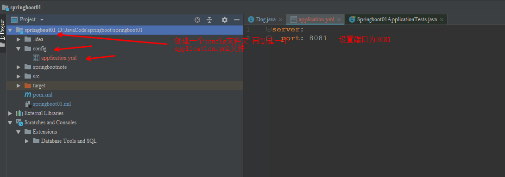
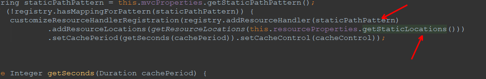

# **一、**Spring Boot 入门

## 1、回顾什么是SpringBoot

Spring是一个开源框架，2003 年兴起的一个轻量级的Java 开发框架，作者：Rod Johnson 。

**Spring是为了解决企业级应用开发的复杂性而创建的，简化开发**

## 2、Spring是如何简化Java开发的

为了降低Java开发的复杂性，Spring采用了以下4种关键策略：

1、基于POJO的轻量级和最小侵入性编程，所有东西都是bean；

2、通过IOC，依赖注入（DI）和面向接口实现松耦合；

3、基于切面（AOP）和惯例进行声明式编程；

4、通过切面和模版减少样式代码，RedisTemplate，xxxTemplate；

## 3、Spring Boot 简介

学过javaweb的同学就知道，开发一个web应用，从最初开始接触Servlet结合Tomcat, 跑出一个Hello Wolrld程序，是要经历特别多的步骤；后来就用了框架Struts，再后来是SpringMVC，到了现在的SpringBoot，过一两年又会有其他web框架出现；你们有经历过框架不断的演进，然后自己开发项目所有的技术也在不断的变化、改造吗？建议都可以去经历一遍；

​		言归正传，什么是SpringBoot呢，就是一个javaweb的开发框架，和SpringMVC类似，对比其他javaweb框架的好处，官方说是简化开发，约定大于配置，  you can "just run"，能迅速的开发web应用，几行代码开发一个http接口。

​		所有的技术框架的发展似乎都遵循了一条主线规律：从一个复杂应用场景 衍生 一种规范框架，人们只需要进行各种配置而不需要自己去实现它，这时候强大的配置功能成了优点；发展到一定程度之后，人们根据实际生产应用情况，选取其中实用功能和设计精华，重构出一些轻量级的框架；之后为了提高开发效率，嫌弃原先的各类配置过于麻烦，于是开始提倡“约定大于配置”，进而衍生出一些一站式的解决方案。

​		是的这就是Java企业级应用->J2EE->spring->springboot的过程。

​		随着 Spring 不断的发展，涉及的领域越来越多，项目整合开发需要配合各种各样的文件，慢慢变得不那么易用简单，违背了最初的理念，甚至人称配置地狱。Spring Boot 正是在这样的一个背景下被抽象出来的开发框架，目的为了让大家更容易的使用 Spring 、更容易的集成各种常用的中间件、开源软件；

​		Spring Boot 基于 Spring 开发，Spirng Boot 本身并不提供 Spring 框架的核心特性以及扩展功能，只是用于快速、敏捷地开发新一代基于 Spring 框架的应用程序。也就是说，它并不是用来替代 Spring 的解决方案，而是和 Spring 框架紧密结合用于提升 Spring 开发者体验的工具。Spring Boot 以**约定大于配置的核心思想**，默认帮我们进行了很多设置，多数 Spring Boot 应用只需要很少的 Spring 配置。同时它集成了大量常用的第三方库配置（例如 Redis、MongoDB、Jpa、RabbitMQ、Quartz 等等），Spring Boot 应用中这些第三方库几乎可以零配置的开箱即用。

​		简单来说就是SpringBoot其实不是什么新的框架，它默认配置了很多框架的使用方式，就像maven整合了所有的jar包，spring boot整合了所有的框架 。

​		Spring Boot 出生名门，从一开始就站在一个比较高的起点，又经过这几年的发展，生态足够完善，Spring Boot 已经当之无愧成为 Java 领域最热门的技术。

**Spring Boot的主要优点：**

- 为所有Spring开发者更快的入门
- **开箱即用**，提供各种默认配置来简化项目配置
- 内嵌式容器简化Web项目
- 没有冗余代码生成和XML配置的要求

真的很爽，我们快速去体验开发个接口的感觉吧！


## 4、什么是微服务

2014，martin fowler

微服务：架构风格（服务微化）

一个应用应该是一组小型服务；可以通过HTTP的方式进行互通；

单体应用：ALL IN ONE

微服务：每一个功能元素最终都是一个可独立替换和独立升级的软件单元；

[详细参照微服务文档](https://martinfowler.com/articles/microservices.html#MicroservicesAndSoa)

## 5、环境准备

### 1、相关开发工具准备

我们将学习如何快速的创建一个Spring Boot应用，并且实现一个简单的Http请求处理。通过这个例子对Spring Boot有一个初步的了解，并体验其结构简单、开发快速的特性。

我的环境准备：

- java version "1.8.0_181"
- Maven-3.6.1
- SpringBoot 2.x 最新版

开发工具：

- IDEA

我们将学习如何快速的创建一个Spring Boot应用，并且实现一个简单的Http请求处理。通过这个例子对Spring Boot有一个初步的了解，并体验其结构简单、开发快速的特性。

我的环境准备：

- java version "1.8.0_181"
- Maven-3.6.1
- SpringBoot 2.x 最新版

开发工具：

- IDEA

### 2、创建项目基本说明

Spring官方提供了非常方便的工具让我们快速构建应用

Spring Initializr：https://start.spring.io/

**项目创建方式一：**使用Spring Initializr 的 Web页面创建项目

1、打开  https://start.spring.io/

2、填写项目信息

3、点击”Generate Project“按钮生成项目；下载此项目

4、解压项目包，并用IDEA以Maven项目导入，一路下一步即可，直到项目导入完毕。

5、如果是第一次使用，可能速度会比较慢，包比较多、需要耐心等待一切就绪。


**项目创建方式二：**使用 IDEA 直接创建项目

1、创建一个新项目

2、选择spring initalizr ， 可以看到默认就是去官网的快速构建工具那里实现

3、填写项目信息

4、选择初始化的组件（初学勾选 Web 即可）

5、填写项目路径

6、等待项目构建成功


**项目结构分析：**

通过上面步骤完成了基础项目的创建。就会自动生成以下文件。

1、程序的主启动类

2、一个 application.properties 配置文件

3、一个 测试类

4、一个 pom.xml

```xml
<?xml version="1.0" encoding="UTF-8"?>
<project xmlns="http://maven.apache.org/POM/4.0.0" xmlns:xsi="http://www.w3.org/2001/XMLSchema-instance"
         xsi:schemaLocation="http://maven.apache.org/POM/4.0.0 https://maven.apache.org/xsd/maven-4.0.0.xsd">
    <modelVersion>4.0.0</modelVersion>
    <parent>
        <groupId>org.springframework.boot</groupId>
        <artifactId>spring-boot-starter-parent</artifactId>
        <version>2.3.3.RELEASE</version>
        <relativePath/> <!-- lookup parent from repository -->
    </parent>
    <groupId>com.example</groupId>
    <artifactId>springboot01</artifactId>
    <version>0.0.1-SNAPSHOT</version>
    <name>springboot01</name>
    <description>Demo project for Spring Boot</description>

    <properties>
        <java.version>1.8</java.version>
    </properties>

    <dependencies>
        <dependency>
            <groupId>org.springframework.boot</groupId>
            <artifactId>spring-boot-starter-web</artifactId>
        </dependency>

        <dependency>
            <groupId>org.springframework.boot</groupId>
            <artifactId>spring-boot-starter-test</artifactId>
            <scope>test</scope>
            <exclusions>
                <exclusion>
                    <groupId>org.junit.vintage</groupId>
                    <artifactId>junit-vintage-engine</artifactId>
                </exclusion>
            </exclusions>
        </dependency>
    </dependencies>

    <build>
        <plugins>
            <plugin>
                <groupId>org.springframework.boot</groupId>
                <artifactId>spring-boot-maven-plugin</artifactId>
            </plugin>
        </plugins>
    </build>
</project>
```

### 3、IDEA设置

整合maven进来；


## 6、创建第一个HelloWorld

需求：

浏览器发送hello请求，服务器接受请求并处理，响应Hello World字符串；

### 1、创建一个maven工程；（jar）

### 2、导入spring boot相关的依赖

```xml
    <parent>
        <groupId>org.springframework.boot</groupId>
        <artifactId>spring-boot-starter-parent</artifactId>
        <version>1.5.9.RELEASE</version>
    </parent>
    <dependencies>
        <dependency>
            <groupId>org.springframework.boot</groupId>
            <artifactId>spring-boot-starter-web</artifactId>
        </dependency>
    </dependencies>
```

### 3、编写一个主程序；启动Spring Boot应用

### 

```java
/**
 *  @SpringBootApplication 来标注一个主程序类，说明这是一个Spring Boot应用
 */
@SpringBootApplication
public class HelloWorldMainApplication {

    public static void main(String[] args) {

        // Spring应用启动起来
        SpringApplication.run(HelloWorldMainApplication.class,args);
    }
}
```

### 4、编写相关的Controller、Service

实际操作：

1、在主程序的同级目录下，新建一个controller包，一定要在同级目录下，否则识别不到

2、在包中新建一个HelloController类

```java
@Controller
public class HelloController {

    @ResponseBody
    @RequestMapping("/hello")
    public String hello(){
        return "Hello World!";
    }
}

```

### 5、运行主程序测试

编写完毕后，从主程序启动项目，浏览器发起请求，看页面返回；控制台输出了 Tomcat 访问的端口号！


简单几步，就完成了一个web接口的开发，SpringBoot就是这么简单。所以我们常用它来建立我们的微服务项目！

将项目打成jar包，点击 maven的 package


如果遇到以上错误，可以配置打包时 跳过项目运行测试用例

如果打包成功，则会在target目录下生成一个 jar 包

)

打成了jar包后，就可以在任何地方运行了！OK

### 6、简化部署

```xml
 <!-- 这个插件，可以将应用打包成一个可执行的jar包；-->
    <build>
        <plugins>
            <plugin>
                <groupId>org.springframework.boot</groupId>
                <artifactId>spring-boot-maven-plugin</artifactId>
            </plugin>
        </plugins>
    </build>
```

将这个应用打成jar包，直接使用java -jar的命令进行执行；


### **7、彩蛋**

如何更改启动时显示的字符拼成的字母，SpringBoot呢？也就是 banner 图案；

只需一步：到项目下的 resources 目录下新建一个banner.txt 即可。

图案可以到：[彩蛋生成处](https://www.bootschool.net/ascii) 这个网站生成，然后拷贝到文件中即可！

## 7、HelloWorld探究

### 1、POM文件

#### 1、父项目

```xml
<parent>
        <groupId>org.springframework.boot</groupId>
        <artifactId>spring-boot-starter-parent</artifactId>
        <version>2.3.3.RELEASE</version>
        <relativePath/> <!-- lookup parent from repository -->
    </parent>

他的父项目是

<parent>
    <groupId>org.springframework.boot</groupId>
    <artifactId>spring-boot-dependencies</artifactId>
    <version>2.2.3.RELEASE</version>
    <relativePath>../../spring-boot-dependencies</relativePath>
</parent>
他来真正管理Spring Boot应用里面的所有依赖版本；

```

Spring Boot的版本仲裁中心；

以后我们导入依赖默认是不需要写版本；（没有在dependencies里面管理的依赖自然需要声明版本号）

#### 2、启动器

```xml
<dependency>
    <groupId>org.springframework.boot</groupId>
    <artifactId>spring-boot-starter-web</artifactId>
</dependency>
```

**spring-boot-starter**-==web==：

​	spring-boot-starter：spring-boot场景启动器；帮我们导入了web模块正常运行所依赖的组件；

Spring Boot将所有的功能场景都抽取出来，做成一个个的starters（启动器），只需要在项目里面引入这些starter相关场景的所有依赖都会导入进来。要用什么功能就导入什么场景的启动器

### 2、主程序类，主入口类

```java
/**
 *  @SpringBootApplication 来标注一个主程序类，说明这是一个Spring Boot应用
 */
@SpringBootApplication
public class HelloWorldMainApplication {

    public static void main(String[] args) {

        // Spring应用启动起来
        SpringApplication.run(HelloWorldMainApplication.class,args);
    }
}

```

但是**一个简单的启动类并不简单！**我们来分析一下这些注解都干了什么

#### @**SpringBootApplication**

​	作用：Spring Boot应用标注在某个类上说明这个类是SpringBoot的主配置类，SpringBoot就应该运行这个类的main方法来启动SpringBoot应用；

进入这个注解：可以看到上面还有很多其他注解！

```java
@Target(ElementType.TYPE)
@Retention(RetentionPolicy.RUNTIME)
@Documented
@Inherited
@SpringBootConfiguration //标注在某个类上，表示这是一个springboot的配置类
@EnableAutoConfiguration
@ComponentScan(excludeFilters = { @Filter(type = FilterType.CUSTOM, classes = TypeExcludeFilter.class),
		@Filter(type = FilterType.CUSTOM, classes = AutoConfigurationExcludeFilter.class) })
public @interface SpringBootApplication {
	 // ......
}
```

##### @**SpringBootConfiguration**

​	Spring Boot的配置类；

​		标注在某个类上，表示这是一个Spring Boot的配置类；

我们继续进去这个注解查看

```java

@Target({ElementType.TYPE})
@Retention(RetentionPolicy.RUNTIME)
@Documented
@Configuration //说明这是一个配置类 ，配置类就是对应Spring的xml 配置文件
public @interface SpringBootConfiguration {
    @AliasFor(
        annotation = Configuration.class
    )
    boolean proxyBeanMethods() default true;
}

```

##### @**Configuration**

​	配置类上来标注这个注解；

​			配置类 -----  配置文件；配置类也是容器中的一个组件；@Component

鼠标回到上一层的注解

##### @**EnableAutoConfiguration**

​	开启自动配置功能；

以前我们需要自己配置的东西，而现在SpringBoot可以自动帮我们配置 ；@EnableAutoConfiguration告诉SpringBoot开启自动配置功能，这样自动配置才能生效；

点进去这个**@EnableAutoConfiguration**看，里面是如下

```java
@Target({ElementType.TYPE})
@Retention(RetentionPolicy.RUNTIME)
@Documented
@Inherited
@AutoConfigurationPackage //自动配置包
@Import({AutoConfigurationImportSelector.class})//Spring的底层注解@Import，给容器中导入一个组件；导入的组件由AutoConfigurationPackages.Registrar.class；
public @interface EnableAutoConfiguration {
    String ENABLED_OVERRIDE_PROPERTY = "spring.boot.enableautoconfiguration";

    Class<?>[] exclude() default {};

    String[] excludeName() default {};
}

```

##### @**AutoConfigurationPackage**

​	自动配置包

再点击@**AutoConfigurationPackage**进去

```java
@Target({ElementType.TYPE})
@Retention(RetentionPolicy.RUNTIME)
@Documented
@Inherited
@Import({Registrar.class})
public @interface AutoConfigurationPackage {
    String[] basePackages() default {};

    Class<?>[] basePackageClasses() default {};
}
```

​		@Import({Registrar.class})：

​		Spring的底层注解@Import，给容器中导入一个组件；导入的组件由Registrar.class提供；

  	  Registrar.class 作用：将主启动类的所在包及包下面所有子包里面的所有组件扫描到Spring容器 ；

##### @**Import**(EnableAutoConfigurationImportSelector.class)；

AutoConfigurationImportSelector ：自动配置导入选择器，那么它会导入哪些组件的选择器呢？我们点击去这个类看源码：

1、这个类中有一个这样的方法

   ```java
// 获得候选的配置
protected List<String> getCandidateConfigurations(AnnotationMetadata metadata, AnnotationAttributes attributes) {
    //这里的getSpringFactoriesLoaderFactoryClass（）方法
    //返回的就是我们最开始看的启动自动导入配置文件的注解类；EnableAutoConfiguration
    List<String> configurations = SpringFactoriesLoader.loadFactoryNames(this.getSpringFactoriesLoaderFactoryClass(), this.getBeanClassLoader());
    Assert.notEmpty(configurations, "No auto configuration classes found in META-INF/spring.factories. If you are using a custom packaging, make sure that file is correct.");
    return configurations;
}
   ```

2、这个方法又调用了  SpringFactoriesLoader 类的静态方法！我们进入SpringFactoriesLoader类loadFactoryNames() 方法

```java
public static List<String> loadFactoryNames(Class<?> factoryClass, @Nullable ClassLoader classLoader) {
    String factoryClassName = factoryClass.getName();
    //这里它又调用了 loadSpringFactories 方法
    return (List)loadSpringFactories(classLoader).getOrDefault(factoryClassName, Collections.emptyList());
}
```

3、我们继续点击查看 loadSpringFactories 方法

 ```java
private static Map<String, List<String>> loadSpringFactories(@Nullable ClassLoader classLoader) {
        MultiValueMap<String, String> result = (MultiValueMap)cache.get(classLoader);
        if (result != null) {
            return result;
        } else {
            try {
                Enumeration<URL> urls = classLoader != null ? classLoader.getResources("META-INF/spring.factories") : ClassLoader.getSystemResources("META-INF/spring.factories");
                LinkedMultiValueMap result = new LinkedMultiValueMap();

                while(urls.hasMoreElements()) {
                    URL url = (URL)urls.nextElement();
                    UrlResource resource = new UrlResource(url);
                    Properties properties = PropertiesLoaderUtils.loadProperties(resource);
                    Iterator var6 = properties.entrySet().iterator();

                    while(var6.hasNext()) {
                        Entry<?, ?> entry = (Entry)var6.next();
                        String factoryTypeName = ((String)entry.getKey()).trim();
                        String[] var9 = StringUtils.commaDelimitedListToStringArray((String)entry.getValue());
                        int var10 = var9.length;

                        for(int var11 = 0; var11 < var10; ++var11) {
                            String factoryImplementationName = var9[var11];
                            result.add(factoryTypeName, factoryImplementationName.trim());
                        }
                    }
                }

                cache.put(classLoader, result);
                return result;
            } catch (IOException var13) {
                throw new IllegalArgumentException("Unable to load factories from location [META-INF/spring.factories]", var13);
            }
        }
    }
 ```

4、发现一个多次出现的文件：spring.factories，全局搜索它

### 3、spring.factories

我们根据源头打开spring.factories ， 看到了很多自动配置的文件；这就是自动配置根源所在！


**WebMvcAutoConfiguration**

我们在上面的自动配置类随便找一个打开看看，比如 ：WebMvcAutoConfiguration


可以看到这些一个个的都是JavaConfig配置类，而且都注入了一些Bean，可以找一些自己认识的类，看着熟悉一下！可以多找一下，可以看见InternalResourceViewResolver 等等

所以，自动配置真正实现是从classpath中搜寻所有的META-INF/spring.factories配置文件 ，并将其中对应的 org.springframework.boot.autoconfigure. 包下的配置项，通过反射实例化为对应标注了 @Configuration的JavaConfig形式的IOC容器配置类 ， 然后将这些都汇总成为一个实例并加载到IOC容器中。

#### **结论：**

1. SpringBoot在启动的时候从类路径下的META-INF/spring.factories中获取EnableAutoConfiguration指定的值
2. 将这些值作为自动配置类导入容器 ， 自动配置类就生效 ， 帮我们进行自动配置工作；
3. 整个J2EE的整体解决方案和自动配置都在springboot-autoconfigure的jar包中；
4. 它会给容器中导入非常多的自动配置类 （xxxAutoConfiguration）, 就是给容器中导入这个场景需要的所有组件 ， 并配置好这些组件 ；
5. 有了自动配置类 ， 免去了我们手动编写配置注入功能组件等的工作；

**现在大家应该大概的了解了下，SpringBoot的运行原理，后面我们还会深化一次！**

## **8、SpringApplication**

```java
@SpringBootApplication
public class SpringbootApplication {
    public static void main(String[] args) {
        SpringApplication.run(SpringbootApplication.class, args);
    }
}
```

**SpringApplication.run分析**

分析该方法主要分两部分，一部分是SpringApplication的实例化，二是run方法的执行；

* >#### SpringApplication

    查看构造器

    ```java
        public SpringApplication(Class... primarySources) {
            this((ResourceLoader)null, primarySources);
        }
    
        public SpringApplication(ResourceLoader resourceLoader, Class... primarySources) {
            this.sources = new LinkedHashSet();
            this.bannerMode = Mode.CONSOLE;
            this.logStartupInfo = true;
            this.addCommandLineProperties = true;
            this.addConversionService = true;
            this.headless = true;
            this.registerShutdownHook = true;
            this.additionalProfiles = new HashSet();
            this.isCustomEnvironment = false;
            this.lazyInitialization = false;
            this.resourceLoader = resourceLoader;
            Assert.notNull(primarySources, "PrimarySources must not be null");
            this.primarySources = new LinkedHashSet(Arrays.asList(primarySources));
            this.webApplicationType = WebApplicationType.deduceFromClasspath();
            this.setInitializers(this.getSpringFactoriesInstances(ApplicationContextInitializer.class));
            this.setListeners(this.getSpringFactoriesInstances(ApplicationListener.class));
            this.mainApplicationClass = this.deduceMainApplicationClass();
        }
    
    ```

    

    **这个类主要做了以下四件事情：**

    1、推断应用的类型是普通的项目还是Web项目

    2、查找并加载所有可用初始化器 ， 设置到initializers属性中

    3、找出所有的应用程序监听器，设置到listeners属性中

    4、推断并设置main方法的定义类，找到运行的主类

    就是最后的上面的最后4行

    

* >#### run方法流程分析

    

跟着源码和这幅图就可以一探究竟了！

附上：别的博客觉得解析springboot启动流程分析，可以参考参考

[springboot启动过程解读](https://blog.csdn.net/zxzzxzzxz123/article/details/69941910)

[springboot启动过程解读2](https://www.cnblogs.com/trgl/p/7353782.html)

# 二、配置文件

## 1、配置文件

SpringBoot使用一个全局的配置文件，配置文件名是固定的；

•application.properties

•application.yml


配置文件的作用：修改SpringBoot自动配置的默认值；SpringBoot在底层都给我们自动配置好；


YAML（YAML Ain't Markup Language）

​	YAML  A Markup Language：是一个标记语言

​	YAML   isn't Markup Language：不是一个标记语言；

标记语言：

​	以前的配置文件；大多都使用的是  **xxxx.xml**文件；

​	YAML：**以数据为中心**，比json、xml等更适合做配置文件；

​	YAML：配置例子

```yaml
server:
  port: 8081
```

​	XML：

```xml
<server>
	<port>8081</port>
</server>
```

## 2、YAML语法：

### 1、基本语法

k:(空格)v：表示一对键值对（空格必须有）；

以**空格**的缩进来控制层级关系；只要是左对齐的一列数据，都是同一个层级的

说明：语法要求严格！

1、==**空格不能省略**==

2、以==**缩进**==来控制层级关系，只要是左边对齐的一列数据都是同一个层级的。

3、==**属性**==和==**值**==的**==大小写==**都是十分敏感的。

```yaml
server:
    port: 8081
    path: /hello
```

属性和值也是大小写敏感；

### 2、值的写法

#### 字面量：普通的值（数字，字符串，布尔）

​	k: v：字面直接来写；

​		字符串默认不用加上单引号或者双引号；

​		""：双引号；不会转义字符串里面的特殊字符；特殊字符会作为本身想表示的意思

​				name:   "zhangsan \n lisi"：输出；zhangsan 换行  lisi

​		''：单引号；会转义特殊字符，特殊字符最终只是一个普通的字符串数据

​				name:   ‘zhangsan \n lisi’：输出；zhangsan \n  lisi

#### 对象、Map（属性和值）（键值对）：

​	k: v：在下一行来写对象的属性和值的关系；注意缩进

​		对象还是k: v的方式

```yaml
friends:
		lastName: zhangsan
		age: 20
```

行内写法：

```yaml
friends: {lastName: zhangsan,age: 18}
```


#### 数组（List、Set）：

用- 值表示数组中的一个元素

```yaml
pets:
 - cat
 - dog
 - pig
```

行内写法

```yaml
pets: [cat,dog,pig]
```

上面已经简单的学习了yaml的一些功能 但是最主要的不是体现在这里 而是**==直接==**给实体类注入匹配值

## 3、配置文件值注入

配置文件的写法

```yaml
person: #这个名字很关键 就是和下面的@ConfigurationProperties中的前缀一一对应的
    lastName: hello
    age: 18
    boss: false
    birth: 2017/12/12
    maps: {k1: v1,k2: 12}
    lists:
      - lisi
      - zhaoliu
    dog:
      name: 小狗
      age: 12
```

javaBean：

```java
/**
 * 将配置文件中配置的每一个属性的值，映射到这个组件中
 * @ConfigurationProperties：告诉SpringBoot将本类中的所有属性和配置文件中相关的配置进行绑定；
 *      prefix = "person"：配置文件中哪个下面的所有属性进行一一映射
 *
 * 只有这个组件是容器中的组件，才能容器提供的@ConfigurationProperties功能；
 *
 */
@Component//注册成为一个组件  直接注册到Bean容器中
@ConfigurationProperties(prefix = "person")
public class Person {

    private String lastName;
    private Integer age;
    private Boolean boss;
    private Date birth;

    private Map<String,Object> maps;
    private List<Object> lists;
    private Dog dog; //还有一个Dog类 也要创建一下
    //记得加上空参数，getXXX,setXXX方法
    
}
```

```java
@Component//注册成为一个组件  直接注册到Bean容器中
public class Dog {
    private  String name;
    private Integer age;

    public Dog() {
    }

    public Dog(String name, Integer age) {
        this.name = name;
        this.age = age;
    }
     //记得加上空参数，getXXX,setXXX方法
}
```

1、思考，我们原来是如何给bean注入属性值的！@Value，给狗狗类测试一下：

```java
@Component//注册成为一个组件  直接注册到Bean容器中
public class Dog {
    @Value("阿黄")
    private  String name;
    @Value("18")
    private Integer age;
```

此时我们再次启动springboot给我们的测试类测试

```java
@SpringBootTest
class Springboot01ApplicationTests {

    
    @Autowired
    Dog dog;//将狗狗自动注入进来
    @Test
    void contextLoads() {
        System.out.println(dog);//可以打印出上面注入的属性值
    }

}
```

上面已经试验了之前的学习的注入方式 ，现在我们看看springboot给我们提供的使用yaml的注入

```java
@SpringBootTest
class Springboot01ApplicationTests {

    @Autowired
    Dog dog;//将狗狗自动注入进来
    @Autowired
    Person person;//将Person自动注入进来
    @Test
    void contextLoads() {
        System.out.println(dog);
        System.out.println(person);//打印出全部属性
    }

}
```


全部属性注入成功

**==注意==**

课堂测试：

1、将配置文件的**==key==** 值 和 **==属性==**的值设置为不一样，则结果输出为null，注入失败

2、在配置一个person2，然后将 @ConfigurationProperties(prefix = "person2") 指向我们的person2；

上面是通过yaml的方式 我们之前是 用XXX.properties进行赋值的 现在我们回顾一下看看怎么弄

加载指定的配置文件

**@PropertySource ：**加载指定的配置文件；

**@configurationProperties**：默认从全局配置文件中获取值；

1. 我们去在resources目录下新建一个**person.properties**文件

    ```java
    name=miao
    ```

2. 然后在我们的代码中指定加载person.properties文件

    ```java
    package com.example.springboot01.pojo;
    
    import org.springframework.beans.factory.annotation.Value;
    import org.springframework.boot.context.properties.ConfigurationProperties;
    import org.springframework.context.annotation.PropertySource;
    import org.springframework.stereotype.Component;
    import sun.awt.SunHints;
    
    import java.util.Date;
    import java.util.List;
    import java.util.Map;
    /*
    @ConfigurationProperties作用：
    将配置文件中配置的每一个属性的值，映射到这个组件中；
    告诉SpringBoot将本类中的所有属性和配置文件中相关的配置进行绑定
    参数 prefix = “person” : 将配置文件中的person下面的所有属性一一对应
    */
    @Component //注册bean到容器中
    //@ConfigurationProperties(prefix="person")//这个一定要注释了 否则就不是这个下面的起作用了
    @PropertySource(value = "classpath:person.properties")
    public class Person {
    
        @Value("${name}")//切记一定要加这个
        private String name;
        private Integer age;
        private Boolean happy;
        private Date birth;
        private Map<String, Object> maps;
        private List<Object> lists;
        private Dog dog;
    
        //有参无参构造、get、set方法、toString()方法省略了
    }
    
    
    ```

    结果：属性绑定成功

    IDEA 提示，springboot配置注解处理器没有找到，让我们看文档，我们可以查看文档，找到一个依赖！

    ```java
    <!--导入配置文件处理器，配置文件进行绑定就会有提示-->
    		<dependency>
    			<groupId>org.springframework.boot</groupId>
    			<artifactId>spring-boot-configuration-processor</artifactId>
    			<optional>true</optional>
    		</dependency>
    ```

@**ImportResource**：导入Spring的配置文件，让配置文件里面的内容生效；

Spring Boot里面没有Spring的配置文件，我们自己编写的配置文件，也不能自动识别；

想让Spring的配置文件生效，加载进来；@**ImportResource**标注在一个配置类上

```java
@ImportResource(locations = {"classpath:beans.xml"})
//导入Spring的配置文件让其生效
```

来编写Spring的配置文件

```xml
<?xml version="1.0" encoding="UTF-8"?>
<beans xmlns="http://www.springframework.org/schema/beans"
       xmlns:xsi="http://www.w3.org/2001/XMLSchema-instance"
       xsi:schemaLocation="http://www.springframework.org/schema/beans http://www.springframework.org/schema/beans/spring-beans.xsd">


    <bean id="helloService" class="com.atguigu.springboot.service.HelloService"></bean>
</beans>
```

SpringBoot推荐给容器中添加组件的方式；推荐使用全注解的方式

1、配置类**@Configuration**------>Spring配置文件

2、使用**@Bean**给容器中添加组件

```java
/**
 * @Configuration：指明当前类是一个配置类；就是来替代之前的Spring配置文件
 *
 * 在配置文件中用<bean><bean/>标签添加组件
 *
 */
@Configuration
public class MyAppConfig {

    //将方法的返回值添加到容器中；容器中这个组件默认的id就是方法名
    @Bean
    public HelloService helloService02(){
        System.out.println("配置类@Bean给容器中添加组件了...");
        return new HelloService();
    }
}
```


**配置文件占位符**

配置文件还可以编写占位符生成随机数

```yaml
person:
    name: miaoyongjin${random.uuid} # 随机uuid
    age: ${random.int}  # 随机int
    happy: false
    birth: 2000/01/01
    maps: {k1: v1,k2: v2}
    lists:
      - code
      - girl
      - music
    dog:
      name: ${person.hello:other}_旺财 #如果有这个person.hello这个属性用这个属性 否则用other 跟三目运算符很像
      age: 1
```

**对比小结**


1、@ConfigurationProperties只需要写一次即可 ， @Value则需要每个字段都添加

2、松散绑定：这个什么意思呢? 比如我的yml中写的last-name，这个和lastName是一样的， - 后面跟着的字母默认是大写的。这就是松散绑定。可以测试一下。其实就是驼峰命名

3、JSR303数据校验 ， 这个就是我们可以在字段是增加一层过滤器验证 ， 可以保证数据的合法性

4、复杂类型封装，yml中可以封装对象 ， 使用value就不支持

**结论：**

配置yml和配置properties都可以获取到值 ， 强烈推荐 yml；

如果我们在某个业务中，只需要获取配置文件中的某个值，可以使用一下 @value；

如果说，我们专门编写了一个JavaBean来和配置文件进行一一映射，就直接@configurationProperties，不要犹豫！

### **1、JSR303数据校验**

Springboot中可以用@validated来校验数据，如果数据异常则会统一抛出异常，方便异常中心统一处理。我们这里来写个注解让我们的name只能支持Email格式；

**==注意：==**

​		如果下面的@Email等不起作用，那就是少了依赖，添加如下依赖即可

```java
<dependency>
            <groupId>org.springframework.boot</groupId>
            <artifactId>spring-boot-starter-validation</artifactId>
</dependency>
```

```java
@Component //注册bean
@ConfigurationProperties(prefix = "person")
@Validated  //数据校验
public class Person {
   //lastName必须是邮箱格式
    @Email
    //@Value("${person.last-name}")
    private String lastName;
    //@Value("#{11*2}")
    private Integer age;
    //@Value("true")
    private Boolean boss;

    private Date birth;
    private Map<String,Object> maps;
    private List<Object> lists;
    private Dog dog;
}
```

运行结果 ：default message [不是一个合法的电子邮件地址];

**使用数据校验，可以保证数据的正确性；**

>常用

```java
@NotNull(message="名字不能为空")
private String userName;
@Max(value=120,message="年龄最大不能查过120")
private int age;
@Email(message="邮箱格式错误")
private String email;

空检查
@Null       验证对象是否为null
@NotNull    验证对象是否不为null, 无法查检长度为0的字符串
@NotBlank   检查约束字符串是不是Null还有被Trim的长度是否大于0,只对字符串,且会去掉前后空格.
@NotEmpty   检查约束元素是否为NULL或者是EMPTY.
    
Booelan检查
@AssertTrue     验证 Boolean 对象是否为 true  
@AssertFalse    验证 Boolean 对象是否为 false  
    
长度检查
@Size(min=, max=) 验证对象（Array,Collection,Map,String）长度是否在给定的范围之内  
@Length(min=, max=) string is between min and max included.

日期检查
@Past       验证 Date 和 Calendar 对象是否在当前时间之前  
@Future     验证 Date 和 Calendar 对象是否在当前时间之后  
@Pattern    验证 String 对象是否符合正则表达式的规则

.......等等
除此以外，我们还可以自定义一些数据校验规则
```

### 2、properties配置文件在idea中默认utf-8可能会乱码


 	5、Profile

### 3、多Profile文件

我们在主配置文件编写的时候，文件名可以是   application-{profile}.properties/yml

默认使用application.properties的配置；


#### 1、yml支持多文档块方式

```yml
server:
  port: 8081
spring:
  profiles:
    active: prod

---
server:
  port: 8083
spring:
  profiles: dev


---

server:
  port: 8084
spring:
  profiles: prod  #指定属于哪个环境
```


#### 2、激活指定profile

​	1、在配置文件中指定  spring.profiles.active=dev

​	2、命令行：

​		java -jar spring-boot-02-config-0.0.1-SNAPSHOT.jar --spring.profiles.active=dev；

​		可以直接在测试的时候，配置传入命令行参数

​	3、虚拟机参数；

​		-Dspring.profiles.active=dev

## 4、配置文件加载位置

springboot 启动会扫描以下位置的application.properties或者application.yml文件作为Spring boot的默认配置文件

–file:./config/  项目路径下的config文件夹配置文件

–file:./   项目路径下配置文件

–classpath:/config/   资源路径下的config文件夹配置文件

–classpath:/ 资源路径下配置文件

优先级1：项目路径下的config文件夹配置文件
优先级2：项目路径下配置文件
优先级3：资源路径下的config文件夹配置文件
优先级4：资源路径下配置文件

优先级由高到底，高优先级的配置会覆盖低优先级的配置；

SpringBoot会从这四个位置全部加载主配置文件；**互补配置**；

现在我们依次在我们的项目中的上面情况依次设置看看具体结果如何

* 项目路径下的config文件夹配置文件

    

* 项目路径下配置文件


* 资源路径下的config文件夹配置文件

    

* 资源路径下配置文件

    

依次启动得出配置文件的加载优先级

```java
优先级1：项目路径下的config文件夹配置文件
优先级2：项目路径下配置文件
优先级3：资源路径下的config文件夹配置文件
优先级4：资源路径下配置文件
```

优先级由高到底，高优先级的配置会覆盖低优先级的配置；

**SpringBoot会从这四个位置全部加载主配置文件；互补配置；**

==我们还可以通过spring.config.location来改变默认的配置文件位置==

**项目打包好以后，我们可以使用命令行参数的形式，启动项目的时候来指定配置文件的新位置；指定配置文件和默认加载的这些配置文件共同起作用形成互补配置；**

java -jar spring-boot-02-config-02-0.0.1-SNAPSHOT.jar --spring.config.location=G:/application.properties

## 5、外部配置加载顺序

**==SpringBoot也可以从以下位置加载配置； 优先级从高到低；高优先级的配置覆盖低优先级的配置，所有的配置会形成互补配置==**

#### **1.命令行参数**

所有的配置都可以在命令行上进行指定

java -jar spring-boot-02-config-02-0.0.1-SNAPSHOT.jar --server.port=8087  --server.context-path=/abc

多个配置用空格分开； --配置项=值


2.来自java:comp/env的JNDI属性

3.Java系统属性（System.getProperties()）

4.操作系统环境变量

5.RandomValuePropertySource配置的random.*属性值


==**由jar包外向jar包内进行寻找；**==

==**优先加载带profile**==

**6.jar包外部的application-{profile}.properties或application.yml(带spring.profile)配置文件**

**7.jar包内部的application-{profile}.properties或application.yml(带spring.profile)配置文件**


==**再来加载不带profile**==

**8.jar包外部的application.properties或application.yml(不带spring.profile)配置文件**

**9.jar包内部的application.properties或application.yml(不带spring.profile)配置文件**


10.@Configuration注解类上的@PropertySource

11.通过SpringApplication.setDefaultProperties指定的默认属性

所有支持的配置加载来源；

[参考官方文档](https://docs.spring.io/spring-boot/docs/1.5.9.RELEASE/reference/htmlsingle/#boot-features-external-config)

# **三、SpringBoot**自动装配原理再讲解

配置文件到底能写什么？怎么写？自动配置原理；

[配置文件能配置的属性参照](https://docs.spring.io/spring-boot/docs/1.5.9.RELEASE/reference/htmlsingle/#common-application-properties)

## 1、自动配置原理

1）、SpringBoot启动的时候加载主配置类，开启了自动配置功能 **@EnableAutoConfiguration**

2）、@EnableAutoConfiguration 作用：

 - 利用EnableAutoConfigurationImportSelector给容器中导入一些组件？

- 可以查看selectImports()方法的内容；

- List<String> configurations = getCandidateConfigurations(annotationMetadata,      attributes);获取候选的配置

    - ```java
        SpringFactoriesLoader.loadFactoryNames()
        扫描所有jar包类路径下  META-INF/spring.factories
        把扫描到的这些文件的内容包装成properties对象
        从properties中获取到EnableAutoConfiguration.class类（类名）对应的值，然后把他们添加在容器中
        
        ```


**将 类路径下  META-INF/spring.factories 里面配置的所有EnableAutoConfiguration的值加入到了容器中**

```properties
# Auto Configure
org.springframework.boot.autoconfigure.EnableAutoConfiguration=\
org.springframework.boot.autoconfigure.admin.SpringApplicationAdminJmxAutoConfiguration,\
org.springframework.boot.autoconfigure.aop.AopAutoConfiguration,\
org.springframework.boot.autoconfigure.amqp.RabbitAutoConfiguration,\
org.springframework.boot.autoconfigure.batch.BatchAutoConfiguration,\
org.springframework.boot.autoconfigure.cache.CacheAutoConfiguration,\
org.springframework.boot.autoconfigure.cassandra.CassandraAutoConfiguration,\
org.springframework.boot.autoconfigure.cloud.CloudAutoConfiguration,\
org.springframework.boot.autoconfigure.context.ConfigurationPropertiesAutoConfiguration,\
org.springframework.boot.autoconfigure.context.MessageSourceAutoConfiguration,\
org.springframework.boot.autoconfigure.context.PropertyPlaceholderAutoConfiguration,\
org.springframework.boot.autoconfigure.couchbase.CouchbaseAutoConfiguration,\
org.springframework.boot.autoconfigure.dao.PersistenceExceptionTranslationAutoConfiguration,\
org.springframework.boot.autoconfigure.data.cassandra.CassandraDataAutoConfiguration,\
org.springframework.boot.autoconfigure.data.cassandra.CassandraRepositoriesAutoConfiguration,\
org.springframework.boot.autoconfigure.data.couchbase.CouchbaseDataAutoConfiguration,\
org.springframework.boot.autoconfigure.data.couchbase.CouchbaseRepositoriesAutoConfiguration,\
org.springframework.boot.autoconfigure.data.elasticsearch.ElasticsearchAutoConfiguration,\
org.springframework.boot.autoconfigure.data.elasticsearch.ElasticsearchDataAutoConfiguration,\
org.springframework.boot.autoconfigure.data.elasticsearch.ElasticsearchRepositoriesAutoConfiguration,\
org.springframework.boot.autoconfigure.data.jpa.JpaRepositoriesAutoConfiguration,\
org.springframework.boot.autoconfigure.data.ldap.LdapDataAutoConfiguration,\
org.springframework.boot.autoconfigure.data.ldap.LdapRepositoriesAutoConfiguration,\
org.springframework.boot.autoconfigure.data.mongo.MongoDataAutoConfiguration,\
org.springframework.boot.autoconfigure.data.mongo.MongoRepositoriesAutoConfiguration,\
org.springframework.boot.autoconfigure.data.neo4j.Neo4jDataAutoConfiguration,\
org.springframework.boot.autoconfigure.data.neo4j.Neo4jRepositoriesAutoConfiguration,\
org.springframework.boot.autoconfigure.data.solr.SolrRepositoriesAutoConfiguration,\
org.springframework.boot.autoconfigure.data.redis.RedisAutoConfiguration,\
org.springframework.boot.autoconfigure.data.redis.RedisRepositoriesAutoConfiguration,\
org.springframework.boot.autoconfigure.data.rest.RepositoryRestMvcAutoConfiguration,\
org.springframework.boot.autoconfigure.data.web.SpringDataWebAutoConfiguration,\
org.springframework.boot.autoconfigure.elasticsearch.jest.JestAutoConfiguration,\
org.springframework.boot.autoconfigure.freemarker.FreeMarkerAutoConfiguration,\
org.springframework.boot.autoconfigure.gson.GsonAutoConfiguration,\
org.springframework.boot.autoconfigure.h2.H2ConsoleAutoConfiguration,\
org.springframework.boot.autoconfigure.hateoas.HypermediaAutoConfiguration,\
org.springframework.boot.autoconfigure.hazelcast.HazelcastAutoConfiguration,\
org.springframework.boot.autoconfigure.hazelcast.HazelcastJpaDependencyAutoConfiguration,\
org.springframework.boot.autoconfigure.info.ProjectInfoAutoConfiguration,\
org.springframework.boot.autoconfigure.integration.IntegrationAutoConfiguration,\
org.springframework.boot.autoconfigure.jackson.JacksonAutoConfiguration,\
org.springframework.boot.autoconfigure.jdbc.DataSourceAutoConfiguration,\
org.springframework.boot.autoconfigure.jdbc.JdbcTemplateAutoConfiguration,\
org.springframework.boot.autoconfigure.jdbc.JndiDataSourceAutoConfiguration,\
org.springframework.boot.autoconfigure.jdbc.XADataSourceAutoConfiguration,\
org.springframework.boot.autoconfigure.jdbc.DataSourceTransactionManagerAutoConfiguration,\
org.springframework.boot.autoconfigure.jms.JmsAutoConfiguration,\
org.springframework.boot.autoconfigure.jmx.JmxAutoConfiguration,\
org.springframework.boot.autoconfigure.jms.JndiConnectionFactoryAutoConfiguration,\
org.springframework.boot.autoconfigure.jms.activemq.ActiveMQAutoConfiguration,\
org.springframework.boot.autoconfigure.jms.artemis.ArtemisAutoConfiguration,\
org.springframework.boot.autoconfigure.flyway.FlywayAutoConfiguration,\
org.springframework.boot.autoconfigure.groovy.template.GroovyTemplateAutoConfiguration,\
org.springframework.boot.autoconfigure.jersey.JerseyAutoConfiguration,\
org.springframework.boot.autoconfigure.jooq.JooqAutoConfiguration,\
org.springframework.boot.autoconfigure.kafka.KafkaAutoConfiguration,\
org.springframework.boot.autoconfigure.ldap.embedded.EmbeddedLdapAutoConfiguration,\
org.springframework.boot.autoconfigure.ldap.LdapAutoConfiguration,\
org.springframework.boot.autoconfigure.liquibase.LiquibaseAutoConfiguration,\
org.springframework.boot.autoconfigure.mail.MailSenderAutoConfiguration,\
org.springframework.boot.autoconfigure.mail.MailSenderValidatorAutoConfiguration,\
org.springframework.boot.autoconfigure.mobile.DeviceResolverAutoConfiguration,\
org.springframework.boot.autoconfigure.mobile.DeviceDelegatingViewResolverAutoConfiguration,\
org.springframework.boot.autoconfigure.mobile.SitePreferenceAutoConfiguration,\
org.springframework.boot.autoconfigure.mongo.embedded.EmbeddedMongoAutoConfiguration,\
org.springframework.boot.autoconfigure.mongo.MongoAutoConfiguration,\
org.springframework.boot.autoconfigure.mustache.MustacheAutoConfiguration,\
org.springframework.boot.autoconfigure.orm.jpa.HibernateJpaAutoConfiguration,\
org.springframework.boot.autoconfigure.reactor.ReactorAutoConfiguration,\
org.springframework.boot.autoconfigure.security.SecurityAutoConfiguration,\
org.springframework.boot.autoconfigure.security.SecurityFilterAutoConfiguration,\
org.springframework.boot.autoconfigure.security.FallbackWebSecurityAutoConfiguration,\
org.springframework.boot.autoconfigure.security.oauth2.OAuth2AutoConfiguration,\
org.springframework.boot.autoconfigure.sendgrid.SendGridAutoConfiguration,\
org.springframework.boot.autoconfigure.session.SessionAutoConfiguration,\
org.springframework.boot.autoconfigure.social.SocialWebAutoConfiguration,\
org.springframework.boot.autoconfigure.social.FacebookAutoConfiguration,\
org.springframework.boot.autoconfigure.social.LinkedInAutoConfiguration,\
org.springframework.boot.autoconfigure.social.TwitterAutoConfiguration,\
org.springframework.boot.autoconfigure.solr.SolrAutoConfiguration,\
org.springframework.boot.autoconfigure.thymeleaf.ThymeleafAutoConfiguration,\
org.springframework.boot.autoconfigure.transaction.TransactionAutoConfiguration,\
org.springframework.boot.autoconfigure.transaction.jta.JtaAutoConfiguration,\
org.springframework.boot.autoconfigure.validation.ValidationAutoConfiguration,\
org.springframework.boot.autoconfigure.web.DispatcherServletAutoConfiguration,\
org.springframework.boot.autoconfigure.web.EmbeddedServletContainerAutoConfiguration,\
org.springframework.boot.autoconfigure.web.ErrorMvcAutoConfiguration,\
org.springframework.boot.autoconfigure.web.HttpEncodingAutoConfiguration,\
org.springframework.boot.autoconfigure.web.HttpMessageConvertersAutoConfiguration,\
org.springframework.boot.autoconfigure.web.MultipartAutoConfiguration,\
org.springframework.boot.autoconfigure.web.ServerPropertiesAutoConfiguration,\
org.springframework.boot.autoconfigure.web.WebClientAutoConfiguration,\
org.springframework.boot.autoconfigure.web.WebMvcAutoConfiguration,\
org.springframework.boot.autoconfigure.websocket.WebSocketAutoConfiguration,\
org.springframework.boot.autoconfigure.websocket.WebSocketMessagingAutoConfiguration,\
org.springframework.boot.autoconfigure.webservices.WebServicesAutoConfiguration
```

每一个这样的  xxxAutoConfiguration类都是容器中的一个组件，都加入到容器中；用他们来做自动配置；

3）、每一个自动配置类进行自动配置功能；

4）、以**HttpEncodingAutoConfiguration（Http编码自动配置）**为例解释自动配置原理；

```java
@Configuration   //表示这是一个配置类，以前编写的配置文件一样，也可以给容器中添加组件
@EnableConfigurationProperties(HttpEncodingProperties.class)  //启动指定类的ConfigurationProperties功能；将配置文件中对应的值和HttpEncodingProperties绑定起来；并把HttpEncodingProperties加入到ioc容器中

@ConditionalOnWebApplication //Spring底层@Conditional注解（Spring注解版），根据不同的条件，如果满足指定的条件，整个配置类里面的配置就会生效；    判断当前应用是否是web应用，如果是，当前配置类生效

@ConditionalOnClass(CharacterEncodingFilter.class)  //判断当前项目有没有这个类CharacterEncodingFilter；SpringMVC中进行乱码解决的过滤器；

@ConditionalOnProperty(prefix = "spring.http.encoding", value = "enabled", matchIfMissing = true)  //判断配置文件中是否存在某个配置  spring.http.encoding.enabled；如果不存在，判断也是成立的
//即使我们配置文件中不配置pring.http.encoding.enabled=true，也是默认生效的；
public class HttpEncodingAutoConfiguration {
  
  	//他已经和SpringBoot的配置文件映射了
  	private final HttpEncodingProperties properties;
  
   //只有一个有参构造器的情况下，参数的值就会从容器中拿
  	public HttpEncodingAutoConfiguration(HttpEncodingProperties properties) {
		this.properties = properties;
	}
  
    @Bean   //给容器中添加一个组件，这个组件的某些值需要从properties中获取
	@ConditionalOnMissingBean(CharacterEncodingFilter.class) //判断容器没有这个组件？
	public CharacterEncodingFilter characterEncodingFilter() {
		CharacterEncodingFilter filter = new OrderedCharacterEncodingFilter();
		filter.setEncoding(this.properties.getCharset().name());
		filter.setForceRequestEncoding(this.properties.shouldForce(Type.REQUEST));
		filter.setForceResponseEncoding(this.properties.shouldForce(Type.RESPONSE));
		return filter;
	}
```

根据当前不同的条件判断，决定这个配置类是否生效？

一但这个配置类生效；这个配置类就会给容器中添加各种组件；这些组件的属性是从对应的properties类中获取的，这些类里面的每一个属性又是和配置文件绑定的；

**一句话总结 ：根据当前不同的条件判断，决定这个配置类是否生效！**

- 一但这个配置类生效；这个配置类就会给容器中添加各种组件；
- 这些组件的属性是从对应的properties类中获取的，这些类里面的每一个属性又是和配置文件绑定的；
- 所有在配置文件中能配置的属性都是在xxxxProperties类中封装着；
- 配置文件能配置什么就可以参照某个功能对应的这个属性类

5）、所有在配置文件中能配置的属性都是在xxxxProperties类中封装着‘；配置文件能配置什么就可以参照某个功能对应的这个属性类

```java
@ConfigurationProperties(prefix = "spring.http.encoding")  //从配置文件中获取指定的值和bean的属性进行绑定
public class HttpEncodingProperties {

   public static final Charset DEFAULT_CHARSET = Charset.forName("UTF-8");
```

**这就是自动装配的原理！**

==**精髓**==

1、SpringBoot启动会加载大量的自动配置类

2、我们看我们需要的功能有没有在SpringBoot默认写好的自动配置类当中；

3、我们再来看这个自动配置类中到底配置了哪些组件；（只要我们要用的组件存在在其中，我们就不需要再手动配置了）

4、给容器中自动配置类添加组件的时候，会从properties类中获取某些属性。我们只需要在配置文件中指定这些属性的值即可；

## 2、了解：@Conditional

了解完自动装配的原理后，我们来关注一个细节问题，**自动配置类必须在一定的条件下才能生效；**

**@Conditional派生注解（Spring注解版原生的@Conditional作用）**

作用：必须是@Conditional指定的条件成立，才给容器中添加组件，配置配里面的所有内容才生效；


**自动配置类必须在一定的条件下才能生效；**

我们怎么知道哪些自动配置类生效；

**==我们可以通过启用  debug=true属性；来让控制台打印自动配置报告==**，这样我们就可以很方便的知道哪些自动配置类生效；

```java
=========================
AUTO-CONFIGURATION REPORT
=========================


Positive matches:（自动配置类启用的）
-----------------

   DispatcherServletAutoConfiguration matched:
      - @ConditionalOnClass found required class 'org.springframework.web.servlet.DispatcherServlet'; @ConditionalOnMissingClass did not find unwanted class (OnClassCondition)
      - @ConditionalOnWebApplication (required) found StandardServletEnvironment (OnWebApplicationCondition)
        
    
Negative matches:（没有启动，没有匹配成功的自动配置类）
-----------------

   ActiveMQAutoConfiguration:
      Did not match:
         - @ConditionalOnClass did not find required classes 'javax.jms.ConnectionFactory', 'org.apache.activemq.ActiveMQConnectionFactory' (OnClassCondition)

   AopAutoConfiguration:
      Did not match:
         - @ConditionalOnClass did not find required classes 'org.aspectj.lang.annotation.Aspect', 'org.aspectj.lang.reflect.Advice' (OnClassCondition)
        
```

**Positive matches:（自动配置类启用的：正匹配）**

**Negative matches:（没有启动，没有匹配成功的自动配置类：负匹配）**

**Unconditional classes: （没有条件的类）**

[演示：查看输出的日志]

掌握吸收理解原理，即可以不变应万变

# 四、日志

## 1、日志框架

 小张；开发一个大型系统；

​		1、System.out.println("")；将关键数据打印在控制台；去掉？写在一个文件？

​		2、框架来记录系统的一些运行时信息；日志框架 ；  zhanglogging.jar；

​		3、高大上的几个功能？异步模式？自动归档？xxxx？  zhanglogging-good.jar？

​		4、将以前框架卸下来？换上新的框架，重新修改之前相关的API；zhanglogging-prefect.jar；

​		5、JDBC---数据库驱动；

​			写了一个统一的接口层；日志门面（日志的一个抽象层）；logging-abstract.jar；

​			给项目中导入具体的日志实现就行了；我们之前的日志框架都是实现的抽象层；


**市面上的日志框架；**

JUL、JCL、Jboss-logging、logback、log4j、log4j2、slf4j....

| 日志门面  （日志的抽象层）                                   | 日志实现                                             |
| ------------------------------------------------------------ | ---------------------------------------------------- |
| ~~JCL（Jakarta  Commons Logging）~~    SLF4j（Simple  Logging Facade for Java）    **~~jboss-logging~~** | Log4j  JUL（java.util.logging）  Log4j2  **Logback** |

左边选一个门面（抽象层）、右边来选一个实现；

日志门面：  SLF4J；

日志实现：Logback；


SpringBoot：底层是Spring框架，Spring框架默认是用JCL；‘

​	**==SpringBoot选用 SLF4j和logback；==**


## 2、SLF4j使用

### 1、如何在系统中使用SLF4j   https://www.slf4j.org

以后开发的时候，日志记录方法的调用，不应该来直接调用日志的实现类，而是调用日志抽象层里面的方法；

给系统里面导入slf4j的jar和  logback的实现jar

```java
import org.slf4j.Logger;
import org.slf4j.LoggerFactory;

public class HelloWorld {
  public static void main(String[] args) {
    Logger logger = LoggerFactory.getLogger(HelloWorld.class);
    logger.info("Hello World");
  }
}
```

图示；


每一个日志的实现框架都有自己的配置文件。使用slf4j以后，**配置文件还是做成日志实现框架自己本身的配置文件；**

### 2、遗留问题

a（slf4j+logback）: Spring（commons-logging）、Hibernate（jboss-logging）、MyBatis、xxxx

统一日志记录，即使是别的框架和我一起统一使用slf4j进行输出？


**如何让系统中所有的日志都统一到slf4j；**

==1、将系统中其他日志框架先排除出去；==

==2、用中间包来替换原有的日志框架；==

==3、我们导入slf4j其他的实现==


## 3、SpringBoot日志关系

```xml
		<dependency>
			<groupId>org.springframework.boot</groupId>
			<artifactId>spring-boot-starter</artifactId>
		</dependency>
```


SpringBoot使用它来做日志功能；

```xml
	<dependency>
			<groupId>org.springframework.boot</groupId>
			<artifactId>spring-boot-starter-logging</artifactId>
		</dependency>
```

底层依赖关系


总结：

​	1）、SpringBoot底层也是使用slf4j+logback的方式进行日志记录

​	2）、SpringBoot也把其他的日志都替换成了slf4j；

​	3）、中间替换包？

```java
@SuppressWarnings("rawtypes")
public abstract class LogFactory {

    static String UNSUPPORTED_OPERATION_IN_JCL_OVER_SLF4J = "http://www.slf4j.org/codes.html#unsupported_operation_in_jcl_over_slf4j";

    static LogFactory logFactory = new SLF4JLogFactory();
```


​	4）、如果我们要引入其他框架？一定要把这个框架的默认日志依赖移除掉？

​			Spring框架用的是commons-logging；

```xml
		<dependency>
			<groupId>org.springframework</groupId>
			<artifactId>spring-core</artifactId>
			<exclusions>
				<exclusion>
					<groupId>commons-logging</groupId>
					<artifactId>commons-logging</artifactId>
				</exclusion>
			</exclusions>
		</dependency>
```

**==SpringBoot能自动适配所有的日志，而且底层使用slf4j+logback的方式记录日志，引入其他框架的时候，只需要把这个框架依赖的日志框架排除掉即可；==**

## 4、日志使用；

### 1、默认配置

SpringBoot默认帮我们配置好了日志；

```java
	//记录器
	Logger logger = LoggerFactory.getLogger(getClass());
	@Test
	public void contextLoads() {
		//System.out.println();

		//日志的级别；
		//由低到高   trace<debug<info<warn<error
		//可以调整输出的日志级别；日志就只会在这个级别以以后的高级别生效
		logger.trace("这是trace日志...");
		logger.debug("这是debug日志...");
		//SpringBoot默认给我们使用的是info级别的，没有指定级别的就用SpringBoot默认规定的级别；root级别
		logger.info("这是info日志...");
		logger.warn("这是warn日志...");
		logger.error("这是error日志...");


	}
```


        日志输出格式：
    		%d表示日期时间，
    		%thread表示线程名，
    		%-5level：级别从左显示5个字符宽度
    		%logger{50} 表示logger名字最长50个字符，否则按照句点分割。 
    		%msg：日志消息，
    		%n是换行符
        -->
        %d{yyyy-MM-dd HH:mm:ss.SSS} [%thread] %-5level %logger{50} - %msg%n

SpringBoot修改日志的默认配置

```properties
logging.level.com.atguigu=trace


#logging.path=
# 不指定路径在当前项目下生成springboot.log日志
# 可以指定完整的路径；
#logging.file=G:/springboot.log

# 在当前磁盘的根路径下创建spring文件夹和里面的log文件夹；使用 spring.log 作为默认文件
logging.path=/spring/log

#  在控制台输出的日志的格式
logging.pattern.console=%d{yyyy-MM-dd} [%thread] %-5level %logger{50} - %msg%n
# 指定文件中日志输出的格式
logging.pattern.file=%d{yyyy-MM-dd} === [%thread] === %-5level === %logger{50} ==== %msg%n
```

| logging.file | logging.path | Example  | Description                        |
| ------------ | ------------ | -------- | ---------------------------------- |
| (none)       | (none)       |          | 只在控制台输出                     |
| 指定文件名   | (none)       | my.log   | 输出日志到my.log文件               |
| (none)       | 指定目录     | /var/log | 输出到指定目录的 spring.log 文件中 |

### 2、指定配置

给类路径下放上每个日志框架自己的配置文件即可；SpringBoot就不使用他默认配置的了

| Logging System          | Customization                                                |
| ----------------------- | ------------------------------------------------------------ |
| Logback                 | `logback-spring.xml`, `logback-spring.groovy`, `logback.xml` or `logback.groovy` |
| Log4j2                  | `log4j2-spring.xml` or `log4j2.xml`                          |
| JDK (Java Util Logging) | `logging.properties`                                         |

logback.xml：直接就被日志框架识别了；

**logback-spring.xml**：日志框架就不直接加载日志的配置项，由SpringBoot解析日志配置，可以使用SpringBoot的高级Profile功能

```xml
<springProfile name="staging">
    <!-- configuration to be enabled when the "staging" profile is active -->
  	可以指定某段配置只在某个环境下生效
</springProfile>

```

如：

```xml
<appender name="stdout" class="ch.qos.logback.core.ConsoleAppender">
        <!--
        日志输出格式：
			%d表示日期时间，
			%thread表示线程名，
			%-5level：级别从左显示5个字符宽度
			%logger{50} 表示logger名字最长50个字符，否则按照句点分割。 
			%msg：日志消息，
			%n是换行符
        -->
        <layout class="ch.qos.logback.classic.PatternLayout">
            <springProfile name="dev">
                <pattern>%d{yyyy-MM-dd HH:mm:ss.SSS} ----> [%thread] ---> %-5level %logger{50} - %msg%n</pattern>
            </springProfile>
            <springProfile name="!dev">
                <pattern>%d{yyyy-MM-dd HH:mm:ss.SSS} ==== [%thread] ==== %-5level %logger{50} - %msg%n</pattern>
            </springProfile>
        </layout>
    </appender>
```


如果使用logback.xml作为日志配置文件，还要使用profile功能，会有以下错误

 `no applicable action for [springProfile]`

## 5、切换日志框架

可以按照slf4j的日志适配图，进行相关的切换；

slf4j+log4j的方式；

```xml
<dependency>
  <groupId>org.springframework.boot</groupId>
  <artifactId>spring-boot-starter-web</artifactId>
  <exclusions>
    <exclusion>
      <artifactId>logback-classic</artifactId>
      <groupId>ch.qos.logback</groupId>
    </exclusion>
    <exclusion>
      <artifactId>log4j-over-slf4j</artifactId>
      <groupId>org.slf4j</groupId>
    </exclusion>
  </exclusions>
</dependency>

<dependency>
  <groupId>org.slf4j</groupId>
  <artifactId>slf4j-log4j12</artifactId>
</dependency>

```

切换为log4j2

```xml
   <dependency>
            <groupId>org.springframework.boot</groupId>
            <artifactId>spring-boot-starter-web</artifactId>
            <exclusions>
                <exclusion>
                    <artifactId>spring-boot-starter-logging</artifactId>
                    <groupId>org.springframework.boot</groupId>
                </exclusion>
            </exclusions>
        </dependency>

<dependency>
  <groupId>org.springframework.boot</groupId>
  <artifactId>spring-boot-starter-log4j2</artifactId>
</dependency>
```

-----------------

# 五、Web开发

## 1、简介


使用SpringBoot；

**1）、创建SpringBoot应用，选中我们需要的模块；**

**2）、SpringBoot已经默认将这些场景配置好了，只需要在配置文件中指定少量配置就可以运行起来**

**3）、自己编写业务代码；**


**自动配置原理？**

这个场景SpringBoot帮我们配置了什么？能不能修改？能修改哪些配置？能不能扩展？xxx

```
xxxxAutoConfiguration：帮我们给容器中自动配置组件；
xxxxProperties:配置类来封装配置文件的内容；

```

## 2、搭建项目

首先创建一个新项目，并且先跑起来，创建controller,并且访问成功

```java
package com.example.springboot02.controller;

import org.springframework.web.bind.annotation.GetMapping;
import org.springframework.web.bind.annotation.RestController;

@RestController
public class HelloController {

    @GetMapping("/hello")
    public String hello(){
        return "hello";
    }
}

```

## 3、静态资源问题的解决

由于静态资源是有webmvc管制的，所以我们看看之前学习的WebMvcAutoConfiguration里面有没有我们需要的

找到WebMvcAutoConfiguration：

我们发现里面有一个==**addResourceHandlers**==这个方法，这个方法仔细研究研究

```java
@Override//添加资源映射器
public void addResourceHandlers(ResourceHandlerRegistry registry) {
    //如果静态资源被自定义了那就不执行下面的默认，直接return
    //就是在spring.mvc.static.path.pattern=\**这种自定义的 就不在使用下面默认的 否则就走下面的 
    if (!this.resourceProperties.isAddMappings()) {
        logger.debug("Default resource handling disabled");
        return;
    }
    Duration cachePeriod = this.resourceProperties.getCache().getPeriod();
    CacheControl cacheControl = this.resourceProperties.getCache().getCachecontrol().toHttpCacheControl();
   //将下面的if放到下面来分析
    if (!registry.hasMappingForPattern("/webjars/**")) {
        customizeResourceHandlerRegistration(registry.addResourceHandler("/webjars/**")
                                             .addResourceLocations("classpath:/META-INF/resources/webjars/")
                                             .setCachePeriod(getSeconds(cachePeriod)).setCacheControl(cacheControl));
    }
    String staticPathPattern = this.mvcProperties.getStaticPathPattern();
    if (!registry.hasMappingForPattern(staticPathPattern)) {
        customizeResourceHandlerRegistration(registry.addResourceHandler(staticPathPattern)
                                             .addResourceLocations(getResourceLocations(this.resourceProperties.getStaticLocations()))
                                             .setCachePeriod(getSeconds(cachePeriod)).setCacheControl(cacheControl));
    }
}

```

将上面的代码抽出来，单独分析。下面说明我们可以使用maven坐标依赖的方式引入webjars[附上webjars官网](https://www.webjars.org/)

```java
 if (!registry.hasMappingForPattern("/webjars/**")) {
        customizeResourceHandlerRegistration(registry.addResourceHandler("/webjars/**")
                                             .addResourceLocations("classpath:/META-INF/resources/webjars/")
                                             .setCachePeriod(getSeconds(cachePeriod)).setCacheControl(cacheControl));
    }
```

**==jquery的坐标：==**

```java
<dependency>
    <groupId>org.webjars</groupId>
    <artifactId>jquery</artifactId>
    <version>3.5.1</version>
</dependency>
```


注意上面是映射在==**classpath:/META-INF/resources/webjars/**==  所以我们如果要访问jquery.js就是要在地址栏输入如下内容


下面还有一段if语句我们也分析一下

```java
if (!registry.hasMappingForPattern(staticPathPattern)) {
    customizeResourceHandlerRegistration(registry.addResourceHandler(staticPathPattern)
                                         .addResourceLocations(getResourceLocations(this.resourceProperties.getStaticLocations()))
                                         .setCachePeriod(getSeconds(cachePeriod)).setCacheControl(cacheControl));
}
```

这个源码我们点进去看看




我们就能看到我们的资源存放路径可以放在这么多位置

下面我们根据源码提示看看能不能添加如下资源并且成功访问到


通过实验我们发现resources的优先级更高>static>public

**总结**：

在springboot我们可以采用如下方式进行静态资源的访问

* webjars 		地址url: localhost:8080/webjars/
* /** public static resources 优先级倒着来resources>static>public  可是发现/**好像没用

## **4、欢迎页解决问题**

```java
@Bean
public WelcomePageHandlerMapping welcomePageHandlerMapping(ApplicationContext applicationContext,FormattingConversionService mvcConversionService, ResourceUrlProvider mvcResourceUrlProvider) {
    WelcomePageHandlerMapping welcomePageHandlerMapping = new WelcomePageHandlerMapping(
        new TemplateAvailabilityProviders(applicationContext), applicationContext, getWelcomePage(),this.mvcProperties.getStaticPathPattern());
    welcomePageHandlerMapping.setInterceptors(getInterceptors(mvcConversionService, mvcResourceUrlProvider));
    welcomePageHandlerMapping.setCorsConfigurations(getCorsConfigurations());
    return welcomePageHandlerMapping;
}

private Optional<Resource> getWelcomePage() {
    String[] locations =getResourceLocations(this.resourceProperties.getStaticLocations());
    return Arrays.stream(locations).map(this::getIndexHtml).filter(this::isReadable).findFirst();
}

private Resource getIndexHtml(String location) {
    return this.resourceLoader.getResource(location + "index.html");
}
```

根据上面的源码显示我们要展示任何一个首页 只要将它放在自定义的路径下或者资源目录下 资源目录就是上面讲的那几个static resources public都行

**==注意==**：即使我们将index.html放在那几个文件夹下面通过首页控制器还是会报404错误的，那是因为我们没有配置

thymeleaf模板引擎。

```java
package com.example.springboot02.controller;

import org.springframework.boot.context.properties.ConfigurationProperties;
import org.springframework.stereotype.Controller;
import org.springframework.web.bind.annotation.RequestMapping;

@Controller
public class IndexController {
    @RequestMapping("/")
    public String index(){
        return "index";
    }
}

```


下面我们讲述怎么配置模板引擎，将我们的首页通过控制器展示出来

1. 导入依赖，如果是2.3.3 可以直接添加启动器就行了

    ```xml
    <!--导入模板引擎的依赖-->
        <dependency>
        <groupId>org.springframework.boot</groupId>
        <artifactId>spring-boot-starter-thymeleaf</artifactId>
        </dependency>
        <!--切换thymeleaf版本-->
    <properties>
    		<thymeleaf.version>3.0.9.RELEASE</thymeleaf.version>
    		<!-- 布局功能的支持程序  thymeleaf3主程序  layout2以上版本 -->
    		<!-- thymeleaf2   layout1-->
    		<thymeleaf-layout-dialect.version>2.2.2</thymeleaf-layout-dialect.version>
      </properties>
    ```

    


**注意**

​	通过上面找到的源码提示，我们需要将我们的index放在我们的templates文件夹下面 就能被模板引擎直接解析渲染了


上面已经学习了怎么展示首页，下面简单学习thymeleaf 的一些基本语法，我也下载了相关的pdf。


[下载地址1](https://www.thymeleaf.org/documentation.html)

[thymeleaf的下载地址](https://www.thymeleaf.org/doc/tutorials/3.0/usingthymeleaf.pdf)

## **5、thymeleaf基本语法**

```java
package com.example.springboot02.controller;

import org.springframework.boot.context.properties.ConfigurationProperties;
import org.springframework.stereotype.Controller;
import org.springframework.ui.Model;
import org.springframework.web.bind.annotation.RequestMapping;
import org.springframework.web.servlet.ModelAndView;

@Controller
public class IndexController {
    @RequestMapping("/")
    public String index(Model model){
        model.addAttribute("msg","hello,springboot");
        return "index";
    }
}

```


### 1、语法规则

1）、th:text；改变当前元素里面的文本内容；

​	th：任意html属性；来替换原生属性的值


2）、表达式？

```properties
Simple expressions:（表达式语法）
    Variable Expressions: ${...}：获取变量值；OGNL；
    		1）、获取对象的属性、调用方法
    		2）、使用内置的基本对象：
    			#ctx : the context object.
    			#vars: the context variables.
                #locale : the context locale.
                #request : (only in Web Contexts) the HttpServletRequest object.
                #response : (only in Web Contexts) the HttpServletResponse object.
                #session : (only in Web Contexts) the HttpSession object.
                #servletContext : (only in Web Contexts) the ServletContext object.
                
                ${session.foo}
            3）、内置的一些工具对象：
#execInfo : information about the template being processed.
#messages : methods for obtaining externalized messages inside variables expressions, in the same way as they would be obtained using #{…} syntax.
#uris : methods for escaping parts of URLs/URIs
#conversions : methods for executing the configured conversion service (if any).
#dates : methods for java.util.Date objects: formatting, component extraction, etc.
#calendars : analogous to #dates , but for java.util.Calendar objects.
#numbers : methods for formatting numeric objects.
#strings : methods for String objects: contains, startsWith, prepending/appending, etc.
#objects : methods for objects in general.
#bools : methods for boolean evaluation.
#arrays : methods for arrays.
#lists : methods for lists.
#sets : methods for sets.
#maps : methods for maps.
#aggregates : methods for creating aggregates on arrays or collections.
#ids : methods for dealing with id attributes that might be repeated (for example, as a result of an iteration).

    Selection Variable Expressions: *{...}：选择表达式：和${}在功能上是一样；
    	补充：配合 th:object="${session.user}：
   <div th:object="${session.user}">
    <p>Name: <span th:text="*{firstName}">Sebastian</span>.</p>
    <p>Surname: <span th:text="*{lastName}">Pepper</span>.</p>
    <p>Nationality: <span th:text="*{nationality}">Saturn</span>.</p>
    </div>
    
    Message Expressions: #{...}：获取国际化内容
    Link URL Expressions: @{...}：定义URL；
    		@{/order/process(execId=${execId},execType='FAST')}
    Fragment Expressions: ~{...}：片段引用表达式
    		<div th:insert="~{commons :: main}">...</div>
    		
Literals（字面量）
      Text literals: 'one text' , 'Another one!' ,…
      Number literals: 0 , 34 , 3.0 , 12.3 ,…
      Boolean literals: true , false
      Null literal: null
      Literal tokens: one , sometext , main ,…
Text operations:（文本操作）
    String concatenation: +
    Literal substitutions: |The name is ${name}|
Arithmetic operations:（数学运算）
    Binary operators: + , - , * , / , %
    Minus sign (unary operator): -
Boolean operations:（布尔运算）
    Binary operators: and , or
    Boolean negation (unary operator): ! , not
Comparisons and equality:（比较运算）
    Comparators: > , < , >= , <= ( gt , lt , ge , le )
    Equality operators: == , != ( eq , ne )
Conditional operators:条件运算（三元运算符）
    If-then: (if) ? (then)
    If-then-else: (if) ? (then) : (else)
    Default: (value) ?: (defaultvalue)
Special tokens:
    No-Operation: _  
```

[springboot官方文档](https://docs.spring.io/spring-boot/docs/current/reference/html/spring-boot-features.html#boot-features-developing-web-applications)